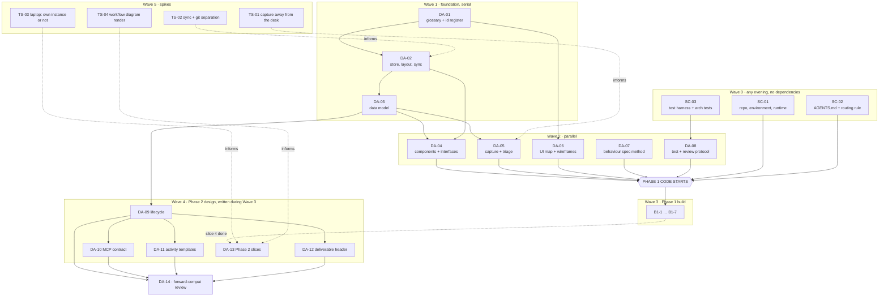

# Design Phase Plan

**Innovator's Workspace — the artifacts that must exist before development starts, and that must still be true when it finishes.**

> First person throughout is Jared. "I", "me", "my" never refer to an AI.
> Governed by `InnovatorsWorkspaceVision.md`. Where this plan conflicts with V§01–02, the vision wins and this file is wrong.

---

## 01 · How this file works

This is a working file, not a report. It is the thing I open on a Tuesday evening and ask *"what's next?"*

**Task IDs and statuses.** Every task has an ID and a status. Statuses are exactly three:

| Status | Means |
|---|---|
| `not started` | Nobody has begun. |
| `in work` | Started, not finished. |
| `done` | Definition of done is met and I have looked at the output. |

**How I drive it.** The three sentences that do the work:

- *"What's next in the design plan?"* — return the lowest-numbered `not started` task whose blockers are all `done`, plus its inputs.
- *"Do DA-03."* — read its inputs, do the activities, produce the output, set the status to `in work`.
- *"Mark DA-03 done."* — only after I have read the output.

**Rule: an AI may set a task to `in work` on its own. Only I set a task to `done`.** The definition of done is written for me to check, not for an AI to assert.

**Cross-references.** `§04` means section 04 **of this plan**. `V§04` means section 04 **of the vision document**. `D17` always means a decision in V§15.

**Effort is in blocks.** One block ≈ 90 minutes, which is the shape of my free time. Nothing here is longer than two blocks. Anything that grows past two blocks gets split before it gets started.

**Sections 03–10 explain *why*. §13 is the task register and carries the *what* — inputs, activities, definition of done, blockers.** The register is the only place status lives.

---

## 02 · Implementation defaults

Decisions this plan takes that the vision does not cover. Visible so they are cheap to overturn.

| # | Default | Reasoning |
|---|---|---|
| **A1** | Design documents live in `docs/design/` in the code repo, as plain markdown. They are not IW nodes. | V§14.21 says frictions about the tool go into the tool. It does not say the design docs do. Making them nodes before the store exists is a bootstrap problem for no gain. |
| **A2** | **Two git repos: `iw-code` and `iw-vault`.** `iw-vault` is the synced store folder; git runs on the workstation only and is excluded from sync (D20). | Idea history and code history are different histories. A `git log` of the corpus is something I will actually want to read, and a note app pointed at a repo full of Python is noise. |
| **A3** | Python 3.12+, dependencies with `uv`. | One binary on Windows, no virtualenv ceremony. |
| **A4** | **One ASGI app hosts both the web UI and the MCP server.** Starlette or FastAPI, Jinja2 templates. | V§07 requires one process for both. The MCP Python SDK is ASGI-native, so mounting it is a route rather than an integration. Not a trade study: the constraint forces the answer. |
| **A5** | **HTMX for interactivity. No npm, no bundler, no build step in the repo.** JavaScript appears only in the three views V§10 names. | Consistent with D19's preference for things that need no build tooling. A build step is a thing I would have to maintain in territory I don't know. |
| **A6** | `pytest`, no other test runner. Tests in `tests/`, mirroring package structure. | |
| **A7** | The event log is written from build slice B1-1. | D8 says from the first commit. It cannot be backfilled. |
| **A8** | Phase 1 has **no index**. The store scans markdown frontmatter into memory at startup. | ~100 ideas plus their questions is low thousands of files at worst. Revisit trigger stated in DA-02, not before. |
| **A9** | The existing prototype is **evidence only**. No code carries forward. | |
| **A10** | The service runs on the **Windows workstation**. The laptop reaches it per D21, still open. **The tablet never runs or reaches it** — it reads and writes files in the synced store with ordinary apps (V§07). | |
| **A11** | **The service is not the only writer of the store**, and never assumes it is. Files arrive from other devices by sync, and I edit them in an editor. Every write is atomic, nothing is cached across a request, and nothing is watched. | V§09's write rules, made a standing assumption rather than a special case. |
| **A12** | **No responsive layout, no mobile breakpoints, no touch targets.** Every surface targets a keyboard and a real screen. Reading a note on the tablet is not a view and needs none of this — it is a markdown file in a markdown editor. | V§07. Building for a tablet that will never open the page is pure waste, and half-doing it is worse than not doing it. |

---

## 03 · Acceptance criteria without requirements

No requirements specification. This is a workshop for one person, not a system that has to be verified against a contract — the way to find out whether a behaviour is right is to use it. What is still needed is something the AI codes against and something that makes scope creep visible, and both are cheaper as tests than as a document.

### Behaviour specs

**One numbered list per subsystem, in `docs/design/specs/`, each line a short imperative statement with a stable ID.**

```markdown
## STORE — behaviour

STORE-01  A node is one markdown file. Structured fields are YAML frontmatter; prose is the body.
STORE-02  Reading a node never caches. Every read hits the file.
STORE-03  Writing a node rewrites only the frontmatter keys the operation supplied.
STORE-04  A write is atomic: a temp file, then a rename into place.
STORE-05  A file whose frontmatter will not parse is reported, never repaired.
STORE-06  Resolving an id to a file scans frontmatter, never filenames.
STORE-07  Renaming a file breaks nothing, because no link references a path.
STORE-08  A file that appeared from another device is treated exactly like one I typed.
```

Three rules stop this becoming ceremony:

1. **Every spec ID appears in exactly two places: this list, and the name or docstring of the test that proves it.** `grep -r STORE-04 tests/` is the whole traceability mechanism. No matrix, no tooling.
2. **A behaviour with no spec ID, or a spec ID with no test, is the scope-creep signal.** One question at review catches it: *which spec ID is this?*
3. **Specs are written per slice, not up front.** DA-07 defines the method; the list for a subsystem is written immediately before the slice that builds it. Writing them all now would be guessing.

Expect 15–40 per subsystem, fifteen minutes of my time per slice.

### The principles become executable

V§14 has twenty-one principles. Several are structural claims a test can check, and a principle a test can check is worth ten a document merely states.

| Principle | The test |
|---|---|
| V§14.14 — everything swappable, nothing depended on | Import-graph test: nothing under `core/` or `domain/` imports anything under `adapters/` or any vendor package. No dependency on another application's API, plugin model, or file format anywhere in `pyproject.toml`. |
| V§14.15 — a note carries its own state | For a node with scores, a verdict, and workflows touching it, **every value the Node view displays is present in the file's frontmatter.** Nothing is computed only at display time. |
| V§14.6 — the MCP surface is a wall | The server exposes exactly five tools. No response body or error message contains a path separator, a filename, a table name, or the vault root. `fetch_context` refuses an id the step did not declare. |
| V§14.18 · V§14.19 — files are truth, links are ids | Deleting the index and rebuilding produces a byte-identical index. Recomputing every derived frontmatter field produces byte-identical files. No edge value matches a path pattern. |
| V§14.4 — no background engine | No thread, no `asyncio.create_task` at module scope, no scheduler dependency, **no filesystem watcher**. |
| V§14.17 — every write is attributed | Every node-writing path requires an `author` argument. No default. |

These live in `tests/arch/` and are the cheapest insurance in the plan. They are also the tests most likely to catch an AI helpfully doing the wrong thing at 11pm on a Sunday.

**One principle is a review question rather than a test.** V§07's *could I delete every other tool today and still capture, read, triage, plan, dispatch, and review?* gets asked at DA-04 and again at DA-14. It is the check that catches a dependency creeping in through the back door, and no unit test will notice that happening.

---

## 04 · The artifact list

Fourteen artifacts. **Eight gate Phase 1 code; the rest are Phase 2 design, written while Phase 1 is being built.** That structure is what stops this being six weeks of documents before anything runs.

Full inputs, activities, and definitions of done are in the register, §13. This table is the reasoning.

### Gate Phase 1

| ID | Artifact | For | Consumed by | Blocks | Effort | If skipped |
|---|---|---|---|:--:|:--:|---|
| **DA-01** | Glossary and id register | One name per thing; the prefix table and the allocation mechanics behind D7's scheme | Every later artifact; every AI session | Everything | 1 | Every document and every AI session invents its own vocabulary. Cheapest artifact here, widest blast radius. |
| **DA-02** | Store, file layout and sync topology | Folder tree, frontmatter schema, id allocation, `unit.yaml`, atomic writes, what sync moves and what it excludes, where git runs, the needs-attention list | Store implementation; me, on three devices | DA-03, DA-04, B1-1 | 2 | The most expensive thing in the system to change once there is data in it — and now it is also the thing that makes the tablet work at all. Getting the sync/git separation wrong corrupts a repository rather than losing an evening. |
| **DA-03** | Data model reference | Field specs; the edge vocabulary with direction and meaning; **which fields are authored and which are derived**, and what rewrites each derived one | Store, domain services, every view | DA-04, DA-05, B1-2 | 1.5 | V§09 is 80% of this but not precise enough to code against. The edge vocabulary has 18 relations with no stated direction. And V§14.15 turns the notes into a cache: derived fields without a stated write trigger go stale silently, which is the worst failure this design can have. |
| **DA-04** | Component and interface map | The Layer 1–4 components as Python `Protocol` classes with real signatures, plus the dependency rule made checkable | AI writing any component; the arch tests | B1-1 | 1.5 | "Everything behind a named interface" stays an aspiration. This is what makes V§14.14 real rather than stated, and it is where the *delete every other tool* question gets asked for the first time. |
| **DA-05** | Capture, inbox and triage design | How a thought gets in from each device, the raw inbox record, the triage pass and its keyboard map | Capture adapters, triage service, UI | B1-4, B1-5 | 1 | Phase 1's whole purpose is getting the corpus in, and the shape changed: most capture is now a file appearing in a synced folder rather than an inlet calling a service. Guessing the inbox record format means rewriting it after the first hundred captures. |
| **DA-06** | UI surface map + two wireframes | The screen map and navigation; low-fi wireframes of **Explore** and **Node view** only | AI writing templates | B1-1, B1-6 | 1 | An AI invents a layout, I reject it, we do it again. One block now saves three later. Note what this is *not*: no design system, no component library, no responsive work, no per-screen specs. |
| **DA-07** | Behaviour spec method | The format from §03, the ID scheme, where they live, the review question | Me, every slice | B1-1 | 0.5 | Every slice invents its own acceptance criteria, and §03's scope-creep mechanism never exists. |
| **DA-08** | Test strategy and review protocol | How I review Python I did not write; the three test tiers; the Python ban list | Me; every AI session | B1-1 | 1 | This is the mechanism by which I trust code I didn't write. Skipping it is skipping the reason the project is viable. |

### Written during Phase 1 build

| ID | Artifact | For | Consumed by | Blocks | Effort | If skipped |
|---|---|---|---|:--:|:--:|---|
| **DA-09** | Unit-of-work lifecycle spec | The state machine, ready computation, dispatch, folder ownership, collection-on-request, attribution stamping | Workflow runtime | B2-1 | 1.5 | V§05 names six states and zero transitions. Every ambiguity becomes a bug in the one subsystem where state bugs are hardest to see. |
| **DA-10** | MCP surface contract | Exact request/response shapes for the five tools; error shapes; **the negative tests that are the wall** | MCP server; the arch tests | B2-6 | 1.5 | The wall is a promise until the negative tests exist. Without them, "no paths in responses" holds until an AI adds a helpful debug field. |
| **DA-11** | Activity template format + two worked templates | The schema for a template file, plus **prior-art survey** and **screening assessment** written out in full (D10) | Workflow runtime; me, authoring templates | B2-8 | 1.5 | The highest-value content artifact in the system and the one the vision leaves most undefined. The library in V§06 is fifteen names with no format behind them. |
| **DA-12** | Deliverable header spec | D17's "short required header", exactly: which fields, how parsed, what happens on parse failure | Template file generation; result collection | B2-5 | 0.5 | Collection either over-parses — a form by the back door, violating V§14.7 — or under-parses and nothing files itself. |
| **DA-13** | Phase 2 slice plan | The Phase 2 equivalent of §09's slice list | Me | — | 1 | Deliberately deferred until Phase 1 slice 4, so it is written by someone who has built on this design rather than someone who has only drawn it. |
| **DA-14** | Forward-compatibility checklist | The short list of things Phases 1–2 must not preclude, checked against the finished design | Me, as a review pass | — | 0.5 | This is the scope boundary's explicit ask. Half a block of paranoia against a rewrite. |
| **DA-15** | User's guide & playbook | Short step-by-step guides for all core use cases + behind-the-scenes system explanations | Jared (daily driver) | — | 0.5 | System becomes shelfware or steps are forgotten without a crisp operational playbook. |

**~15.5 blocks of artifacts. Adding the three scaffolding tasks, about 13 blocks — roughly nine evenings — stand between here and the first line of Phase 1 code.**

---

## 05 · What we are deliberately not producing

Each of these is a document a competent process would produce. Each is skipped, with the reason.

| Not producing | Why not |
|---|---|
| **A requirements specification** | §03. Behaviour specs traced by grep replace it entirely. |
| **A traceability matrix** | The spec ID in the test name *is* the trace. A matrix is a second copy of that fact, maintained by hand, wrong within a month. |
| **A non-functional requirements section** | There are two — *Explore opens in under two seconds* and *a note is legible with no interface running*. Both are behaviour specs like any other. |
| **A mobile or responsive design** | A12. The tablet never opens a page. Designing for a device that will not use the interface is the purest possible waste. |
| **A risk register** | The real risks are *I lose interest* and *the corpus never gets in*. Neither is helped by a register; both are helped by shipping Phase 1 in small pieces. |
| **A deployment or infrastructure architecture** | One Python process on one Windows box, plus a sync service someone else wrote. SC-01 covers it in a page. |
| **A threat model or security design** | D18 accepts that whatever can reach the service is me. That is a recorded accepted risk, one line in SC-01, not a document. |
| **API documentation** | Server-rendered HTML has no API. The MCP surface has DA-10, which is the only contract with an outside party. |
| **A design system, component library, or per-screen UI spec** | Two wireframes (DA-06) and HTMX. V§14.7 removes most UI design by removing forms. |
| **An activity diagram or spec per activity in V§06** | Activities are content, not code. DA-11 defines the format once; the other thirteen are files I write when I want them, in fifteen minutes each. |
| **A sync implementation** | D20 buys it. The design task is what sync moves, what it must exclude, and how the service behaves when files appear — not how to replicate bytes. |
| **A data migration plan** | There is no data. |
| **An ADR per decision** | V§15 is the decision log. New decisions append a row there. A second ADR system would compete with it. |
| **Detailed design for Phases 3–5** | Scope boundary. DA-14 is the whole treatment: a checklist that the Phase 1–2 design does not preclude them. |
| **Anything about the prototype's code** | A9. Evidence only. |

---

## 06 · Sequence and dependencies

Two facts drive the shape:

1. **Vocabulary and storage are cheap and decisive.** DA-01 costs one block and every later artifact depends on it. DA-02 costs two and is the most expensive thing to change later. They go first, in that order.
2. **Scaffolding has no dependencies at all.** SC-01, SC-02, SC-03 depend on nothing in the data model. They can be done on any evening, including the first, and doing them early means the first line of code lands in a repo that already has its guard rails.



**Parallel-safe pairs**, for evenings when I want to do two small things: `SC-01`+`SC-02`, `DA-05`+`DA-06`, `DA-07`+`DA-08`, any two spikes.

**The one thing that must not slip:** TS-02 informs DA-02, and DA-02 gates everything. It is a 45-minute spike and it is the only one that can invalidate a design decision rather than merely fill one in. Do it first.

---

## 07 · Spikes that are genuinely open

Four, all **spikes rather than documents** — the answers come from touching the setup for an hour, and a paper comparison would be a worse answer produced more slowly.

V§15 settles twenty-two decisions. One of them, D21, is explicitly open and becomes TS-03.

### TS-01 · Capture away from the desk — *0.5 block*

The device model changed what this question is. The tablet writes into the synced store with an ordinary markdown editor, so tablet capture is nearly free and needs proving rather than choosing. The phone is the open part: it is not in V§07's device table, but V§01 leads with a thought arriving at a stoplight.

Try, for a day each: the same sync client on the phone, appending to a file in the synced inbox folder · email-to-self with a mailbox the service reads when I ask · the MCP `capture` tool from whatever AI app is already open on the phone.

**Measured on one thing: seconds from thought to logged, one-handed.** Not features. If the sync client on the phone is good enough, there is nothing to build at all, which is the outcome to hope for.

### TS-02 · Sync and git, side by side — *0.5 block, do this first*

D20 separates device sync from version history, and names the failure it is avoiding: a sync service replicating a git metadata directory across machines corrupts the repository. That rule needs proving on the actual tools before DA-02 commits the store layout to it.

Set up the sync service across workstation, laptop, and tablet against a throwaway folder containing a git repo. Confirm the exclusion actually holds. Then force a conflict — edit the same note on two devices while both are offline — and look at exactly what the tool leaves behind, because DA-02 has to say what the service does when it finds it.

**Decides:** whether the chosen sync tool is the one, and what a conflict looks like on disk.

### TS-03 · The laptop: its own instance, or reach the workstation? — *0.5 block*

D21, verbatim, and it needs an evening rather than an argument. Reaching the workstation is simpler and needs it awake; a second instance works offline but means two services could write the same store.

The thing worth actually testing is the second option's failure mode: run two instances against one synced folder, use both, and see whether the atomic-write and no-watcher rules genuinely make it safe or merely usually safe. If they do, the answer is the offline-capable one. Decide before Phase 2, per D21.

### TS-04 · Workflow diagram rendering — *0.5 block*

V§07 wants the workflow view to be **"a diagram first, a list second"**, with per-step buttons on the steps: copy the ID, open my template file, open the diagram editor, dispatch, attach results, skip, park. That combination is harder than it looks — Mermaid renders a graph beautifully and gives no clean way to hang seven buttons off a node.

Compare: server-rendered Mermaid with a click-to-select side panel · a small graph library with real DOM nodes · server-computed layout rendered as plain HTML boxes positioned by CSS grid, with normal buttons inside them.

The third deserves serious consideration. Workflows are small and mostly linear; a hand-rolled layout of a dozen boxes may beat a graph library and adds no dependency. This spike exists because guessing wrong means rebuilding the view V§07 says is the point of the whole surface.

---

## 08 · Diagrams that earn their place

V§07 says walls of text are the failure mode to design against. That applies to these documents, not just to the application. All Mermaid, all embedded in the artifact they belong to — not a separate diagram folder, which is a folder nobody opens.

| Diagram | Lives in | Type | Why it earns it |
|---|---|:--:|---|
| **Unit-of-work state machine** | DA-09 | `stateDiagram-v2` | Six states named in V§05, zero transitions. Highest value per minute in the whole plan. |
| **Store and sync topology** | DA-02 | `flowchart` | Three devices, one synced folder, one git repo on one of them, one service. Which arrows exist and which deliberately don't is the whole of D20 and D21 in one picture. |
| **Dispatch sequence, MCP pull path** | DA-10 | `sequenceDiagram` | Board → agent → `get_step` → `fetch_context` → work → `submit_result` → collect → commit. The contract at the centre of the system, currently existing only as prose. |
| **Component and interface map** | DA-04 | `flowchart` | Layers 1–4, who calls whom, where adapters sit. The reviewability anchor: if a diff doesn't fit this picture, it's wrong. |
| **Data model** | DA-03 | `erDiagram` | Node, edge, record, artifact, work unit, workflow — cardinalities and which references which. Compact; V§09's YAML carries the field detail. |
| **Capture → inbox → triage → node** | DA-05 | `flowchart` | Phase 1's entire spine on one screen, now including the path that arrives by sync rather than through the service. |
| **Collection and attribution** | DA-09 | `flowchart` | Folder read → artifact nodes → header parse → attribution stamp → commit. The place silent data loss would hide. |
| **UI surface map** | DA-06 | `flowchart` | The surfaces and the navigation between them. Not per-screen flows. |

**Not drawing:** class diagrams — the Protocol definitions in DA-04 are better and are also the code · a deployment diagram · a sequence diagram per service · an activity diagram per activity in V§06 · anything with swimlanes.

---

## 09 · Development plan

### How the work is sliced

**A slice is one evening's review, not one evening's writing.** The constraint is my reading throughput, not the AI's output rate. A slice producing more than roughly 400 lines of new code is too big and gets split before it starts.

**Every slice ends running.** If I cannot exercise a slice in the browser in under a minute, it was the wrong slice.

#### Phase 1 — get the corpus in

| ID | Slice | Done when |
|---|---|---|
| **B1-1** | Walking skeleton: store reads and writes one node type; one list page; one detail page; **the event log**; the arch tests running | I hand-type a friction into a `.md` file, it appears in the browser, and `pytest` is green including `tests/arch/` |
| **B1-2** | Full node and edge model; id allocation and resolution; atomic writes; git commit on write; needs-attention list for unparseable files | Every node type round-trips; ids allocate correctly across a restart; a broken frontmatter file lands on the needs-attention list instead of blowing up; `git log` in the vault shows one commit per write with an author |
| **B1-3** | **Store sync across the three devices**, git excluded and workstation-only; the service treats a synced-in file exactly like one it wrote; commit-what-arrived on refresh | I create a note on the tablet in a markdown editor, it appears in the browser on the workstation, and the workstation's next refresh commits it with an author |
| **B1-4** | Quick capture surface + the inbox + whatever TS-01 chose for the phone | A thought captured away from the desk shows in the inbox in under ten seconds, with no classification asked for |
| **B1-5** | Triage: keyboard pass, inbox item → typed node, link creation, attribution stamped | Twenty inbox items triaged in one sitting without touching the mouse |
| **B1-6** | Explore and Node views for real: filters, full-text, saved views, **and every displayed value present in the file** | I find a node by domain, by tag, and by a word in its body, in under two seconds each — and the same node opened in a plain text editor on the tablet tells me the same things |
| **B1-7** | Intake: file drop read on request, stub creation with the file attached, including drawings exported from the tablet | I export a sketch from the tablet, it syncs, I press refresh, and I get a stub with the drawing attached that I can flesh out |

**Phase 1 goal, unchanged from V§16:** the notebook is in the IW, I have stopped adding to the paper one, and a thought captured on the tablet shows up on the workstation.

**The asset list is my own intake work, not a slice.** It needs no code beyond the node type in B1-2 — one evening of typing thirty capability-grained lines, done any time after B1-5 exists to type them into.

#### Phase 2 — make it the centre of work

Sketched here; detailed in DA-13 once B1-4 is done.

`B2-1` work units, folders, `unit.yaml`, state machine · `B2-2` workflow runtime and ready set · `B2-3` work board · `B2-4` workflow diagram view per TS-04 · `B2-5` template files for my own steps + *attach result* · `B2-6` MCP server and the wall tests · `B2-7` file-handoff courier · `B2-8` activity templates: prior-art survey and screening (D10) · `B2-9` consent policy list · `B2-10` derived SQLite index (D5) · `B2-11` the embedded diagram editor (D19) · `B2-12` how the laptop reaches the service, per TS-03 · `B2-13` recommended activities on the arrival view (D24)

**Phase 2 goal:** I dispatch work from the IW rather than opening a chat window.

### How I review AI-written code

The protocol, in order. Built around being a Java reader of Python, and around reviewing volume rather than authoring it.

1. **Run it first.** Before reading a line. If it doesn't run, the review is over and the slice comes back.
2. **Read the behaviour spec, then the test, then the interface, then the implementation.** In that order, always. **If the test does not read as a sentence in English that I agree with, reject the slice before opening the implementation.** An unreadable test is a defect regardless of whether the code is correct — it is the artifact I will rely on in six months.
3. **Check the diff against the component map (DA-04).** Anything crossing a layer boundary is a finding, not a judgment call.
4. **Ask for the Java analogue.** For any Python construct I don't recognise on sight, the rule is to ask rather than nod. Normal part of the loop, not an admission.
5. **Size limits, enforced by a test rather than by discipline:** no file over 200 lines, no function over 40, no more than one level of comprehension nesting.
6. **Every slice hands back four things:** what changed, which spec IDs it satisfies, which tests prove them, and what it deliberately did not do. The fourth is the one that catches scope creep.

**The Python ban list**, which goes verbatim into `AGENTS.md` (SC-02). These are the constructs that make Python unreviewable to someone who reads Java:

> No metaclasses. No decorators beyond `@property`, `@dataclass`, `@pytest.fixture`, and framework routing decorators. No `__getattr__`/`__setattr__` magic. No dynamic imports or `importlib`. No monkeypatching, in code or in tests. No `*args`/`**kwargs` passthrough in anything I'm expected to read — spell the parameters out. No comprehension nested more than one level. No `functools.partial` where a named function would do. Type hints on every public function, no exceptions.

### Test strategy

Tests are the mechanism by which I trust code I did not write. That makes them the primary artifact of a slice and the implementation the secondary one.

**Three tiers, three directories:**

| Tier | Directory | What it does | Named for |
|---|---|---|---|
| **Contract** | `tests/contract/` | One suite per interface in DA-04, run against *every* implementation of it | The interface |
| **Behaviour** | `tests/behaviour/` | One or more per behaviour spec ID | The spec ID |
| **Architecture** | `tests/arch/` | The §03 table — import graph, note-carries-state, MCP wall, no watcher, attribution required | The principle |

**Rules:**

- **Tests read as specifications.** `def test_a_unit_is_ready_when_every_upstream_unit_is_accepted():` — if the name needs a comment, the name is wrong.
- **The store is never mocked.** Tests write real markdown into a temp directory. Real files are the entire point of the design; mocking them tests a fiction.
- **Tests must simulate the other writer.** A file changing on disk between two reads, and a file appearing that the service never wrote, are normal conditions here — not edge cases. At least one test per store operation does it.
- **The MCP surface gets negative tests, and they are the wall.** Assert the tool list has exactly five entries. Assert no response body or error message contains a path separator, a filename, a table name, or the vault root string. Assert `fetch_context` refuses an id the step did not declare. Assert `capture` returns an acknowledgement and nothing else.
- **Golden-file tests for the store:** a fixture directory of markdown in, an expected node graph out. This is how a frontmatter change gets caught the day it happens.
- **Coverage is not a target.** The target is: **every behaviour spec ID has at least one test.** That is checkable with grep and it means something.

---

## 10 · Conventions and scaffolding

### Repo layout

Two repos (A2). `iw-vault` is the synced folder; `.git` inside it is excluded from sync and only the workstation runs git against it.

```
iw-code/
  AGENTS.md              canonical AI instruction file
  CLAUDE.md              one line: @AGENTS.md
  pyproject.toml
  iw/
    contracts/           Protocol definitions only. No implementations, ever.
    core/                store, ids, events
    domain/              triage, workflow, planner, assessor, association, sampler, resurfacer, scout
    adapters/
      capture/  courier/  model/  extractor/  drawing/  bookkeeper/
    web/                 routes, templates/, static/
    mcp/                 server, tools
  content/               activity templates, consent policy, sampler configs
  docs/design/           this plan, DA-01…DA-14
  docs/design/specs/     behaviour specs
  tests/
    contract/  behaviour/  arch/

iw-vault/                the corpus — the synced folder
  friction/  observation/  idea/  question/  experiment/  source/
  work/<UOW-id>/         a folder per work unit, holding unit.yaml and its artifacts
  inbox/                 where captures land, from any device
  drop/                  files I drop in, read when I ask
  .git/                  workstation only, excluded from sync
```

`contracts/` existing as its own package with no implementations is what makes "everything behind a named interface" checkable rather than aspirational: the arch test is *does `core/` or `domain/` import anything outside `contracts/`*.

### The project instruction file

**`AGENTS.md` at the repo root is canonical.** `CLAUDE.md` contains one import line pointing at it and nothing else. One source of truth, read by both tools.

It contains, and nothing more: the ban list from §09 · the layer dependency rule · the size limits · the id scheme · the spec ID convention · the standing rule that **the service is never the only writer of the store** · the four things every slice hands back · a pointer to `docs/design/` · and a standing instruction that **an AI may set a task to `in work` and never to `done`**.

It does *not* restate the vision or this plan. An instruction file that duplicates a design document is a second source of truth with worse formatting.

### The environment rule

V§14.6 extends the wall past this codebase: no note-app plugin that ships an MCP server over the vault folder, and no note-app command line offering search or code evaluation, gets installed or enabled on any machine that can see the store. This is not enforceable by a test in this repo, so it is written into `docs/design/runtime.md` (SC-01) and re-checked whenever a tool is added. **The wall is worthless if something else opens a door beside it.**

### Routing between Claude and Antigravity

Both tools, split by task shape rather than by how hard something feels:

> **If the tests can be written before the code, Antigravity writes the code. Otherwise Claude does.**

Crisp enough to apply without thinking, and it has a useful side effect: writing the tests first is what unlocks the fast tool.

| Antigravity | Claude |
|---|---|
| Implementing against an interface that already exists | Defining an interface |
| A second adapter that mirrors a first | The first implementation of a subsystem |
| Templates, routes, wiring | Anything touching the store, the id scheme, or the data model |
| Mechanical refactors, renames, test fill-in | Anything where the spec is still being discovered |
| Making a failing test pass | Writing the behaviour spec |

Both read the same `AGENTS.md`. Neither is trusted more than the other at review — the protocol in §09 does not change based on which tool produced the diff.

### Naming

- Modules and functions: `snake_case`, spelled out. No abbreviations that aren't in DA-01's glossary.
- One class per file where the class is a component. Helper functions can share a file.
- Test names are sentences (§09).
- Vault files: `<type>/YYYY-MM-DD-slug.md` per D7. The date is the created date and never changes. The slug is mine and may change freely, because nothing references it.
- Branches: `slice/B1-4-quick-capture`. One branch per slice, one review per branch.

---

## 11 · What this plan needs from me

| ID | Input | Blocks | Status |
|---|---|---|:--:|
| **IN-01** | **The prototype folder**, from the machine that holds it. The best available evidence about Phase 1 scope — specifically which capture routes I actually used, and which views I opened more than twice. | Confirmation of B1-4 and B1-6 scope. **Not blocking any design artifact.** | not started |
| **IN-02** | Windows workstation specifics: always on or does it sleep, whether Python is already installed, and whether the laptop is Windows too. | SC-01 | not started |
| **IN-03** | Confirmation of A2 (two repos), and the name of the private git remote. | SC-01, B1-2 | not started |
| **IN-04** | Which sync service, and which markdown editor and sketching app are already on the tablet. | TS-02, DA-05 | not started |

**Nothing here blocks the design artifacts.** DA-01 can start tonight.

---

## 12 · Where this plan does not go

Per the scope boundary, Phases 3–5 get exactly one artifact: **DA-14**, a checklist run against the finished Phase 1–2 design, asking whether anything in it precludes:

- The **local model tier** arriving as a provider adapter and nothing more (D2, V§08) — the model provider interface must not assume network or per-call cost.
- **Embeddings and a vector index** — the index must be derived and disposable enough that adding a vector column is a rebuild, not a migration (D5, A8).
- **The association engine's corpus dump** — a distilled dump (title, one-line, domain, tags, origin, state) must be producible as a tool step's output and passable as a declared input to `fetch_context`, without `fetch_context` becoming a query interface (V§13, V§05).
- **Assets as pairable material** — V§13 puts assets in the sampler pool, so the distilled corpus dump has to be able to carry them, and the sampler must not assume every record has a maturity score.
- **Competing sampler strategies with a control arm** — the record of *which strategy produced each kept survivor* must be writable from day one of the engine, which means the record format has to accommodate it (V§13).
- **Agent-proposed template revisions** — activity templates must be versioned content in git, so a proposal is an ordinary reviewable diff (V§05, V§10).
- **The `meta` domain** — frictions about the IW are ordinary nodes competing with everything else (V§14.21). Nothing may special-case them.
- **Scores that a later phase computes** — the assessment scores, verdicts, and CML of Phase 3 have to land in frontmatter as derived fields under DA-03's rules, or V§14.15 breaks the first time an idea is assessed.

Plus the review question V§07 poses, asked one final time against the finished design: **could I delete every other tool today and still capture, read, triage, plan, dispatch, and review?**

The association engine and the local model tier are **not** designed here, by instruction. DA-14 exists only to make sure they can be.

---

## 13 · Task register

The only place status lives. Each task: status · inputs · activities · done when · blocked by.

### Inputs

**IN-01 · Prototype folder** — `done`
*Done when:* the folder is reachable and read, and a half-page note lands in `docs/design/prototype-findings.md` saying which capture routes and views were actually used. (Recorded in `docs/design/inputs.md`: fresh start, evidence only).

**IN-02 · Windows host specifics** — `done` · *Blocks:* SC-01 (Recorded in `docs/design/inputs.md`)
**IN-03 · Two repos confirmed, remote named** — `done` · *Blocks:* SC-01, B1-2 (Recorded in `docs/design/inputs.md`)
**IN-04 · Sync service, tablet apps** — `done` · *Blocks:* TS-02, DA-05 (Recorded in `docs/design/inputs.md`)

---

### Scaffolding

**SC-01 · Repo, environment, runtime** — `in work` · 1 block · *blocked by:* IN-02, IN-03
*Inputs:* §10 layout · A2, A3, A4, A5, A10 · D18, D20
*Activities:* create both repos; `pyproject.toml` with `uv`; the ASGI app skeleton serving one page; document how the service starts on Windows and what happens after a reboot; write `docs/design/runtime.md` including the environment rule from §10 and one paragraph recording D18's accepted risk.
*Done when:* the skeleton page loads in a browser on the workstation and on the laptop; `docs/design/runtime.md` says how it starts, where both repos live, and which tools are forbidden on machines that can see the store.

**SC-02 · `AGENTS.md` and the routing rule** — `in work` · 1 block · *blocked by:* DA-08
*Inputs:* §09 ban list and review protocol · §10 routing table · D7 id scheme
*Activities:* write `AGENTS.md`; write the one-line `CLAUDE.md`; verify both tools read it by giving each a trivial task and checking it obeyed the layout rule.
*Done when:* `AGENTS.md` exists, is under 150 lines, restates nothing from the vision, and both tools have demonstrably obeyed it once.

**SC-03 · Test harness and architecture tests** — `in work` · 1 block
*Inputs:* §03 principle-to-test table · §09 three tiers
*Activities:* `pytest` configured; the three test directories; write the arch tests **first, against an empty package** — import graph, no-watcher, no-scheduler, file size. They should pass trivially and start failing the moment something is wrong.
*Done when:* `pytest tests/arch/` is green on an empty repo, and deliberately adding `import requests` to `iw/core/` turns it red.

---

### Design artifacts — gate Phase 1

**DA-01 · Glossary and id register** — `in work` · 1 block
*Inputs:* V§03, V§05, V§09, D7
*Activities:* one term, one meaning — node, edge, record, artifact, work unit, workflow, activity, template, courier, inlet, surface, component; **and the pair that will otherwise drift: a *view* is an IW screen, workstation and laptop only, while *reading a note* is opening the markdown file in any editor on any device, and neither term is ever used for the other;** the full prefix table with room for types not yet invented, **including the `asset` / `artifact` pair, which must be defined against each other because they will otherwise be blurred** — an *artifact* is a step's output, an *asset* is something I own or can do; the allocation mechanics behind D7 — next-after-highest by scanning, never reused, case-insensitive in and upper-case out, `I` and `O` excluded from the letter position.
*Done when:* `docs/design/DA-01-glossary.md` exists; every term used in this plan and the vision appears in it or is deliberately excluded; the id rules are stated tightly enough that two people allocating ids independently would produce the same next one.

**DA-02 · Store, file layout and sync topology** — `in work` · 2 blocks · *blocked by:* DA-01; *informed by:* TS-02
*Inputs:* V§09 ids, write rules, and storage · D7, D20, D23 · A2, A8, A11 · TS-02 result
*Activities:* the vault tree; frontmatter schema per node type; `unit.yaml` schema; id allocation and resolution; startup with no index; the write rules from V§09 as testable sentences — create-not-modify, atomic rename, frontmatter-over-body; **the sync topology** — what syncs, what is excluded, where git runs, and the `flowchart` that shows it; **what the service does with a file it did not write**, including committing what arrived; the needs-attention list; what a sync conflict looks like on disk and what the service does about it; the index trigger (*Explore takes over two seconds to open*).
*Done when:* the spec is written; a person following it by hand could create a valid node file in a text editor; each write rule is one testable sentence; the topology diagram shows every arrow that exists and names the two that deliberately don't — git to the tablet, and the service to anything but the store.

**DA-03 · Data model reference** — `in work` · 1.5 blocks · *blocked by:* DA-02
*Inputs:* V§09, V§11, V§12 · V§14.15 · D23, D25 · DA-01, DA-02
*Activities:* field-level spec for node, edge, record, artifact, **asset**, work unit, workflow — including the asset `kind` and `state` enums and the capability-grain rule from V§09; **the 19-relation edge vocabulary with direction and a one-line meaning each** — the biggest gap in V§09, and `enables` is the one most likely to be drawn backwards; **mark every field authored or derived**, and for each derived one name the event that rewrites it and the command that recomputes them all; the `attrs{}` graduation rule as a procedure; the default of 1 for unassessed maturity scores, so an unassessed idea reads as CML 1; one `erDiagram`.
*Done when:* every field has a type, a required/optional marker, and a default; every edge relation has a direction and a sentence; **every derived field names its write trigger**, and recomputing all of them is one command whose output is byte-identical to what is on disk; the erDiagram renders.

**DA-04 · Component and interface map** — `in work` · 1.5 blocks · *blocked by:* DA-02, DA-03
*Inputs:* V§10 · V§07 on leaning on other tools · DA-02, DA-03
*Activities:* each Layer 1–3 component as a Python `Protocol` with real method signatures and docstrings; a `flowchart` of who calls whom; the dependency rule stated in the exact terms `tests/arch/` will check; ask V§07's question against the map — *could I delete every other tool today and still capture, read, triage, plan, dispatch, and review?*
*Done when:* the Protocol definitions are valid Python that imports cleanly into `iw/contracts/`; the arch test in SC-03 is written against the rule as stated here; no Protocol has more than seven methods; the delete-every-other-tool question has a written answer.

**DA-05 · Capture, inbox and triage design** — `in work` · 1 block · *blocked by:* DA-03; *informed by:* TS-01
*Inputs:* V§04 Job 1, V§07 devices table and surfaces, V§14.10 · TS-01 result · IN-04
*Activities:* confirm that an asset is captured and typed exactly like any other thought, with no asset form and no separate intake path (V§09); name the capture routes shipping in Phase 1 — expect three: the desktop quick-capture surface, a file written into the synced inbox from the tablet, and whatever TS-01 chose for the phone — and defer the rest by name; the raw inbox record format, which must be something I can produce by hand in a text editor on a tablet; **where attribution is stamped**, since a file arriving by sync carries none until triage; the triage pass, what one item looks like, what the keys do, what *defer* means; the capture → inbox → triage → node `flowchart`, including the path that never touches the service.
*Done when:* the keyboard map is written and I believe I would triage twenty items with it; capture demonstrably requires zero classification decisions; the inbox record is simple enough that a note typed on a tablet with no template is a valid one.

**DA-06 · UI surface map and two wireframes** — `in work` · 1 block · *blocked by:* DA-01
*Inputs:* V§07 surfaces table and interface principles · A12
*Activities:* a `flowchart` of the surfaces and the navigation between them; low-fi wireframes — ASCII or Mermaid, not a design tool — of **Explore** and **Node view** only; the two or three layout conventions that apply everywhere, including where the id lives and where actions live; for Node view specifically, mark which displayed values come straight from frontmatter, which is every one of them per V§14.15.
*Done when:* both wireframes exist and I would accept an implementation of either without a second round; no wireframe contains a responsive or small-screen consideration.

**DA-07 · Behaviour spec method** — `in work` · 0.5 block
*Inputs:* §03
*Activities:* the format; the ID scheme per subsystem; where the files live; the review question (*which spec ID is this?*); the grep that constitutes the trace; one worked example — the eight STORE lines in §03, expanded to a full list of ~20.
*Done when:* `docs/design/specs/STORE.md` exists as the worked example, and the method is under one page.

**DA-08 · Test strategy and review protocol** — `in work` · 1 block · *blocked by:* SC-03
*Inputs:* §09 · §03 principle-to-test table
*Activities:* write up the three tiers, the six review steps, the size limits, the ban list, the no-mocking-the-store rule, the simulate-the-other-writer rule, the MCP negative tests, the golden-file approach, and the coverage-is-not-a-target rule.
*Done when:* the document exists; the ban list is copied verbatim into `AGENTS.md` by SC-02; I have used the six-step protocol once, on SC-03's own output, and it worked.

---

### Design artifacts — written during Phase 1 build

**DA-09 · Unit-of-work lifecycle spec** — `done` · 1.5 blocks · *blocked by:* DA-03
*Inputs:* V§05 in full · DA-03
*Activities:* the `stateDiagram-v2` — six states, every transition, who or what causes each; how *ready* is computed; what dispatch does and does not do; **folder ownership** — who creates it, what may write into it, what happens to unexpected files; the collection procedure and its `flowchart`, triggered only by my press; where the attribution stamp is applied; which unit facts are materialised onto the subject node per V§14.15.
*Done when:* every state in V§05 has at least one inbound and one outbound transition or an explicit note saying why not; the collection flowchart names every point where data could be silently lost.

**DA-10 · MCP surface contract** — `done` · 1.5 blocks · *blocked by:* DA-09
*Inputs:* V§05 couriers and the wall constraints · V§10 Layer 4 · V§14.6
*Activities:* request and response shape for each of the five tools; error shapes that leak nothing; what `fetch_context` may return and the explicit refusal case; **how a declared bulk input is delivered** — the asset list and the association engine's distilled corpus dump are the same mechanism, and neither may become a tool; `capture` as text-in, acknowledgement-out; the dispatch `sequenceDiagram`; **the negative test list, written as tests before the server exists**.
*Done when:* the five tool schemas are written; the negative test list has at least seven entries, one of which asserts that no tool enumerates any slice of the store — assets included; no example response or error anywhere in the document contains a path, a filename, a table name, or a folder name.

**DA-11 · Activity template format + two worked templates** — `done` · 1.5 blocks · *blocked by:* DA-09
*Inputs:* V§06, V§10 content-not-code, D10 · DA-09, DA-12
*Activities:* the template file schema — id, version, inputs, deliverable spec, default assignee and tier, size hint, prompt text, what it advances; versioning and how `trade-study@1` resolves; **write out prior-art survey and screening assessment in full**, not as sketches; state how a template is validated.
*Done when:* both templates are complete enough to dispatch by hand today via file handoff, and I would accept the result; the schema is expressible in about 30 lines.

**DA-12 · Deliverable header spec** — `done` · 0.5 block · *blocked by:* DA-09
*Inputs:* D17, V§05 human steps · DA-09
*Activities:* the exact required fields; how they are parsed out of a markdown file; what happens when parsing fails; the explicit statement of what is *not* parsed.
*Done when:* the header is five fields or fewer; parse failure degrades to "keep the prose, attach the file, flag it" and never to an error; a reader can tell from the document that this is not a form.

**DA-13 · Phase 2 slice plan** — `in work` · 1 block · *blocked by:* B1-4; *informed by:* TS-03, TS-04
*Done when:* Phase 2 slices have the same shape as §09's Phase 1 table, each with a runnable definition of done, none larger than one evening's review. Output written to `docs/design/DA-13-phase-2-slices.md`.

**DA-14 · Forward-compatibility checklist** — `done` · 0.5 block · *blocked by:* DA-09, DA-10, DA-11, DA-12
*Inputs:* §12's seven items and its closing question · all completed design artifacts
*Activities:* for each item, name the specific place in the design that would have to change, and confirm it is a change rather than a rewrite; then answer the delete-every-other-tool question against the whole design.
*Done when:* every item has a written verdict; anything failing produces a specific amendment to a named artifact, not a note.

**DA-15 · User's guide & operational playbook** — `deferred` · 0.5 block · *deferred until running system is deployed*
*Inputs:* Running system, all completed DA design artifacts, V§05, V§07, V§14
*Activities:* author `docs/USER_GUIDE.md` containing concise, step-by-step playbooks for every major user workflow (quick capture, keyboard triage, exploring ideas, executing human steps in Obsidian, dispatching AI agents via MCP/file-handoff, running freeform activities, authoring new template files, tablet drop sync) followed by an architectural "what happens behind the scenes" section for each.
*Done when:* a new or returning user can execute any daily workflow in under 3 steps without reading technical design docs.

---

### Spikes

**TS-01 · Capture away from the desk** — `not started` · 0.5 block · *blocked by:* IN-04
*Done when:* three routes have been tried from the phone and the tablet, and one is chosen for each on seconds-from-thought-to-logged. Feeds DA-05. The best outcome is *nothing to build*.

**TS-02 · Sync and git, side by side** — `not started` · 0.5 block · *blocked by:* IN-04
*Done when:* the sync service runs across all three devices against a throwaway folder containing a git repo; the git-metadata exclusion is confirmed to hold; a deliberate two-device conflict has been forced and what it leaves on disk is written down. Feeds DA-02.

**TS-03 · The laptop: own instance, or reach the workstation?** — `not started` · 0.5 block · *blocked by:* B1-2
*Done when:* two service instances have been run against one synced folder and used in anger, and D21 has an answer with a stated reason. Result amends D21 before Phase 2.

**TS-04 · Workflow diagram rendering** — `not started` · 0.5 block
*Done when:* one approach can show six named steps with status colour, dependency arrows, and seven working buttons on a step — demonstrated, not argued.

---

### Phase 1 build slices

**B1-1 · Walking skeleton** — `not started` · *blocked by:* DA-04, DA-06, DA-07, DA-08, SC-01, SC-02, SC-03
*Done when:* I hand-type a friction into a `.md` file, it appears in the browser, and `pytest` is green including `tests/arch/`.

**B1-2 · Full node and edge model** — `not started` · *blocked by:* B1-1, IN-03
*Done when:* every node type round-trips; ids allocate correctly across a restart; writes are atomic; a broken frontmatter file lands on the needs-attention list instead of blowing up; `git log` in the vault shows one commit per write with an author.

**B1-3 · Store sync across devices** — `not started` · *blocked by:* B1-2, TS-02
*Done when:* I create a note on the tablet in a markdown editor, it appears in the browser on the workstation, and the workstation's next refresh commits it with an author. Nothing is watched to make this happen.

**B1-4 · Quick capture and the inbox** — `not started` · *blocked by:* B1-3, DA-05, TS-01
*Done when:* a thought captured away from the desk shows in the inbox in under ten seconds, with no classification asked for.

**B1-5 · Triage** — `not started` · *blocked by:* B1-4
*Done when:* twenty inbox items triaged in one sitting without touching the mouse, each leaving the inbox with an author stamped.

**B1-6 · Explore and Node views** — `not started` · *blocked by:* B1-2
*Done when:* I find a node by domain, by tag, and by a word in its body, in under two seconds each — and the same node opened in a plain text editor on the tablet tells me the same things.

**B1-7 · Intake and file drop** — `not started` · *blocked by:* B1-6
*Done when:* I export a sketch from the tablet, it syncs, I press refresh, and I get a stub with the drawing attached that I can flesh out.
