# The Innovator's Workspace

**Vision & Architecture**

A workshop for my ideas — a workspace, a set of tools, and a small crew. The IW is the centre of the work; AI tools are workers it hands orders to. Built to get more of my ideas out of the notebook and moving, on the few hours a week I actually have.

> §01–02 are authoritative. Where anything later conflicts with them, they win.
> First person throughout this document is Jared. "I", "me", and "my" never refer to an AI.

---

## 01 · What it is for - my (Jared's) perspective

My notebook I've used for years holds many of my ideas.  They sit there in static form, many forgotten about.  The Innovator's Workspace (IW) is so more than a static notebook, it's a workspace, a set of tools, and a small crew that works with me to capture my ideas, generate new ideas, analyze ideas, and efficiently and effectively mature those ideas in a way I never have done before.   The IW can bring bring things back to my memory,  pair unrelated things in new ways, and help me decide what deserves free time. 

The IW helps me act on my ideas, not just capture them.

The workspace has four jobs:

1. **Help me catch my thoughts** — anything, anytime, from anywhere, in any way.
2. **Help me generate new ideas** based on my existing corpus of data and info, it helps marinate my ideas and bring in new things to add to the recipes I hadn't thought of.
3. **Help me analyze my ideas** to determine if they are feasible, novel and worth pursuing further before I spend more time on them.
4. **Help me push the good ones forward** — with tailored structures borrowed from my readings, my experiences at JPL and from any source of creative and concept maturation concepts.

I enjoy innovating, and I wish I could give more time and effort to my ideas and see where they could go. But I'm only one person and I have a job and family and other things to do. The IW is meant to help me do more innovating with less effort, and allow me to spend the little time I have more effectively focused on the fun parts of innovation - seeing ideas come to life.  The IW is meant to increase my enjoyment of innovation through seeing more of my ideas move beyond a scribble in a notebook.

---

## 02 · Key Guiding Principles

### How we work together

The IW helps me actively work my ideas.  The IW should have capability to notice things, prepare work, offer it to me, but it should never act without my consent, either in real-time or through policy.

Therefore, there is no active engine running in the background, no permission framework, no runaway-agent failure mode, and no question about what happened while I was asleep. The workspace's active surface is workflows of defined units of work, assigned to myself or to an agent or a tool, that I can kick off and execute.

### Subscription-only budgets

The tool should help me be cognizant of and stay within my AI (e.g. Claude and Antigravity) subscription usage limits without incurring overage costs.   I should be able to add other AI usage models or local AI models in the future

### Flexibility and Evolvability

I expect that the IW will grow and morph and should be designed always in a modular fashion with interfaces and implementations that can be swapped out for other providers, and new processes, capabilities, and so on can be easily added.  

### MCP Pull Model

The IW is the center of work, not the AI chatbot interface.  The initial way I want to integrate with AI is to queue tasks in the IW, go to whatever AI tool is assigned to the task, then tell it to query the unit of work using an MCP interface which will provide back to the AI the work instructions for what is to be done (i.e. prompt), input data and context data it needs to do the job.  AI does the job, writes the output where it was told in the work instructions, then the IW notices (or I help it notice) and ingests the response and updates the workflow step accordingly.

The important verification: **Antigravity documents MCP support in both its IDE and its CLI**, and so do Claude Code, Claude Desktop, and Cowork. So the pull courier is not a Claude-specific trick. Any MCP-capable client can be pointed at my queue — and the file-handoff fallback works with literally anything, including a tool with no MCP support, and including me doing it by hand.

### The corpus is the bottleneck, not the engine

Initial backlog of ~maybe ~100 ideas to ingest, <20 new frictions, ideas per month.  


## 03 · Foundations

Three sources. Not citations — the node types, the services, and the activity library each come directly from one of them, and the mapping is the reason the design has the shape it does.

### A More Beautiful Question — Warren Berger

Innovation starts with a question, and the most productive questions challenge whether things have to be the way they are. Berger's arc is **Why → What If → How**: why does it work this way, what if it didn't, how might we change it.

My amendment: answering *why* isn't always useful, and it isn't the only entry point. Often it's enough to notice the irritation and write it down. Three stems catch most of mine:

> **"I don't like…"**  ·  **"There has to be a better way to…"**  ·  **"I wish…"**

Those are how a **Friction** gets captured — the seedling form, before there is any idea. They appear as prompts in the capture surface, never as required fields.

The second thing Berger gives is the discipline of *not converging too early*. Questioning is how an idea gets examined from every direction before I let myself move into solution space, which is what §12 exists for.

**Gives:** the Friction node type · the capture stems · the questionstorming moves.

### The Innovator's DNA — Dyer, Gregersen & Christensen

Five discovery skills. Four behavioural ones fill the head with problems and raw material; one cognitive one connects them in novel ways.

**Questioning · Observing · Networking · Experimenting → Associating**

Associating is the master skill. The other four exist to give it material, which means the corpus is not an archive — it is the feedstock. This maps onto the store one-for-one:

| Discovery skill | What it produces | Node type |
|---|---|---|
| **Questioning** | Frustrations worth recording; questions worth holding open | `friction`, `question` |
| **Observing** | Things noticed in the world | `observation` · origin `observed` |
| **Networking** | Things learned from people | `observation` · origin `networked` |
| **Experimenting** | Things learned by trying, and things left working afterwards | `observation` · origin `experimented`, `experiment`, `asset` |
| **Associating** | Novel combinations | `idea`, linked by `derived_from` |

Three consequences worth stating as rules:

- **An observation with no home is still valuable.** Capture it unattached to any friction or idea. The association engine is what eventually finds a use for it. "Fill up your head" is a literal instruction to the corpus, not a metaphor.
- **Random resurfacing is a mechanism, not a nicety.** Deliberately putting an old, unrelated observation in front of me — or into a pairing — is how associating gets material it wouldn't otherwise reach.
- **Experimenting leaves things behind, and they are capability.** A trail-camera rig that works is not just a finished project — it is a capability I now have, and the next idea can be built on top of it. Those, and the ordinary tools I own, are `asset` nodes (§09). This is why an idea reaching CML 5 is not the end of a thread but the start of another one.
- **AI can do the observing too.** Observing and networking don't have to be things only I do. An agent sent to research a topic area, a technology, or a field comes back with candidate observations for the corpus. This is the **observation sweep** activity in §06, and it is how the corpus grows faster than my own reading can fill it.

**Gives:** the Observation and Experiment node types · the association engine's reason for existing · the observation sweep · the case for capturing things with no current purpose.

### JPL Innovation Foundry — Concept Maturity Levels and the A-Team

Concept Maturity Levels give a shared language for how far a concept has come. The A-Team is the practice that moves a concept through the early levels: facilitated sessions, **divergent generation followed by convergent screening against explicit rejection criteria**. Team X picks up later with a costed point design.

What I take is the *activities*, not the ceremony. A named library of maturation moves, each with defined inputs, outputs, and a facilitator's structure — which is precisely what a workflow template is. The roles collapse for one person: the agent facilitates, Jared decides.

**Gives:** the CML scale · the activity library · the divergent/convergent discipline · the workflow template model.

---

## 04 · The four jobs and their services

Every service serves one of the four jobs in §01, plus a small set of cross-cutting concerns. Anything fitting none of them is out of scope.

### Job 1 — Catch my thoughts

| Service | Use case | What it does |
|---|---|---|
| **Capture** | A thought arrives at a stoplight, mid-ride, in a meeting, while reading. Seconds, one hand. | Many inlets, one append-only inbox. No classification required, ever. A phone voice note, email-to-self, a desktop hotkey, a line appended to a synced text file, a file dropped in, or an MCP `capture` tool for logging from inside whatever AI I'm already talking to. The quick-capture form offers Berger's three stems — *I don't like… / There has to be a better way to… / I wish…* — as prompts, never as required fields. |
| **Intake** | ~100 ideas in a paper notebook, plus whatever is scattered in files and note apps. | **Deliberately manual.** I retype an idea, or export a Samsung note and drop the file in, and the IW makes a stub node with that file attached for me to flesh out. No OCR pipeline, no transcription service, no sync bridge. Getting the backlog in is my work, and building machinery to avoid it would cost more than doing it. |
| **Triage** | Twenty raw inbox lines after a week away. | Propose a type, domain, tags, and candidate links; I approve, correct, or defer in a fast keyboard-driven pass. Until a local model exists (§08) the proposals are simple rules and my own hands — which is fine, because intake is manual anyway. |
| **Keep** | A datasheet, a paper, a web page that will be gone in a year, a photo of a whiteboard, a diagram I drew. | Content-addressed originals, extracted or rendered versions for reading, provenance records. Durability is a backup concern, not this service's job. |

### Job 2 — Generate new ideas

The Innovator's DNA skills of Observing, Networking, and Experimenting fill the corpus; Associating is what turns it into ideas.

| Service | Use case | What it does |
|---|---|---|
| **Associate** | Friction 12 and observation 312 share a structure I will never notice, because I cannot hold five hundred records in working memory. | Forced pairing in code, abstraction-then-transfer prompting, adversarial judging. §13. Associating, mechanised. |
| **Sweep** | "Go find me things I don't know about yet." | An agent researches a topic area, a technology, a field, or an adjacent industry and returns candidate observations for ingestion. Not tied to any particular idea — this is observing and networking at reach, and the main way the corpus outgrows my own reading. |
| **Resurface** | The observation from March that turns out to matter now. | Deliberate re-presentation of dormant records — randomly, or biased toward what's far from whatever I'm currently working on. Feeds both my head and the sampler. |
| **Scout** | A standing interest rather than a one-off question. | Interests attached to ideas or domains, each with a staleness interval. When I open the IW, an interest past its interval appears under **Recommended activities** with how long it has been — I press to raise a sweep order, or dismiss it. Also how I learn someone else already built it. |
| **Curate** | Two frictions turn out to be the same one. An observation belongs to three ideas. | Link, merge, split, retire. Typed edges with an author on each. Generative rather than clerical — putting two things side by side is the mechanism. |

### Job 3 — Analyze ideas

| Service | Use case | What it does |
|---|---|---|
| **Questionstorm** | I have a friction or an idea and want to look at it from every direction before letting myself move into solution space. | Many questions on one subject, transformed between open and closed, linked into a graph, rated by importance. Some may never be answered. §12. |
| **Assess** | "Is this feasible, is it novel, is it worth more of my evenings?" | The four maturity scores plus a screening verdict. §11. Cheap and early by design — it runs *before* I spend time, not after. **Reach reads the asset list** (§09), which is what lets an agent draft it rather than only me. |
| **Prior art** | Before investing weeks, find out whether it exists. | A survey against the outside world, results filed as evidence for or against, advancing the Novel score. |

### Job 4 — Push the good ones forward

| Service | Use case | What it does |
|---|---|---|
| **Plan** | "I want to move this idea from CML 2 to CML 4 — what activities should be done to get there?" | Pick a template, author a workflow by hand, or have an agent draft one from the current scores and a target CML. Sized into chunks that fit an hour or two. §11. |
| **Workflow runtime** | Running the plan. | Instantiates templates, tracks unit state, computes what is ready, dispatches, ingests results. §05. |
| **Work board** | "What's going on with my ideas, what do I want to work on now?" | The active surface: what is ready now, who it's assigned to, sized so I can pick something that fits the time I have. |

### Cross-cutting

| Service | What it does |
|---|---|
| **Observe** | An append-only event log, written from the first commit. Analysis comes later; the log cannot be backfilled. |

---

## 05 · How work happens

### What this covers

**Every unit of work travels the same path**, whether it belongs to a multi-step workflow or is a one-off order I created on the spot. A workflow is nothing more than several units with dependencies between them; each unit travels the path independently, and the workflow's only job is deciding which units are ready.

So this section is the life of one unit of work, from the moment it exists to the moment its results are filed.

### Three kinds of assignee

| Assignee | Means | Examples | Consent |
|---|---|---|---|
| **Me (Jared)** | I do it. | Decide something, sketch a diagram, go measure a thing, read a paper, judge an association proposal, set rejection criteria | Implicit |
| **Agent** | An AI exercising judgment, reached through a courier. | Run a trade study; facilitate an A-Team divergent phase or convergent screening; run a questionstorm; sweep for observations; propose associations; conduct a prior-art survey; draft a maturation plan | Explicit, per dispatch |
| **Tool** | A deterministic local operation, no judgment. | Extract text from a PDF, render a corpus dump, fetch a URL, compute an embedding, generate an input file for a later step | Usually standing policy |

Keeping agent and tool distinct is what lets the boring machinery run freely while judgment calls stay with me.

`human`, `agent`, `tool` is the vocabulary everywhere a kind is recorded — `assignee.kind` and `author.kind` are the same three values. *Worker* is only the English word for whoever is doing a given piece of work, and is never a stored value.

### Units of work

```yaml
id:          UOW-A01                              # short, speakable — I read this aloud to an AI
workflow:    WFL-A01                              # null for a standalone order
subject:     [IDEA-A01]
title:       "Trade study: display tech for a bar-mounted cycling computer"
activity:    trade-study                          # which entry in the activity library (§06)
assignee:
  kind:      agent                                # human | agent | tool
  tier:      subscription                         # subscription | local | api
  model:     claude-opus-5                        # requested; null = any at this tier
deliverable:
  folder:    work/UOW-A01/                        # the step owns a folder
  outputs:
    - { role: report,  format: markdown-sections,
        sections: [criteria, options, scores, sensitivity, recommendation] }
    - { role: diagram, format: svg-or-png, optional: true }
  primary:   report
estimate:    { my_time: "1-2h", size: large }     # size is a hint, not a budget
state:       ready                                # blocked | ready | dispatched | returned |
                                                  # accepted | skipped | parked
template:    trade-study@1
```

**Model is chosen per step, not per system.** Some work wants a particular model — a hard synthesis on one, a long-context survey on another. The unit names the model it wants; the courier carries the request. What actually ran comes back as `declared_model` in the attribution, and if it differs from what was asked, both are recorded rather than reconciled.

**Ready is computed, never scheduled.** A unit is ready when its upstream units are accepted. Nothing advances on a clock — I am the engine, looking at the ready set and choosing.

### A step produces a folder, not a file

One unit of work commonly yields more than one artifact: a written analysis and the diagram that goes with it, a trade study table and a sketch of the chosen option, a questionstorm write-up and a photographed page of scribbles.

So **a step owns a folder**, and its deliverable spec lists the outputs it expects, one of them marked primary. Anything else I or an agent drops in that folder gets attached too — the spec names what's expected, it doesn't forbid extras. On ingest, every file in the folder becomes an artifact linked to the step and through it to the subject.

### Workflows

A workflow is an ordered or dependency-linked set of units attached to a subject. Three ways to get one: instantiate a **template**, build a **custom** one by hand, or instantiate and then edit — the **hybrid** case, which will be the common one. A maturation plan (§11) produces one of these.

Workflow Templates are pre-defined sequences of tasks that perform a specific type of activity.  They can be instantiated for a specific need, and populated with details specific to the need.  Once instantiated, they live as an active workflow that can be executed.  The stored workflow templates can be updated and versioned over time as we learn what works and what doesn't.  An agent proposing a template improvement is a normal reviewable change, and one concrete way the IW gets better over time.

### Consent

- **In the moment.** A ready unit sits on the board with a button. Pressing it dispatches. Default for anything an agent does.
- **By standing policy.** A short editable list — *extract text from files I register; refresh a corpus dump before an association order; render a preview.* Each entry names an operation and a tier.

Two rules keep this from becoming a permission framework. **Policies are a flat list readable in ten seconds**, not a rule engine with conditions and precedence. And **no policy may authorise work against a metered plan** — anything that consumes subscription allowance requires a press, every time.

No background daemon, and **nothing is watched.** Policy-approved work runs when the IW is open and I do something that triggers it: opening a view, or pressing refresh. Results are collected the same way — I press *check for results* on a step or a workflow, and the IW reads the folder then. Nothing is polling a directory on my behalf, which is why there is no question about what happened while the workstation was asleep. It is also what makes a synced store safe: files arriving from another device are noticed when I look, not raced for.

### The dispatch path

```mermaid
flowchart LR
    A["<b>1 · ORDER</b><br/>step ID, instructions,<br/>inputs, deliverable spec"]
    subgraph COURIER["HOW IT GETS THERE"]
        direction TB
        C2["MCP pull<br/><small>'act on step UOW-A01'</small>"]
        C1["File handoff<br/><small>paste into any chat</small>"]
        C4["Me<br/><small>a template file, or the<br/>diagram editor</small>"]
        C3["Local model<br/><small>later — see §08</small>"]
    end
    W["<b>2 · WORKER</b><br/>the assignee named<br/>on the step"]
    R["<b>3 · RESULT</b><br/>one or more files in<br/>the step's folder"]
    I["<b>4 · INGEST</b><br/>read them, attach them,<br/>stamp attribution"]
    S["<b>5 · STORE</b><br/>markdown files under<br/>git, on my machine"]

    A -- offers --> COURIER
    COURIER -- carries --> W
    W -- writes --> R
    R -- I collect --> I
    I -- commits --> S
    S -- informs --> A
```



Every arrow originates inside the IW. How the order gets to the worker is the only replaceable part — change it and stages 1, 4, and 5 are unchanged.

### What the contract is, and between whom

Two parties: **the IW** on one side, **whoever does the work** on the other — me, an agent, or a local tool.

The IW's side of the deal is the **work instructions**: what to do, what inputs to use, what to produce, in what format, and where to put it. The worker's side is producing those things in that place. That is the whole contract.

The important part is what the IW *doesn't* specify: not which model, not how to think, not what tool to use. **It specifies the deliverable, not the method.** That is what keeps the whole thing vendor-neutral — any worker that can read instructions and save a file can serve.

### How strict the deliverable spec is depends on who's doing the work

| Assignee | Deliverable spec | What actually happens |
|---|---|---|
| **Me** | A template file with the sections pre-headed, in the step's folder | I open it, do the work my own way, save it, press *attach result* |
| **Agent** | Named sections, or a machine format where the output feeds something automatic | The agent writes the files into the step's folder |
| **Tool** | A strict machine format | Nothing to see; the tool writes it |

**Loose by default, and deliberately so.** A deliverable spec that constrains what I can produce is a bug, not a safeguard. If I can't hand back whatever form of output the work actually wanted, the spec is inhibiting the thinking it exists to support.

So the rule is **a short required header, then wide open.** A handful of fields the IW genuinely needs to file the result — the step ID, the subject, and whatever few values a later step or a score depends on — and after that, whatever I judge to be right. Prose, a table, a sketch, three files, a photo of a whiteboard. Strict machine formats appear only where an output feeds something automatic, and never on a step assigned to me.

### Human steps: a template file, not a form

If a step is mine, the IW hands me a **file, not an interface.** It writes a markdown file into the step's folder — pre-headed with the expected sections, stamped with the step ID and the subject. I open it wherever I like, including Obsidian, do the questionstorm or the sketch or the measurement in my own way, and save. Then one button on the step: **attach result.**

The IW reads the folder, attaches everything in it, links it to the subject, and pulls out whatever structured parts it finds under the headings. If it can't parse something it keeps the prose as it is. **The artifacts are the deliverable; any parsed fields are a convenience.**

No generated forms, no dropdowns, no per-field pickers. I never hand-write JSON, and the IW never asks me to fill in a UI it invented.

### The couriers

| Courier | How it works | Role |
|---|---|---|
| **MCP pull** | Each dispatchable step shows a short ID on the board. I open whatever AI is assigned and say *"use the IW service and act on workflow step UOW-A01."* The AI calls `get_step("UOW-A01")` for the instructions, inputs, and context, does the work, and calls `submit_result`. Several steps can be ready at once and I address them individually by ID. | Primary path. Works across Claude Code, Claude Desktop, Cowork, and Antigravity's IDE and CLI. |
| **File handoff** | The order renders to one self-contained file, pasteable anywhere. The worker writes result files into a drop folder, which the IW reads when I ask it to. | The floor that guarantees no lock-in. Keep forever, use rarely. |
| **Me** | A template file in the step's folder, the embedded diagram editor (§07), and an *attach result* button. | Whenever the judgment is mine to make. |
| **Local model** | The IW calls a local endpoint directly. | Not in the initial versions. See §08. |

The MCP surface is deliberately small: `get_step`, `submit_result`, `list_ready`, `fetch_context`, `capture` — and nothing else. Addressing by explicit ID rather than "give me the next one" means I stay in control of what gets worked and in what order, and it makes the handoff a single sentence I can type or say.

**What the wall is actually for.** It is not only about an agent doing more than it was asked. It is about an agent going *around* the surface entirely. AI is very good at ignoring the interface it was given and reaching for whatever gets the job done — if it can tell there is a SQLite file behind the service, it will open it and write SQL; if it can tell there is a folder of markdown, it will edit the files directly. Either one bypasses attribution, the event log, consent, and every rule in this document. So the agent must never learn that a store exists at all. §14.6 extends the same rule to anything else I might install beside it.

That constraint has teeth, and it shapes the design rather than just describing it:

- **No filesystem paths in anything an agent sees.** Inputs arrive as content through `fetch_context`, not as paths to go read. The store's folder layout is not the agent's business.
- **No database, table, file, or folder name appears in any response**, including error messages and stack traces. An error says what went wrong, never where.
- **`fetch_context` returns only what the step declared it needs.** It is not a query interface over the corpus.
- **No tool for browsing, searching, or listing the store.** An agent that can search will search, then reason about what it found instead of what it was asked.
- **The step's folder is the only place an agent writes**, and it reaches it through `submit_result`, not through a path. Nothing else is reachable.
- **New kinds of corpus never mean new tools.** The asset list (§09) is the case in point: a step that needs it declares it as an input and receives it as content through `fetch_context`, exactly like a distilled corpus dump. There is no `list_assets`, and there never will be — the moment an agent can enumerate one slice of the store, it will reason about what it found instead of what it was asked.
- **`capture` is the one write that isn't a result.** It lets an agent log a thought into my inbox on my behalf — useful, because half my thoughts arrive while I am already talking to an AI. It takes text and returns an acknowledgement. It returns no id, reads nothing back, and cannot be used to discover whether anything else exists.

### Attribution

A pull architecture cannot verify which model did the thinking. The IW knows which **courier** delivered a result, because it dispatched it. The model name is whatever the worker declared.

Record both, labelled differently: `courier` is **observed**, `declared_model` is **asserted**. Never merge them into one field implying more certainty than exists.

---

## 06 · The activity library

An **activity** is a named kind of work with defined inputs, a defined deliverable, and a structure for doing it. It is *content*, not code — a versioned template file, not a component of the architecture. The workflow runtime instantiates activities into units of work; §10 covers the code, this covers the catalogue.

This is the library at the start. It grows, and adding an entry is writing a file, not changing the program.

| Activity | Job | Origin | Advances | Shape |
|---|---|---|---|---|
| **Observation sweep** | 2 | Innovator's DNA | corpus | An agent researches a topic area, technology, field, or adjacent industry and returns candidate observations for ingestion |
| **Association run** | 2 | Innovator's DNA | corpus | Forced pairs → shared abstraction → transfer to a third domain → adversarial judge (§13) |
| **Questionstorm** | 3 | Berger | Story, and my own understanding | Divergent question generation on a subject; many questions held open (§12) |
| **Prior-art survey** | 3 | — | Novel | Agent survey against the world; results filed as evidence for and against |
| **Heilmeier screening** | 3 | DARPA | Story, Worth | The eight-question catechism, answered plainly |
| **Experiment design** | 3 | mine | Works, Reach | Draft what to test, how to test it, and what result would mean what — including what would kill the idea |
| **Divergent architecture generation** | 4 | A-Team | Works | Generate many candidate approaches. **No filtering during this phase** — that is the whole discipline. |
| **Convergent screening** | 4 | A-Team | Works | Rejection criteria stated *before* looking at candidates, then applied. Every reject recorded with a `rejected_because` edge. |
| **Trade study** | 4 | A-Team / Team X | Works, Reach | Weighted criteria, scored options, a sensitivity pass on the weights |
| **Point design** | 4 | Team X | Reach | One approach costed in parts, hours, and money |
| **Parts-and-skills survey** | 4 | mine | Reach | Reads the asset list (§09) for what I have, then names what I would need and what the gap costs |
| **Sketch or diagram** | any | mine | varies | A drawing made on the tablet (§07) — block diagram, mechanism, layout — attached to the subject or to another step's output |
| **Prototype and measure** | 4 | mine | Works | Build the smallest thing that would prove or kill it, and say in advance what result would kill it |
| **Story draft** | 4 | PR-FAQ / Shape Up pitch | Story | The one-paragraph version, written for someone who doesn't care yet |
| **Assumption audit** | 4 | Discovery-Driven Planning | any | What must be true, and the cheapest test of each |

Every activity declares what it advances. **An activity that advances nothing is either mis-scoped or belongs to a different job than the one it was filed under.**

---

## 07 · The interface

If it isn't easy to use, I won't use it, and everything else in this document is wasted. Ease of use is a functional requirement here, not polish applied at the end. it also needs to make things easy to understand. walls of text are hard to get.  but a diagram showing a workflow with steps, status, and flow can be understood really quickly.

**Shell:** a local web application in the browser, served by the same process that hosts the MCP server. It serves the workstation and the laptop — the two places I do IW work. The tablet does not use it at all (see below), which is what keeps it a desktop-class interface with no mobile compromises.

**On leaning on other tools.** A note-taking app pointed at the same folder is a pleasant companion for following links and searching, and I expect to keep one open. But **the IW is built so it can be uninstalled tomorrow.** The IW owns its data, its sync, and its interface; it depends on no other application's API, plugin model, or subscription. The test is simple and should be re-run whenever a shortcut is tempting: *could I delete every other tool today and still capture, read, triage, plan, dispatch, and review?* If not, something has crept in that shouldn't have.

**Templates for my own steps** open in whatever editor I like — that's a file on disk, not an integration.

### Devices, and what each one does

Three devices, and deliberately not equal.

| Device | What I do there | Needs the IW service? |
|---|---|---|
| **Workstation** | Everything. Triage, planning, dispatch, review, assessment, association. This is where AI work happens. | Yes |
| **Laptop** | The same, when I'm not at the workstation. | Yes |
| **Tablet** | Capture a friction, question, observation, or idea — as text, or as a drawing made in whatever sketching app I already use. Read an idea with its links and status. | **No** |

The tablet's list is short because it matches how I actually use it: thinking, sketching, and reading, away from a keyboard. I wouldn't build a workflow or run a step there, and I have no AI tool on it anyway. **Questionstorming is also a keyboard activity** — see §12 for why.

The tablet uses no IW software. A markdown editor for text, a sketching app for drawings, a sync client to move files. Nothing to build, nothing to install, nothing to maintain.

That restriction is load-bearing rather than a compromise. **Everything the tablet does is a read or a create against the store; everything it doesn't do is what needs the service.** That isn't coincidence — the service exists to do the things that need computation or AI, and the tablet is where thinking and sketching happen. So the tablet never talks to the IW service. It only needs the store, kept in sync.

Which means the hardest mobile problems never arise: reaching a local service from a phone-class OS, securing that connection, capturing while offline, and fitting a desktop interface on a small screen. None of them are problems the IW has to solve.

**The rule this creates:** *anything I need to read on the tablet must be legible without the IW interface running.* Scores, state, worth ratings, and links live in the note's own frontmatter and ordinary links — materialised there by the service, not computed at display time by a view. A note opened in any markdown editor, on any device, shows what the idea is and where it stands.

That single rule pays for itself three times over: the tablet needs nothing but a markdown editor and a sync client, any query layer stays fast because it only reads plain properties, and the store outlives the tool.

### The surfaces

| Surface | Purpose | What it must do |
|---|---|---|
| **Quick capture** | Get a thought in before it's gone | One field, always reachable. Berger's three stems offered as prompts. No type, no tags, no decisions. |
| **Inbox & triage** | Turn raw capture into typed nodes | Keyboard-first, one item at a time. Accept, correct, defer, merge into an existing node. |
| **Explore** | Find and browse everything | Frictions, observations, ideas, questions, experiments, with their files and their links. Filter by type, domain, tag, state, maturity, origin. Full-text search. Saved views. |
| **Node view** | Everything about one thing | Body, metadata, in- and out-links grouped by relation, attached files and drawings, assessment history, workflows touching it, and full provenance. |
| **Work board** | Decide what to do now | The ready set across all workflows. Assignee, size, and the step ID. Filterable to what fits the time I have. |
| **Workflow view** | Run a maturation | **A diagram first, a list second** — steps as boxes, status as colour, dependencies as arrows, so the state of a workflow reads in a glance. Per-step buttons: copy the step ID, open my template file, open the diagram editor, dispatch to a tool, attach results, skip, park. |
| **Diagram editor** | Draw a diagram as a step output | An embedded, mouse-driven editor reachable from any step assigned to me. See below. |
| **Question graph** | See an idea from all directions | Questions shaded by importance, grouped open versus closed, edges showing which broaden, narrow, or reframe which. Clusters and orphans visible at a glance. |
| **Maturity board** | See the portfolio | Ideas against their scores as a grid, with CML and the two worth ratings. Sort by laggard. Click through to plan the activity that would move it. |
| **Association review** | Judge proposals | One card per proposal: the pair, the abstraction, the transfer, the judge's verdict and its strongest objection. Keep or discard, with the verdict and originating sampler strategy recorded. |
| **Recommended activities** | Notice what has gone quiet, without nagging | On the arrival view. Things with a staleness interval — a standing interest, an idea not reassessed in months, an association run — appear as offers with *how long since the last one*. I press to raise the order, or dismiss it, which resets the clock. |

**Recommended activities is the one place the IW gets to bring something up on its own, so it has rules.** It shows offers, never a count of what is overdue. Dismissing is an answer, not a snooze — the item does not come back until its interval passes again. And it computes the list when I open the view, not on a timer, because nothing here runs while I am not looking at it.

### Drawing

Two different needs, in two different places.

**At a keyboard — diagrams as step outputs.** A block diagram, a mechanism, a layout, produced as part of a work unit. An embedded diagram editor inside the web app, driven with a mouse: it hands back both the diagram source and an exported SVG or PNG, and the best of them embed a copy of the source *inside* the exported SVG, so **one file is simultaneously the viewable attachment and the re-editable document.** No pairing to maintain, and the IW needs to understand nothing about the format. It lands in the step's folder alongside the written part, which is why §05 gives a step a folder rather than a single file.

**On the tablet — sketches as capture.** Whatever sketching app I already use, exported into the synced store. It arrives as an inbox item with the drawing attached, and gets typed and linked at triage. This costs nothing to build and it's already how I work; what it gives up is the sketch being re-editable as a first-class store file, which is an acceptable trade for a captured thought.

**Deliberately not built:** a pressure-sensitive freehand canvas inside the web app. It would only matter for sketching with a pen at the workstation, which isn't something I do — pen work happens on the tablet, in an app that's already good at it. Keeping it out also removes the whole class of stylus problems from the design: pressure reporting, palm rejection, and the browser secure-context rules that gate high-frequency pen input. If that need ever appears, it slots in behind the same drawing-component interface.

### Interface principles

- **Diagrams before prose.** Anything with structure — a workflow's state, a question graph, an idea's links, the portfolio — gets drawn, not described. Walls of text are the failure mode to design against.
- **Buttons, not commands.** Every step exposes its available actions as buttons on the step itself.
- **The step ID is always visible and always copyable.** It is the handle for the entire AI handoff.
- **Files, not forms.** My own work happens in a template file in my own editor, or in the embedded diagram editor. The IW hands me the file and takes it back; it does not invent an interface for entering it.
- **Keyboard-first where volume lives.** Triage and question rating are high-repetition; they get real keyboard handling.
- **Desktop-class, on two machines.** Every surface is built for a keyboard and a real screen, on the workstation and the laptop. Nothing here is responsive, nothing is thumb-sized, and no view is compromised to fit a tablet — because the tablet never opens one. **Reading a note on the tablet still works perfectly**; it just happens in a markdown editor against the synced file, not in an IW view. Those are different things and the document keeps them apart: a **view** is an IW screen, and **reading a note** is opening the file.
- **Show movement on arrival.** Opening the IW after a week away leads with what moved and what came back, never with a count of what didn't.

Every surface above is desktop-class, for the workstation and laptop. **The tablet uses none of them** — it reads and writes files in the synced store with ordinary apps.

---

## 08 · Model providers and usage

Note: Initial versions will only include subscription-based tools.  bringing in my own local AI capability will be a future development.

| Tier | Handles | Status |
|---|---|---|
| **Subscription** — my paid Claude and Antigravity plans | Everything an agent does: questionstorms, trade studies, A-Team divergent and convergent phases, observation sweeps, the abstraction and analogy step of association, adversarial judging, screening analyses, prior-art surveys, maturation plans | **The tier for now.** Reached by the pull courier, always with a press. |
| **Local** — Ollama or equivalent, on my own machine | Embeddings; near-duplicate detection; tag and domain suggestion; first-pass triage; card summaries; pre-scoring association candidates | **Future.** Everything it would do is either deferred or done by hand until then. Its arrival is what makes the association funnel and automatic triage affordable at volume. |
| **Metered API** | Anything, at a per-token price | Designed for, not enabled. Adding it must be a config change and an adapter, never a redesign. |

The consequence of deferring the local tier honestly stated: until it exists, triage is mostly my hands, there are no embeddings, and the association engine's sampler works on structure rather than semantic distance. That is workable at a corpus of a few hundred and stops being workable well before a few thousand.

### Usage: what the IW does, and what it deliberately doesn't

The providers enforce their own limits. Claude and Antigravity both stop or degrade at the cap, and going beyond a plan requires an explicit opt-in from me. The IW holds no API key and never dispatches without a press, so **the IW cannot cause a surprise charge.** That removes the reason for most of what a budget subsystem would do — no meter, no spend units, no soft ceiling, no cost estimator.

What is worth keeping is small:

- **A size hint on an order.** Qualitative — *small*, *large*, *full-corpus read* — so I can decide whether to fire it now or wait for my window to reset. Not a number, because the providers don't publish limits as numbers.
- **A dispatch count per provider per period**, which falls out of the event log for free and becomes real data if a meter is ever actually wanted.
- **The routing discipline**, as guidance written into activity templates rather than enforcement in code: don't send trivia to a frontier model.

§02 asks the IW to keep me cognizant of my limits and clear of overage. The size hint and the dispatch log serve the first; the providers' own gates and the IW's lack of a key serve the second. Managing my usage stays my job, which is the correct place for it.

---

## 09 · Data model

One node type, one edge type, and a key-value bag for what hasn't been thought of yet. At a corpus in the hundreds to low thousands this costs nothing and buys years of flexibility.

### Nodes

```yaml
id:            FRI-A01
type:          friction     # friction | observation | idea | question | experiment | asset | artifact | source
title:         "Bike computers are $400 and I want three numbers"
created:       2026-08-24T19:02:00Z
author:        { kind: human }
domain:        cycling
tags:          [hardware, display, low-cost]
state:         active
origin:        null         # observations only: observed | networked | experimented
stem:          "There has to be a better way to..."   # frictions only, when one was used
last_touched:  2026-08-24T19:02:00Z
source:        { inlet: file-drop, filename: "cycling-display.pdf" }
attrs:         { mood_at_capture: irritated }         # the bag
```

`origin` records which Innovator's DNA discovery skill produced an observation. It is not bookkeeping — it is how I find out which of the four behavioural skills is actually feeding my corpus, and which one I'm neglecting. An observation returned by a sweep carries an agent author, which is how I can tell my own observing from the machine's.

**The service writes carefully, because it is not the only thing touching these files.** I may have a note open in an editor while the service updates it, and editors do not reliably reload a file changed underneath them — so a stale buffer can overwrite a good write. Three rules keep that safe: **create rather than modify** wherever possible; **modify atomically**, writing a temp file and renaming it into place; and **prefer frontmatter over the note body**, since frontmatter is what the service owns and the body is what I write. A fourth guard falls out of the design for free — the service only ever writes in response to something I clicked, which means my attention is in the IW at that moment and not in an editor on that same note.

**Derived facts are written into the note, not computed at display time.** A node's CML, its four scores, its two worth ratings, its screening verdict, and the workflows touching it all live in frontmatter, written there by the service whenever they change. This is what makes a note legible on the tablet with no interface running (§07), and it keeps any query layer reading plain properties rather than walking the graph.

> **Graduation rule.** A key lives in `attrs{}` until code branches on it. The moment a view filters by it, a workflow gates on it, or the UI renders it specially, it becomes a real field with a real name and a migration.

### Edges

`from`, `to`, `relation`, `created`, `author`, `confidence`, `note`. The vocabulary carries most of the value:

`raises` · `answers` · `addresses` · `evidence_for` · `evidence_against` · `contradicts` · `duplicate_of` · `refines` · `supersedes` · `derived_from` · `produced_by` · `illustrates` · `cites` · `broadens` · `narrows` · `presupposes` · `reframes` · `rejected_because` · `enables`

`evidence_against` and `rejected_because` are the ones that get forgotten. Without them the store accumulates only confirmation, and let-go ideas and screened-out architectures get re-litigated. `illustrates` is how a drawing attaches to the thing it depicts. `enables` runs from an asset to an idea it makes reachable, and is what turns the asset list from a list of possessions into an input to the Reach score.

### Assets — what I already have

`asset` records a standing capability: something I own, something I built, or something I know how to do. It exists to answer the **Reach** question in §11 — *can I do it, with the skills, tools, parts, and hours I have* — which is otherwise the only maturity score with no evidence behind it at all.

```yaml
id:       AST-A01
type:     asset
title:    "Jeep trail-camera rig"
kind:     system            # equipment | system | skill | material | space
state:    have              # have | wanted | retired
domain:   automotive
tags:     [raspberry-pi, video, magnetic-mount, 12v]
notes:    |
  Magnetic cameras that attach anywhere on the body, a Pi under the seat,
  a screen in the cab. Streams work; range is the weak part.
```

Three rules, and the first one is what keeps this from becoming a chore:

- **Capability grain, never inventory.** *"A 3D printer."* *"A soldering station."* *"I can write Java."* Not filament colours, not resistor counts, not where the M3 screws are. **The test before adding an entry: will this still be accurate next summer?** If keeping it current would be work, it is too fine-grained — and an asset list I have to feed is a list I will abandon.
- **Things I built are assets too**, and that is the interesting half. An idea that reaches CML 5 becomes a capability the next idea can stand on, so the IW offers to make an asset node from it with a `derived_from` edge back. The workshop compounds.
- **Skills sit here with the hardware**, because they answer the same question and the same activity reads them together. Splitting them would mean a parts-and-skills survey fetching two lists to answer one question.

`state: wanted` is allowed and costs nothing extra — it lets several ideas point at the same thing I do not own yet, which is how *"buying one of these unblocks four ideas"* becomes visible. Nothing is built for that; the model simply permits it.

An asset is captured like any other thought — a line in the inbox, typed at triage. There is no asset form (§14.7).

### Artifacts

A step's outputs are artifact nodes. Each records its role in the step, its format, and — for drawings and extracted documents — both the editable source and the rendered form.

```yaml
id:        ART-A01
type:      artifact
role:      diagram                          # from the step's deliverable spec
produced_by: UOW-A01
source:    { file: blocks.excalidraw, editable: true }
rendered:  { file: blocks.svg }
author:    { kind: human, surface: drawing }
```

### Attribution

```yaml
author:
  kind:             agent         # human | agent | tool
  courier:          mcp-pull      # observed
  requested_model:  claude-opus-5 # what the step asked for
  declared_model:   claude-opus-5 # what it said it was
  order_id:         UOW-A01
  template_version: trade-study@1
```

### Records rather than fields

Maturity assessments, screening verdicts, and order outcomes are records, not fields — so the history of how an idea moved is free rather than overwritten. The Observe event log is the general form.

### Ids

Ids are for me to read, say, and type. That is the only requirement they have to meet, and it beats sortability, timestamps, and global uniqueness schemes.

**`PREFIX-A01`** — a three or four letter type prefix, then one letter and two digits. `A01` through `Z99`, then `AA01` through `ZZ99`.

| Prefix | Thing | | Prefix | Thing |
|---|---|---|---|---|
| `FRI` | friction | | `ART` | artifact |
| `OBS` | observation | | `SRC` | source |
| `AST` | asset | | | |
| `IDEA` | idea | | `UOW` | unit of work |
| `QUE` | question | | `WFL` | workflow |
| `EXP` | experiment | | | |

- **Sequential per type**, allocated by taking the next after the highest already issued.
- **Never reused.** A retired, let-go, or completed thing keeps its id forever, because the event log and every edge point at it.
- **`I` and `O` never appear in the letter position**, because they read as 1 and 0.
- **Case-insensitive on input**, upper-case on write, so typing `uow-a01` works.
- Spoken as *"U-O-W A zero one."* That is the whole point.

### Storage

- **One markdown file per node.** Structured data in YAML frontmatter, prose in the body. Editable in any editor, readable by any model, outlives the tool — which is why the metadata travels *inside* the file rather than in a sidecar beside it, and why §07's tablet rule works at all.
- **The IW owns the frontmatter; I own the body.** It never repairs a file it cannot parse — that file appears on a *needs attention* list with the error, and waits for me.
- **A folder per work unit**, holding its artifacts and a `unit.yaml` with its state. A work unit is not a note: no prose, nobody hand-edits it, so it is a structured file rather than a markdown one.
- **The store is the synced folder** (D20). Everything above has to survive arriving from another device, which is why writes are atomic and nothing is watched.
- **Git for history and backup**, on the workstation only, pushed to a private remote, and excluded from device sync.
- **Links reference ids, never paths.** The most important storage rule.
- **The index is derived and disposable.** Rebuildable from the files in one command.

---

## 10 · Architecture: components and interfaces

Four layers, plus a body of content that is versioned but is not code. The distinction matters: an **activity** is a template file describing work to be done on an idea; a **courier** is code that moves an order. They are not the same kind of thing and do not belong in the same list.

A note on vocabulary: *node* already means a record in the store, so the pieces of the architecture are called **components**.

**Language:** Python for everything server-side, including the MCP server. The browser gets server-rendered HTML with JavaScript only where a view genuinely needs it — the workflow diagram, the question graph, and the embedded diagram editor.

### Layer 1 — Core

| Component | Responsibility | Swappable for |
|---|---|---|
| **Store** | Read and write nodes, edges, records, and work-unit folders | Markdown files today; the interface exists so that is not permanent |
| **Index** | Answer queries — filters, full text, later vector similarity | In-memory scan · SQLite · SQLite with vectors |

### Layer 2 — Domain services

The logic that makes this the IW rather than a note app. Each is called by a surface or by the workflow runtime; none of them talks to a vendor directly.

| Component | Responsibility |
|---|---|
| **Triage** | Turn raw inbox items into typed nodes |
| **Workflow runtime** | Instantiate activity templates into units, track state, compute the ready set, dispatch, ingest a step's folder |
| **Planner** | Given current scores and a target CML, draft a maturation plan — an ordered set of activities — and hand it to the runtime as a workflow.  NOTE: planning may be Jared selecting a template from a template list and then allowing me to populate it's instantiation for the project, or authoring a new workflow.  or it may include AI support in developing or instantiating a workflow.  |
| **Assessor** | Produce maturity scores and screening verdicts |
| **Association engine** | Sample pairs, run abstraction-and-transfer, run the adversarial judge, write survivors back |
| **Sampler** | Choose which records get compared — the pluggable strategy inside the association engine (§13) |
| **Resurfacer** | Choose dormant records to put in front of me, or into a pairing |
| **Scout** | Hold standing interests with staleness intervals; offer sweep orders for stale ones when I open the IW |
| **Event log** | Append-only record of everything that happened, including dispatches per provider |

### Layer 3 — Adapters

Everything that touches the outside world. Each has a narrow interface and at least two implementations expected.

| Component | Interface | Implementations foreseen |
|---|---|---|
| **Capture inlet** | Put raw text, files, and pictures into the inbox | Hotkey · email · file drop · file watch · voice note · MCP tool · manual entry |
| **Courier** | Deliver an order to a worker; accept results back | MCP pull · file handoff · my template file and the diagram editor · direct local call later |
| **Model provider** | Complete a prompt against a deliverable spec | Claude · Antigravity · anything OpenAI-shaped · Ollama later |
| **Extractor** | Turn a file or URL into readable text | Per format, replaceable as tools improve |
| **Drawing component** | Provide a diagram surface; return an editable source and a rendered image | An embedded diagram editor over `postMessage`. A freehand canvas would sit behind the same interface if it were ever wanted (§07) |
| **Bookkeeper** | Keep original files addressably, with renditions | Local content-addressed tree; backup is a separate concern |

### Layer 4 — Surfaces

| Component | Responsibility |
|---|---|
| **Web UI** | The views in §07, served to both desktop and tablet |
| **MCP server** | `get_step`, `submit_result`, `list_ready`, `fetch_context`, `capture` — and nothing else |

**The MCP server is a wall, not a window.** It is the entire visible surface for any agent. No filesystem paths, no store browsing, no search tool, no hint that a repository exists behind it. §05 states why.

### Content, not code

Versioned in the repo, edited as files, changed without touching the program:

- **Activity templates** — the library in §06. Each defines inputs, a deliverable spec, and the prompt or instructions for whoever does it.
- **Prompt text** — inside the activity templates, versioned with them.
- **Consent policy list** — the flat list from §05.
- **Sampler configurations** — the competing strategies and their parameters.

**The rule that keeps the layers honest:** Layers 1 and 2 depend only on interfaces. No vendor SDK, no model name, and no file-format assumption appears anywhere except in an adapter.

---

## 11 · Maturity: assessing and advancing

Two different questions, deliberately kept apart:

- **How far along is this?** — four maturity scores, which combine into one CML.
- **How much do I want it, and would anyone else?** — two worth ratings, which are *not* maturity and never drag the CML down.

Separating them is what lets me be honest about an idea I want anyway.

### The CML scale

Numbered to line up with JPL's, so their language stays usable and there is no off-by-one when reading their material.

| CML | Name | JPL equivalent | Meaning |
|:--:|---|---|---|
| 1 | **Spark** | CML 1 · *Cocktail Napkin* | A complete idea exists and is written down. Every node in the store is at least here. |
| 2 | **Plausible** | CML 2 · *Initial Feasibility* | JPL's question: *"Does any solution exist?"* One path sketched. |
| 3 | **Explored** | CML 3 · *Trade Space* | JPL's question: *"What other solutions exist?"* Alternatives surveyed, rejects recorded with reasons. |
| 4 | **Chosen** | CML 4 · *Point Design* | JPL's question: *"What is a good approach, given our circumstances?"* One approach picked, and I can say why it beat the others. |
| 5 | **Real** | past JPL's early ladder | Something exists that works. Prototype, experiment, or in use. JPL's CML 5–8 are formal review gates — Baseline Concept, Integrated Concept, Preliminary Implementation Baseline, Project Baseline — which exist to carry a mission to a design review. For a one-person workshop, "it works" is the level that matters. |

### The four maturity scores

Each scored 1–5 on the scale above. The score says how well established that aspect is, not how good the idea is.

| Score | The question | What moves it |
|---|---|---|
| **Novel** | Has this been done, and if so how is mine different? | Prior-art survey — the one score moved by outside evidence rather than my judgment |
| **Works** | Can this be done at all, by anyone? | Physics, math, a demo, an existence proof somewhere else |
| **Reach** | Can *I* do it, with the skills, tools, parts, and hours I have? | Parts-and-skills survey read against the asset list (§09), a spike, a cost estimate in hours and money |
| **Story** | Can I explain why it matters to someone who doesn't care yet? | Writing the one-paragraph version and watching someone's face |

> **An idea's CML is the lowest of its four scores.** You are only as mature as the weakest aspect. That makes the single number meaningful, and it makes the plan obvious: to go from CML 2 to CML 4, raise every score to at least 4, starting with whichever is furthest behind.

### The two worth ratings

Not scored 1–5, not part of the CML. Just **high / medium / low**, set by me, revised whenever.

| Rating | The question |
|---|---|
| **Worth to me** | Do I want this to exist badly enough to spend my evenings on it? |
| **Worth to others** | Would anyone else want it? Is there a real audience beyond me? |

**These are allowed to diverge sharply, and a low Worth to others is not a defect.** This is a personal workshop, not a business. An idea can be worth building purely because I want it, with full knowledge that nobody else would buy it. Keeping the two apart means the IW can hold that fact without implying the idea has failed at something.

The pairing also carries real information. High to me, low to others is a hobby project — build it for joy. High to both is the one worth telling someone about. Low to me, high to others is the interesting trap: a good idea I don't actually care about, which is exactly the kind of thing that sits at Spark for three years.

### Reading a vector

| Idea | Worth me | Worth others | Novel | Works | Reach | Story | CML | Next |
|---|:--:|:--:|:--:|:--:|:--:|:--:|:--:|---|
| Low-cost display for road cycling | High | Low | 2 | 3 | 2 | 3 | **2** | Others solved this differently, and few would want mine — I want it anyway. Novel and Reach are tied for laggard; a parts-and-skills survey is the one that tells me whether I can actually build it. |
| A new way to organise when/where/how we use compute and I/O | High | High | 1 | 2 | 1 | 4 | **1** | A compelling story on an unexplored space. Prior art first — at this scale someone has published adjacent work, and finding it beats another evening of thinking. |

Assessment can be a sixty-second self-rating with no agent involved. An agent-assisted assessment is worth ordering only when I actually want the prior-art work done.

### The screening verdict

Separate again from both the scores and the ratings. After an assessment, one of three, always with a recorded reason:

- **Pursue** — worth a workflow and a slice of my time.
- **Park** — interesting, not now. Not a failure state and not a debt; an idea may live here for years and still be worth having.
- **Let go** — recorded with the reason, kept in the corpus. Dead ideas carry transplantable mechanisms and stop me re-litigating.

Assessment is optional, cheap, and re-runnable, and its output is advice. An idea may sit at Spark forever.

### Maturation planning

The step the assessment exists to enable. I state a target — *"move this idea from CML 2 to CML 4"* — and get a **maturation plan**: an ordered set of activities from the library in §06, each with its inputs, its deliverable, its assignee, and a size. I might assemble it myself from templates, or have an agent draft it. Either way it instantiates as a workflow (§05), and I edit it before running anything.

Three rules keep it honest:

- **The plan is a proposal.** I add, delete, and reorder freely, and I can invent activities the library doesn't have.
- **Sized to the time I actually have.** Every unit should fit an hour or two, because that is the shape of my free time. A step that needs a whole Saturday needs splitting.
- **Cheap and decisive first.** A prior-art survey that could end the whole effort belongs before a trade study that assumes it survives.

### The A-Team discipline, for one person

The transferable part of an A-Team study is not the room or the roster — it is the enforced separation of divergent and convergent phases, and the requirement that rejection criteria be named before candidates are judged. Both survive translation to one person and an agent:

- **The divergent phase must not filter.** An agent asked to "generate options and recommend one" collapses the two and returns three options with a foregone conclusion. Generation and screening are separate units, separately dispatched.
- **Rejection criteria are written down first**, as their own unit, assigned to me. This is the step that stops me quietly moving the goalposts toward whatever I already wanted to build.
- **Rejects are recorded, not discarded.** A `rejected_because` edge on each screened-out candidate is what makes CML 3 real, and what stops the same architecture being re-proposed next year.
- **Roles collapse onto two.** The agent facilitates. **Jared is the study lead, the architect, and the decider** — all three, always. No agent decides anything. What I lose relative to a real A-Team is genuine outside perspective, which is why the adversarial judge (§13) and the prior-art survey matter more here than they would in a room full of people.

---
## 12 · Questionstorming

An analysis activity, not an idea generator. Its purpose is to examine a friction or an idea from every direction and keep the solution space open a while longer, before I let myself converge.

The practice: write many questions about one subject, transform them between open and closed forms, link the related ones into a graph, and mark each high, medium, or low importance. **Some may never be answered**, and that is fine — a question's job can be done the moment it exists, because it is what keeps my mind open and what I carry around afterwards.

### A keyboard activity, deliberately

Questionstorming happens at a keyboard — never on the tablet. Not an arbitrary restriction: the work is high-volume and structural. Twenty or thirty questions get written, transformed between open and closed forms, linked to each other, and rated. That is typing at speed plus a graph to arrange, and thumbs on a small screen make all four of those worse. A half-finished questionstorm is worth less than none.

The tablet's role in questioning sits upstream of this. A question that occurs to me on a ride gets captured as a question node like any other thought, and feeds the next questionstorm I sit down to run.

### The construct

A **Questionstorm** is a session record attached to one subject. It produces a batch of Question nodes, edged to the subject and to each other.

- Question-to-question relations: `broadens` · `narrows` · `presupposes` · `reframes` · `sibling`
- Each question carries a `form` (open or closed) and an `importance` (high, medium, low)

> **`held_open` is a first-class, honourable state** — not a synonym for unanswered, and never counted as debt. No view may display a count of open questions as a number needing reduction.

### The moves

Berger's arc gives the spine — **Why → What If → How** — and each stage is a runnable template:

| Move | Stage | What it does |
|---|---|---|
| **Why is it this way?** | Why | The plain version. Why does this work as it does? |
| **Why does it *have* to be?** | Why | The one that does the work — surfaces the constraint everyone stopped questioning |
| **Question the question** | Why | What does this question assume? What would have to be true for it to make sense? |
| **What if the constraint weren't there?** | What If | Remove the binding constraint and see what becomes possible |
| **What if the opposite were true?** | What If | Invert the premise entirely |
| **How might we…?** | How | Reframe a complaint as a solvable invitation |
| **Open ↔ closed** | any | Turn a vague question into a decidable one, or a yes/no into a space |
| **The dissenter** | any | What would someone who thinks this is a bad idea ask? |

Berger's caution applies throughout: **answering *why* is not the goal.** The questions are the product. A questionstorm that produces twenty good questions and no answers has succeeded.

With a hundred ideas imported, questions will be the largest node type in the store.

---

## 13 · The association engine

Associating is the master skill in the Innovator's DNA, and this is it mechanised: propose novel connections across the corpus so that friction 12 and observation 312 get compared even though no human holds five hundred records in working memory.

The corpus is **frictions, observations, ideas, and assets together** — not ideas alone. Assets belong in the pool because an unused capability is latent material: *what could I do with the trail-camera rig and this irritation* is exactly the kind of pairing I would never make on my own. An observation captured with no home, or returned by a sweep, is exactly the material this exists to use.

**The model is not the source of novelty.** It is a combinatorial engine and a first-pass evaluator, operating over pairs I would never have thought to compare. Novelty comes from the pairing structure imposed on it. I stay the selector; the model widens the field being selected from.

### Design rules

- **Force the pairs in code.** Never ask the model to find the interesting connections — that selects on typicality and returns what I already knew. Ten lines of sampler, not a prompt option. The load-bearing decision, and the one most likely to be helpfully reversed by someone later.
- **Ask for the mechanism, not the connection.** Two stages: state the abstract structure the pair shares in terms belonging to neither domain, then instantiate that structure in a third domain. The abstraction step *is* the mechanism.
- **Judge in a separate pass, framed to refute.** Structured verdict; the program branches on the structure, never on prose. A model reviewing its own output in the same context defends it.
- **Verify novelty against the world.** A survey pass on survivors — same machinery as the Novel score in §11.
- **Dead ideas stay in the corpus, and the sampler stays blind to state.** A failed idea can carry a transplantable mechanism. The judge gets state as context; the sampler does not.
- **Survivors become new nodes with `derived_from` edges**, never edits to the parents.
- **Expect a keeper rate of 1 in 20 to 1 in 50.** That is the design operating correctly. Tuning toward a higher rate is tuning toward typicality.

### Where the yield lives is unknown

Maximum-distance sampling and mid-band sampling are both plausible theories, and no armchair argument settles it.

> Make distance a sampler parameter and run three named strategies as competitors: `random` as the control arm, `anti_similar`, and `mid_band`. Log which strategy produced every kept survivor. The kept set is the highest-signal data this workspace will ever produce — spend it on this. Decide with fifty verdicts.

Keeping `random` is not a formality. If the clever strategies don't beat chance, that is the single most useful thing the engine could report, and without a control arm it is unknowable.

### Economics under a subscription allowance

- **Local pre-scoring is load-bearing.** A model on my own machine discards obviously barren pairs before any subscription turn is spent. This is what makes a 1-in-50 keeper rate affordable.
- **Send a distilled corpus for selection, full text only for chosen pairs.** Title, one-line, domain, tags, origin, and state per record is enough for pairing. Keep the dump in append order — some tools cache prefixes, and it costs nothing to be cache-friendly.
- **Batch many pairs per order.** One order carrying thirty pairings amortises one corpus read and gives the budget estimator something predictable to quote.

Full-corpus-in-context remains right for years. Embeddings are for *choosing pairs*, not for fetching context — do not build a retrieval service.

---

## 14 · Design principles

1. **Leverage is the point.** Every feature must absorb non-innovating work, not add it. Filing, searching, summarising, formatting, chasing prior art, remembering decisions — the IW's job. Judgment, taste, questions, choosing — mine.
2. **Movement is the reward.** Enjoyment comes from seeing ideas move, so show movement plainly. Never present what didn't move as a debt.
3. **Consent always, in the moment or by policy.** The IW notices, prepares, and offers. It never acts without permission, and permission for metered work is never standing.
4. **No background engine.** Ready is computed, not scheduled.
5. **The IW is the centre.** Work originates here and is dispatched outward. AI tools are workers, never drivers.
6. **The MCP surface is a wall, not a window.** It is everything an agent can see. No paths, no browsing, no search, no hint of a store behind it — not in a response, not in an error. An agent that can look around will, and will then work on what it found instead of what it was asked. Worse, an agent that discovers a database or a folder will write to it directly and go around consent, attribution, and the event log entirely. **This extends to other tools I install.** Several note-app plugins now ship MCP servers that expose a whole folder to AI with list-and-search tools, and some note apps have command-line interfaces offering search and arbitrary code evaluation. None of those get installed or enabled. The wall is worthless if something else opens a door beside it.
7. **Files, not forms.** My own work happens in a template file in my own editor, or in the embedded diagram editor. The IW specifies the deliverable, never the method, and never invents an interface for me to type into.
8. **Diagrams before prose.** Anything with structure gets drawn. Walls of text are the failure mode to design against.
9. **Easy or unused.** Ease of use is a functional requirement, not polish.
10. **Capture never requires classification.** If logging a thought demands a decision, the thought goes unlogged.
11. **Fill the head deliberately.** Observations with no current purpose are captured anyway, dormant ones are resurfaced on purpose, and an agent can go find more. The corpus is feedstock, not an archive.
12. **Diverge before converging.** Generation and screening are separate units with separate dispatches, and rejection criteria are written before candidates are judged.
13. **Worth and maturity are different questions.** An idea nobody else wants can still be worth building.
14. **Everything swappable, and nothing depended on.** Named interfaces with replaceable implementations. The core knows no vendor — not a model provider, and not another application. Other tools may be used; none may be required.
15. **A note carries its own state.** Everything I need to read about an idea is in the note itself — no interface required to understand it. Derived values are materialised, never computed at display time.
16. **Managing my usage is my job.** The IW holds no key and spends nothing on its own, so it informs rather than meters.
17. **Every write is attributed**, and machine-authored material is quarantined until reviewed.
18. **Files are the truth; the index is a convenience.**
19. **Links reference ids, never paths.**
20. **A key graduates from the bag when code branches on it** — and not before.
21. **The IW is its own first user.** Frictions about the tool go into the tool, in a `meta` domain, competing with everything else.

---

## 15 · Open decisions

All answered for now. Recorded here so the reasoning survives, and so a later change is a visible decision rather than a drift.

| # | Decision | Position |
|---|---|---|
| **D1** | Which courier ships first? | **MCP pull**, with file handoff as the permanent fallback. |
| **D2** | Local model tier now or later? | **Later.** Initial versions are subscription-only (§08). Until the local tier exists, triage is mostly manual, there are no embeddings, and the association sampler works on structure rather than semantic distance. |
| **D3** | UI shell? | **Local web app**, one process, desktop-class, serving the workstation and the laptop. The tablet does not use it (§07). A note-taking app may sit alongside as a companion, never as a dependency — D22. |
| **D4** | Language and stack? | **Python.** Server, MCP endpoint, and services all Python; server-rendered HTML with JavaScript only for the workflow diagram, question graph, and embedded diagram editor. Chosen because AI writes the code and Python is the most efficient target for that, and because the document and extraction ecosystem is Python-native. |
| **D5** | When does a real index arrive? | **Phase 2.** SQLite, kept strictly derived. Vectors whenever the local tier arrives. |
| **D6** | Build a graph view, or lean on a note app pointed at the folder? | **Build the views that are jobs; leave general reading to whatever note app I happen to use.** Purpose-built views only for triage, workflow diagram, question graph, maturity board, work board, association review, recommended activities. Everything else is a markdown file any editor can open — which is also what makes the tablet work. The note app is never required: D22. |
| **D7** | Node and step ID scheme? | **`PREFIX-A01`** — a type prefix, one letter, two digits, sequential per type, never reused, `I` and `O` excluded. `UOW-A01`, `FRI-A01`, `IDEA-A01`. Files named `type/YYYY-MM-DD-slug.md`, a folder per work unit, all links by id. Full scheme in §09. Rationale: **simple and memorable beats sortable.** A sortable id I cannot say out loud is worse than a sequential one I can, and the only thing that has to sort is the created date, which is already in the filename and the frontmatter. |
| **D8** | Telemetry from the start? | **Event log from the first commit**, analysis much later. |
| **D9** | Multi-user shape? | **Author on every record**, and nothing else. No accounts, no permissions, no tenancy. See D18 for device access, which is a different question. |
| **D10** | First activity template? | **Prior-art survey plus screening assessment.** With a hundred ideas coming in, the first need is deciding which deserve attention. Questionstorm second, observation sweep third. |
| **D11** | How does the notebook backlog get in? | **Manually, by me.** Retype an idea, or export a note and drop the file in as the basis of a stub I flesh out. No OCR, no transcription pipeline, no importers. |
| **D12** | Is **Novel** its own score? | **Yes.** Named as a distinct screening criterion in §01, and the only score moved by outside evidence. |
| **D13** | How is usage managed? | **By me, not by the IW.** The providers enforce their own limits and require explicit opt-in to spend beyond a plan, and the IW holds no key and never dispatches unpressed. A qualitative size hint on orders and a dispatch count in the event log are all that's warranted. No meter, no spend units, no ceiling. |
| **D14** | How does Samsung Notes reach the inbox? | **Manual export and file drop**, same as D11. No watcher, no sync bridge, no external-id dedup problem. |
| **D15** | Are observation origins required at triage? | **Suggested, never required.** I can leave it blank. |
| **D16** | Two worth ratings, or one? | **Two — Worth to me and Worth to others**, high/med/low, outside the CML. Needed to hold "I know nobody else wants this, I want it anyway" without the system treating it as a deficiency. |
| **D17** | How much structure in a deliverable spec? | **A short required header, then wide open.** A few fields the IW needs to file the result; everything else is mine to shape. Strict machine formats only where an output feeds something automatic, and never on a step assigned to me. Rationale: a spec that limits what I can produce inhibits the thinking it exists to support. |
| **D18** | How do my devices reach the IW? | **Two of them do, and the tablet doesn't.** The service runs on the Windows workstation. The tablet reaches the *store*, through sync, and never the service (§07) — which removes the mobile access problem, the mobile security problem, and the secure-context problem in one move. How the laptop reaches it is D21, still open. If it reaches the workstation, Tailscale supplies HTTPS with publicly-trusted certificates and covers travel access at the same time, with the client on those two machines only; if it runs its own instance, `localhost` is already a secure context and nothing is needed. No login gate for now — anything that can reach the service is me, which I accept. A passphrase is a cheap addition later. |
| **D19** | Which drawing component? | **One: a diagram editor, embedded, mouse-driven, and it needs no build tooling at all.** A permissively-licensed editor self-hosted and embedded as a plain iframe with a `postMessage` conversation — no npm, no bundler, nothing in the Python repo but an HTML template — whose SVG export carries its own source, so one file is both attachment and editable document. No freehand canvas, no pressure, no palm rejection: pen work happens on the tablet in an app that is already good at it (§07). Avoid anything whose licence requires requesting permission, embedding a key, or displaying a watermark — that rules out one otherwise-excellent option. |
| **D20** | How do my three devices stay in sync? | **Device sync and version history are separate jobs, done by separate tools.** A continuous file-sync service keeps the store consistent across workstation, laptop, and tablet; git runs on the workstation only, for history and offsite backup. Two rules make this safe: the sync service must be configured to **exclude the git metadata directory** — syncing it across devices is a known corruption risk — and git never runs on the tablet, where the available implementations are unreliable. A paid first-party sync service is the low-effort alternative and buys real markdown conflict merging plus a version-history undo; a free file-syncer is the low-cost one and never merges, preserving both copies of a conflict instead. Either works; the separation of concerns is the part that matters. |
| **D21** | Does the laptop run its own service instance, or reach the workstation's? | ⚠️ **Open.** Reaching the workstation is simpler but needs it awake and on the network, and a LAN address is not a browser secure context, which costs clipboard-image and file-picker conveniences. A second instance against the laptop's synced copy works offline and avoids all that, but means two services could write the same store — safe only because I am one person using one machine at a time, which is a convention rather than a guarantee. Decide before Phase 2. |
| **D22** | Is any other application depended on? | **No.** A note-taking app pointed at the store is welcome as a companion for reading, linking, and search, and is expected to be used daily. It is never required: no plugin is written for it, no capability of it is assumed, and its removal costs nothing but convenience. Rationale — an interface built on another product's plugin API would contradict principle 14 in the layer hardest to unwind, and that API has changed disruptively within the last year. Revisit only if running two windows proves genuinely annoying after real use; a plugin added later would call the same HTTP API the browser already calls, so nothing is foreclosed. |
| **D23** | Frontmatter in the note, or a sidecar file? | **In the note.** One markdown file per node, YAML frontmatter, prose body, with the service owning the frontmatter. A sidecar would give cleaner ownership and costs too much for it: metadata that does not travel inside the file breaks the "open this in any editor on any device and it still means something" property that principle 15 and the whole tablet arrangement depend on, and it doubles the file count while adding orphan and desync failures a single file cannot have. Work units are the exception and go the other way — `unit.yaml` in the work-unit folder, because a work unit is machine state, not a note. |
| **D24** | How does the IW raise something without becoming a nag? | **Recommended activities on the arrival view** (§07). Items carry a staleness interval; when I open the IW, anything past its interval is offered with how long it has been. I press or I dismiss, and dismissing resets the clock rather than snoozing. Offers only — never a count of what is overdue, which would violate the rule that nothing unmoved is presented as a debt. |
| **D25** | Are the things I already own part of the corpus? | **Yes — as `asset` nodes at capability grain, and with no new MCP tool.** Reach is the only maturity score with no evidence behind it, and the parts-and-skills survey in §06 already assumes a *"what I have"* list that nothing produces. An `asset` node type costs one value in an enum and one prefix, so the cost of having it is close to zero and the cost of not having it is that Reach stays pure guesswork and a finished project never becomes capability for the next idea. Two boundaries make it safe. **Capability grain, never inventory** — if keeping an entry current would be work, it is too fine-grained (§09). And **no `list_assets` tool**: agents receive the asset list as a declared step input through `fetch_context`, exactly like a corpus dump, because a tool that enumerates one slice of the store is a hole in the wall regardless of which slice it is (§05). Skills live here alongside hardware, since both answer the same question and the same activity reads them together. |

Also outstanding: the existing prototype has not been read. What was actually used versus built and abandoned is the best available evidence about Phase 1.

---

## 16 · Sequence

Each phase independently worth having.

| Phase | Goal | Contents | Done when |
|---|---|---|---|
| **1** | Get the corpus in | Store, quick capture, file drop, manual intake of the notebook backlog and the asset list, hand triage, node and edge editing, Explore and Node views, **store sync across the three devices, and tablet capture including drawings** | The notebook is in the IW, I've stopped adding to the paper one, and a thought captured on the tablet shows up on the workstation |
| **2** | Make it the centre of work | Work units and their folders, workflow runtime, activity templates, work board, workflow diagram view, template files for my own steps, the embedded diagram editor, how the laptop reaches the service (D21), consent policies, MCP courier and file-handoff fallback, derived index, prior-art and screening templates | I dispatch work from the IW rather than opening a chat window |
| **3** | Make it analyse and generate | Assessment scores and maturity board, questionstorm and its graph view, the association engine with competing samplers and the adversarial judge, association review, resurfacing, observation sweeps | The IW proposes something I wouldn't have thought of and I keep it |
| **4** | Make it mature | The Planner, the full activity library — divergent generation, convergent screening, trade study, point design, experiment design — the bookkeeper and extractors, Scout's standing interests | An idea reaches CML 5 that would not have without the IW |
| **5** | Make it improve itself | The local model tier, embeddings and semantic sampling, telemetry analysis, periodic sweeps for tools and methods worth stealing, the meta-friction review, agent-proposed template revisions | The IW proposes a change to itself that I adopt |

---

## Sources this is built on

**Warren Berger, *A More Beautiful Question*** — the Why → What If → How arc, questioning as a practice, and the origin of the Friction concept (§03, §12).

**Jeff Dyer, Hal Gregersen & Clayton Christensen, *The Innovator's DNA*** — the five discovery skills, and the claim that Associating is the master skill the other four feed (§03, §13).

**JPL Innovation Foundry** — Concept Maturity Levels (Wessen et al., AIAA SPACE 2013) and the A-Team's divergent/convergent study practice, adapted into the CML scale in §11 and the activity library in §06.

Also drawn on: the DARPA Heilmeier Catechism as a screening questionnaire · Discovery-Driven Planning's assumption checklist · Shape Up's appetite and circuit-breaker mechanics for sizing units of work.
