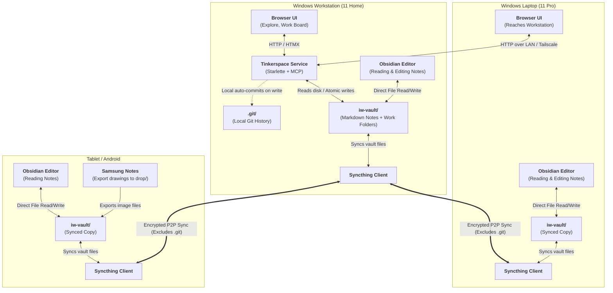

# DA-02 · Store, File Layout and Sync Topology

**Authoritative specification for vault directory structure, frontmatter schemas, atomic write rules, multi-device sync, and external file coexistence.**

Governed by `docs/InnovatorsWorkspaceVision_12.md` §07, §09, §14 and `docs/DesignPhasePlan_2.md` A2, A8, A11, D7, D20, D23.

---

## 01 · Directory Hierarchy: Code Repo vs. Datastore Vault

We maintain a strict separation between software code and data storage:
1. **`iw-code` (`tinkerspace`)**: Software application repository (Python code, MCP server, templates, tests).
2. **`iw-vault`**: Synced datastore directory (notes, work folders, inbox).

```
tinkerspace/ (Code Repo)
  ├── content/
  │   ├── activities/     # Activity templates (trade-study@1.yaml, prior-art@1.yaml)
  │   ├── workflows/      # Workflow templates (cml-2-to-4@1.yaml, a-team@1.yaml)
  │   └── policies/       # Consent policies
  ├── iw/                 # Python package (contracts, core, domain, adapters, web, mcp)
  ├── docs/               # Architectural plans and design artifacts
  └── tests/              # Contract, behaviour, and architecture test suites

iw-vault/ (Datastore Vault — Synced across devices)
  ├── friction/           # FRI-xxx notes (irritations, complaints, seedling problems)
  ├── observation/        # OBS-xxx notes (discovered facts, quotes, experiments)
  ├── idea/               # IDEA-xxx notes (mature concepts, solutions)
  ├── question/           # QUE-xxx notes (inquiry nodes, questions held open)
  ├── experiment/         # EXP-xxx notes (test protocols, prototypes)
  ├── asset/              # AST-xxx notes (standing capabilities Jared has)
  ├── artifact/           # ART-xxx notes (deliverable metadata / file registrations)
  ├── source/             # SRC-xxx notes (provenance for external PDFs, datasheets)
  ├── work/
  │   └── UOW-A01/        # Dedicated folder per work unit
  │       ├── unit.yaml   # Machine state for the work unit
  │       ├── input.pdf   # Optional input artifact(s)
  │       ├── out.md      # Produced deliverable artifact(s)
  │       └── diag.svg    # Produced diagram artifact(s)
  ├── inbox/              # Raw textual thought captures (lines, quick notes)
  ├── drop/               # Dropped files (PDF datasheets, tablet sketch exports)
  ├── .stignore           # Syncthing ignore file (.git, OS temp files)
  └── .git/               # Workstation only, EXCLUDED from sync (D20)
```

### Filename Conventions
- Note files: `<type>/YYYY-MM-DD-slug.md` (e.g. `idea/2026-08-24-cycling-display.md`).
- The date is the date of node creation and remains immutable.
- The slug is human-friendly and may change freely; **no system link ever references a file path or slug**.

---

## 02 · Frontmatter Schemas

Every node is stored as a single markdown file containing YAML frontmatter between `---` fences, followed by the markdown body.

### 1. Common Frontmatter Fields (All Node Types)

```yaml
id:            FRI-A01                                 # Required. PREFIX-A01 format
type:          friction                                # Required. Node type enum
title:         "Bike computers are $400 for 3 numbers" # Required. Single-line summary
created:       2026-08-24T19:02:00Z                   # Required. ISO 8601 UTC
author:                                                # Required on write
  kind:        human                                   # human | agent | tool | external
  courier:     web-ui                                  # web-ui | mcp-pull | sync | manual
  requested_model: null
  declared_model:  null
domain:        cycling                                 # Required. Primary domain string
tags:          [hardware, display, low-cost]           # Required. List of string tags
state:         active                                  # Required. active | parked | retired
last_touched:  2026-08-24T19:02:00Z                   # Required. ISO 8601 UTC
attrs:         {}                                      # Optional. Key-value bag for raw properties
edges:         []                                      # Optional. Structured edge relationships
```

### 2. Node-Specific Schemas

#### A. Friction (`type: friction`, prefix `FRI`)
```yaml
stem:          "There has to be a better way to..."   # Optional. Stored prompt stem used
source:        { inlet: quick-capture }                # Optional. Capture origin
```

#### B. Observation (`type: observation`, prefix `OBS`)
```yaml
origin:        observed                                # Optional. observed | networked | experimented
```

#### C. Idea (`type: idea`, prefix `IDEA`)
```yaml
cml:               2                                   # Derived: lowest of 4 scores (1-5)
worth_me:          high                                # Required. high | medium | low
worth_others:      low                                 # Required. high | medium | low
scores:
  novel:           2                                   # 1-5 (default 1 if unassessed)
  works:           3                                   # 1-5 (default 1 if unassessed)
  reach:           2                                   # 1-5 (default 1 if unassessed)
  story:           3                                   # 1-5 (default 1 if unassessed)
screening_verdict: pursue                              # Optional. pursue | park | let_go
screening_reason:  "Clear personal utility, simple hardware path."
```

#### D. Question (`type: question`, prefix `QUE`)
```yaml
form:          open                                    # Required. open | closed
importance:    high                                    # Required. high | medium | low
held_open:     true                                    # Required. True if kept actively open
```

#### E. Asset (`type: asset`, prefix `AST`)
```yaml
kind:          system                                  # Required. equipment | system | skill | material | space
state:         have                                    # Required. have | wanted | retired
```

#### F. Artifact (`type: artifact`, prefix `ART`)
```yaml
role:          report                                  # Required. report | diagram | dataset | code
produced_by:   UOW-A01                                 # Optional. Originating work unit ID (if output)
input_to:      [UOW-A02]                               # Optional. Units of work consuming this artifact
source_file:   "work/UOW-A01/report.md"                # Relative path within vault
rendered_file: null                                    # Optional. Rendered SVG/PNG path
```

#### G. Source (`type: source`, prefix `SRC`)
```yaml
inlet:         file-drop                               # Required. file-drop | email | manual
original_file: "cycling-sensor-datasheet.pdf"
mime_type:     "application/pdf"
```

---

## 03 · Work Unit Machine Schema (`unit.yaml`)

Work units are machine state, not markdown notes. They live in `work/UOW-xxx/unit.yaml`:

```yaml
id:          UOW-A01
workflow:    WFL-A01                                  # null if standalone order
subject:     [IDEA-A01]
title:       "Display technology trade study"
activity:    trade-study
assignee:
  kind:      agent                                    # human | agent | tool
  tier:      subscription                             # subscription | local | api
  model:     claude-opus-5                            # null = any
inputs:
  artifacts: [ART-A01]                                # Declared input artifact IDs
  context_nodes: [IDEA-A01, AST-A01]                  # Declared context nodes
deliverable:
  folder:    work/UOW-A01/
  outputs:
    - { role: report,  format: markdown-sections, primary: true }
    - { role: diagram, format: svg, optional: true }
estimate:    { my_time: "1-2h", size: large }
state:       ready                                    # blocked | ready | dispatched | returned | accepted | skipped | parked
template:    trade-study@1
```

---

## 04 · Atomic Write & Coexistence Rules

The service is **never the only writer** of the store. Notes are edited directly in Obsidian on the Workstation, Laptop, or Tablet, and files arrive via sync.

### Testable Write Rules

1. **STORE-WRITE-01 (Atomic Rename)**: Every write operation must write to a temporary file in the same directory (e.g. `.<filename>.tmp`) and atomically rename it into the destination path.
2. **STORE-WRITE-02 (Frontmatter Key Preservation)**: When updating frontmatter, the service modifies only the keys specified by the operation, preserving all other existing frontmatter keys verbatim.
3. **STORE-WRITE-03 (Body Preservation)**: Updating frontmatter leaves the markdown body byte-identical. Body text is rewritten only when explicitly instructed.
4. **STORE-WRITE-04 (Attribution Requirement)**: Every write initiated by the service requires an explicit `author` object with `kind` defined. Defaulting to an anonymous author is forbidden.
5. **STORE-WRITE-05 (Never Overwrite Unparseable Files)**: If a file contains invalid YAML frontmatter, the service aborts writing, leaves the file untouched, and logs it to the needs-attention list.
6. **STORE-WRITE-06 (No Path Linking)**: Links in frontmatter and prose reference entity IDs only (`IDEA-A01`), never filesystem paths.

---

## 05 · Multi-Device Sync Topology



### Git Commits vs. Remote Pushes
- **Local Auto-Commit on Write**: The service makes an automatic local Git commit in `iw-vault` whenever it writes/modifies a note (`git commit -m "update FRI-A01: ..."`).
- **Manual Remote Push**: Pushing commits to the private remote (`git push origin main`) is performed **manually by Jared** at the end of a working session (or on-demand). The service does not make network calls to push automatically.

### Deliberate Exclusions
1. **Git never runs on or syncs to the Tablet**: Mobile Git clients are unreliable and cause repository corruption. Git runs strictly on the Workstation.
2. **The Tablet never connects to the IW Service**: The tablet interacts exclusively with files in `iw-vault` via Obsidian.
3. **The Service never watches files in the background**: Changes from sync or Obsidian are discovered when the service scans or reads on user interaction.

---

## 06 · `inbox/` vs. `drop/` Purpose

| Folder | Primary Content | Typical Workflow |
|---|---|---|
| **`iw-vault/inbox/`** | **Raw textual thought captures** (quick text lines, short notes captured away from desk). | Processed during the rapid **Keyboard Triage pass** into typed nodes (`friction`, `idea`, `observation`, `question`, `asset`). |
| **`iw-vault/drop/`** | **Standalone reference files and media** (PDF datasheets, Samsung Notes sketch exports, photos of whiteboard, diagrams). | Processed during **Intake** to create stub nodes with the attached file or link as an artifact/source. |

*(Note: Triage handles any file found in either directory seamlessly).*

---

## 07 · Conflict Handling & Needs-Attention List

### Sync Conflicts
- When Syncthing detects concurrent offline edits, it saves the conflicting file as `<filename>.sync-conflict-<date>-<time>-<node>.<ext>`.
- The service identifies `.sync-conflict-*` files during store scanning, puts them on the in-memory **Needs-Attention List**, and never attempts automatic merging.

### Malformed / Broken Frontmatter
- If a note file fails YAML parsing or is missing a valid `id`, it is flagged on the Needs-Attention list with the parsing error. The service ignores the invalid file during ID resolution and search indexing, preventing crashes.

---

## 08 · Startup and Index Revisit Trigger (A8 / D5)

1. **Phase 1 (No Database Index)**:
   - On startup or on-demand query, the service performs an in-memory scan of markdown frontmatter across the vault directory.
   - For a corpus of ~100 ideas and several hundred questions/observations, direct scan takes < 50ms.
2. **Revisit Trigger for Phase 2 SQLite Index**:
   - **Trigger Condition**: When opening the Explore view takes **> 2.0 seconds** on the workstation.
   - When triggered, a derived, disposable SQLite index is introduced (D5).
