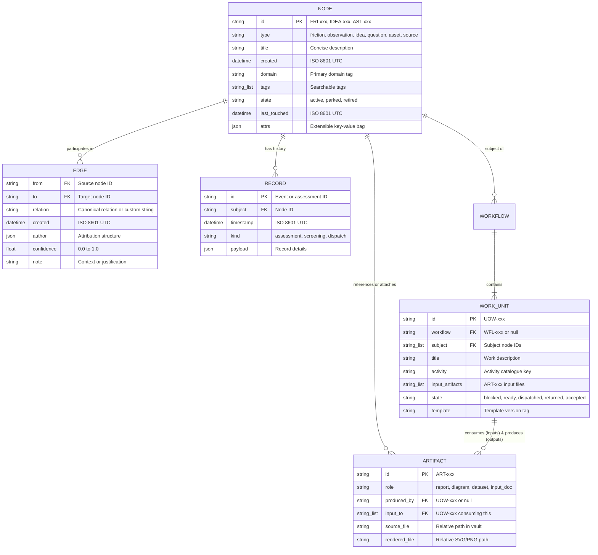

# DA-03 · Data Model Reference

**Complete field-level specifications for nodes, flexible edge vocabulary, authored vs. derived field lifecycle, and entity-relationship model.**

Governed by `docs/InnovatorsWorkspaceVision_12.md` §09, §11, §13, §14 and `docs/DesignPhasePlan_2.md` DA-03.

---

## 01 · Entity-Relationship Diagram (ERD)



---

## 02 · Edge Relations: Canonical Vocabulary & Open Flexibility

### Open Flexibility Rule
The `relation` field in an Edge is stored as an **open string**. You are not restricted to an immutable enum; you can define custom relationship names during triage or note editing at any time.

### Canonical 19 Relations
To enable automated graph rendering (e.g. question graphs, maturity calculations, workflow chaining), the system recognizes 19 standardized relations with defined directionality:

| # | Relation Name | From Node | To Node | Directional Meaning |
|---|---|---|---|---|
| 1 | **`raises`** | Friction / Observation / Idea | Question | `from` brings up or triggers inquiry in `to` |
| 2 | **`answers`** | Idea / Observation / Experiment | Question | `from` resolves or provides an answer for `to` |
| 3 | **`addresses`** | Idea / Experiment | Friction | `from` offers a solution or mitigation for `to` |
| 4 | **`evidence_for`** | Observation / Experiment / Source | Idea / Question | `from` provides supporting evidence for `to` |
| 5 | **`evidence_against`** | Observation / Experiment / Source | Idea / Question | `from` provides refuting evidence against `to` |
| 6 | **`contradicts`** | Node | Node | `from` factually conflicts with statement in `to` |
| 7 | **`duplicate_of`** | Node (duplicate) | Node (canonical) | `from` is a duplicate of original node `to` |
| 8 | **`refines`** | Idea / Question | Idea / Question | `from` clarifies, details, or specializes `to` |
| 9 | **`supersedes`** | Node (successor) | Node (predecessor) | `from` obsoletes and replaces `to` |
| 10 | **`derived_from`** | Idea / Asset | Parent Node(s) | `from` originated from concept/material in `to` |
| 11 | **`produced_by`** | Artifact | Unit of Work | `from` was generated during execution of `to` |
| 12 | **`illustrates`** | Artifact (Drawing/Diagram) | Node | `from` visually depicts or charts `to` |
| 13 | **`cites`** | Node | Source / Artifact | `from` references external publication or file `to` |
| 14 | **`broadens`** | Question | Question | `from` expands the inquiry scope of `to` |
| 15 | **`narrows`** | Question | Question | `from` focuses the inquiry scope of `to` |
| 16 | **`presupposes`** | Question / Idea | Question / Assumption | `from` takes for granted the prior truth of `to` |
| 17 | **`reframes`** | Question / Idea | Question / Idea | `from` shifts the paradigm or perspective of `to` |
| 18 | **`rejected_because`** | Candidate Idea / Option | Observation / Finding | `from` was screened out due to criteria in `to` |
| 19 | **`enables`** | **Asset** | **Idea / Experiment** | **`from` (standing capability) makes `to` reachable** |

> [!IMPORTANT]
> **Direction of `enables`**: `AST-A01 (Asset)` → `IDEA-A01 (Idea)`. The asset is the enabler; the idea is the beneficiary.

---

## 03 · Frontmatter Fields of a Node (`.md` Note File)

The table below specifies all YAML frontmatter fields stored inside each individual node's `.md` file, distinguishing between directly authored fields and system-derived fields.

Per V§14.15, **a note carries its own state**. Derived fields are never calculated solely at display time in a view; they are materialized directly into the file's YAML frontmatter.

| Frontmatter Field | Nature | Default Value | Write Trigger Event |
|---|---|---|---|
| `id` | Authored | Auto-allocated | Initial file creation |
| `type` | Authored | Required | Triage or manual authoring |
| `title` | Authored | Required | Triage or note edit |
| `domain`, `tags` | Authored | Required | Triage or note edit |
| `state` | Authored | `active` | User state change (`active`, `parked`, `retired`) |
| `worth_me`, `worth_others` | Authored | Required on Idea | User evaluation in Triage / Node view |
| `scores.novel` | Derived | `1` | Prior-art survey completion or self-assessment |
| `scores.works` | Derived | `1` | Proof-of-concept trial or assessment |
| `scores.reach` | Derived | `1` | Parts-and-skills survey read against assets |
| `scores.story` | Derived | `1` | Pitch draft review or self-assessment |
| `cml` | Derived | `1` | Recomputed automatically as `min(novel, works, reach, story)` |
| `screening_verdict` | Derived | `null` | Completion of screening assessment activity |
| `last_touched` | Derived | Timestamp on write | Any write operation touching the note |

### Recompute Command (V§14.18)
All derived fields can be recomputed deterministically from store files using a single CLI command:
```bash
uv run tinkerspace recompute
```
Executing this command on a clean repository produces **byte-identical** file frontmatter.

---

## 04 · The `attrs{}` Bag Graduation Procedure

To prevent premature data modeling, new experimental attributes start in the `attrs{}` dictionary.

### The Graduation Rule (V§14.20)
A key lives in `attrs{}` until code logic branches on it. The moment:
1. A UI view filters, sorts, or renders specially based on the key, OR
2. A workflow rule or domain service gates logic on the key,

The key **graduates** out of `attrs{}` to become a first-class typed property in the schema.
