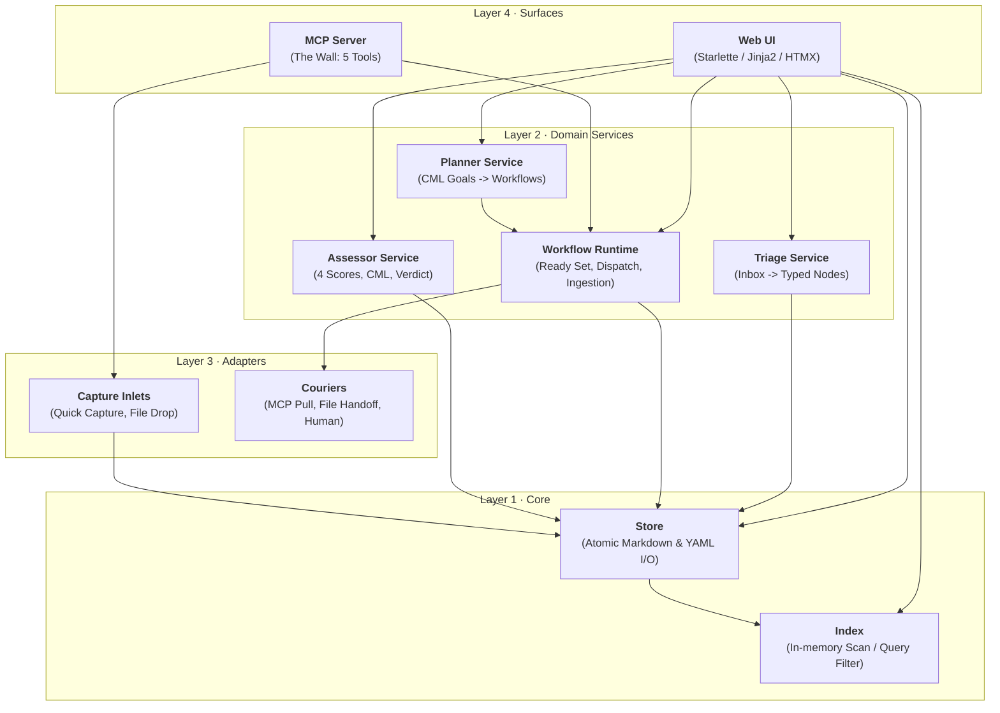

# DA-04 · Component and Interface Map

**The 4-layer component architecture, Python `Protocol` interfaces, interaction flowchart, and the independence verification test.**

Governed by `docs/InnovatorsWorkspaceVision_12.md` §07, §10, §14 and `docs/DesignPhasePlan_2.md` DA-04.

---

## 01 · Component Interaction Flowchart

---

## 02 · Layer Invariants & Interface Summary

All public interfaces are strictly specified as `@runtime_checkable` Python `Protocol` definitions in `iw/contracts/`.

| Component | Layer | Protocol Interface | File Location | Max Methods |
|---|:--:|---|---|:--:|
| **Store** | 1 | `StoreProtocol` | `iw/contracts/store.py` | 6 (≤ 7) |
| **Index** | 1 | `IndexProtocol` | `iw/contracts/index.py` | 3 (≤ 7) |
| **Triage** | 2 | `TriageProtocol` | `iw/contracts/triage.py` | 3 (≤ 7) |
| **Workflow** | 2 | `WorkflowProtocol` | `iw/contracts/workflow.py` | 4 (≤ 7) |
| **Courier** | 3 | `CourierProtocol` | `iw/contracts/courier.py` | 2 (≤ 7) |
| **Capture Inlet** | 3 | `CaptureInletProtocol` | `iw/contracts/capture.py` | 1 (≤ 7) |

### Layer Dependency Rules (Verified by `tests/arch/test_architecture.py`)
1. `iw/contracts/` imports ONLY standard library typing, dataclasses, and enum. Zero implementations allowed.
2. `iw/core/` and `iw/domain/` import ONLY `iw.contracts`, stdlib, and YAML parser. They NEVER import `iw.adapters`, `iw.web`, `iw.mcp`, or third-party web/network libraries.
3. `iw/adapters/`, `iw/web/`, and `iw/mcp/` implement protocols defined in `iw/contracts/`.

---

## 03 · The "Delete Every Other Tool" Review Test (V§07)

> **Question**: *Could I delete every other tool today and still capture, read, triage, plan, dispatch, and review?*

### The Written Answer
**Yes, unconditionally.**

1. **Capture**: Can be performed via desktop Web UI, or by manually typing a text file into `iw-vault/inbox/`.
2. **Read**: Every node is plain markdown with frontmatter, readable in any generic text editor or terminal pager on any device.
3. **Triage**: Handled by the built-in keyboard triage surface in `iw/web/` without external plugins.
4. **Plan & Dispatch**: Work units live in `work/UOW-xxx/unit.yaml`; dispatches work over local MCP pull, or via manual file handoff to any text file.
5. **Review**: Result artifacts are plain markdown/SVG files displayed in the built-in Node and Workflow views.

The Tinkerspace architecture requires no external SaaS subscriptions, no proprietary databases, and no closed note-app plugin ecosystems.
