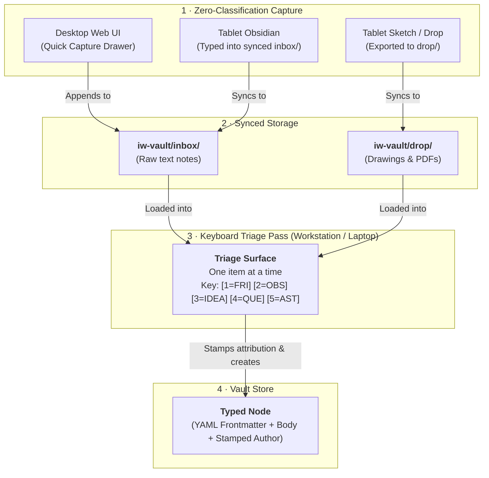

# DA-05 · Capture, Inbox and Triage Design

**Frictionless zero-classification thought capture, raw inbox and drop directory semantics, and rapid keyboard-driven triage.**

Governed by `docs/InnovatorsWorkspaceVision_12.md` §04, §07, §14 and `docs/DesignPhasePlan_2.md` DA-05.

---

## 01 · Zero-Classification Capture Principles

Per V§14.10, **capture never requires classification**:
- If logging an irritation or idea requires picking a category, domain, or tag, the thought goes unlogged.
- Berger's three stems are presented as optional prompts, never required fields:
  > - *"I don't like..."*
  > - *"There has to be a better way to..."*
  > - *"I wish..."*
- **Assets are captured identically**: An asset (e.g., *"Got a new solder station"* or *"I know how to write C on ARM"*) is typed as an ordinary sentence in the inbox and classified as an `asset` during triage. There is no separate asset intake form.

---

## 02 · `inbox/` vs. `drop/` Purpose and Workflows

| Location | Intended Contents | Typical Device / Source | Intake & Triage Path |
|---|---|---|---|
| **`iw-vault/inbox/`** | **Raw textual thoughts** (short notes, quick lines, text files created on tablet/phone/desktop). | Obsidian on tablet/phone, desktop quick-capture drawer, appended lines. | Processed via the fast **Keyboard Triage pass** into typed nodes (`friction`, `idea`, `observation`, `question`, `asset`). |
| **`iw-vault/drop/`** | **Standalone reference files & media** (PDF datasheets, Samsung Notes sketch exports, photos of whiteboard, diagrams). | Exported from drawing apps, saved PDFs, dropped files. | Processed during **Intake** into stub notes with the file attached or registered as an artifact/source. |

*(Note: The triage service scans both folders seamlessly — if a text note is placed in `drop/` or an image in `inbox/`, it is ingested cleanly without error).*

---

## 03 · Phase 1 Capture Routes

| Route | Mechanism | Device | Requires IW Service? |
|---|---|---|:--:|
| **1. Desktop Quick Capture** | Hotkey / web drawer (`Ctrl+K`) in the browser UI. | Workstation / Laptop | Yes |
| **2. Tablet Synced Text Note** | Writing a raw `.md` file in `iw-vault/inbox/` using Obsidian. | Tablet / Mobile | **No** |
| **3. File / Sketch Drop** | Dropping an exported drawing (PNG/SVG) or datasheet into `iw-vault/drop/`. | Tablet / Workstation | **No** |

*Explicitly Deferred Routes (Phase 3+):* Automatic email-to-self inbox polling, automated audio voice-note transcription pipeline, dedicated mobile client apps.

---

## 04 · Raw Inbox Record Format

A raw inbox record must be so simple that a note typed in a text editor on an airplane with no network is a valid record.

### Format A: Single File in `iw-vault/inbox/`
File: `iw-vault/inbox/2026-08-29-123456.md`
```markdown
Bike computer batteries die in 5 hours when backlight is on full. Why not use a reflective memory LCD that uses microwatts?
```
*(No frontmatter or metadata required; the service generates ID upon ingest).*

### Format B: Line in `iw-vault/inbox/quick.txt`
```text
Bike computers are $400 and I just want three numbers
Jeep trail-camera rig works but video stream drops over 15ft
```

---

## 05 · Capture to Triage Flowchart



---

## 06 · Rapid Keyboard Triage Protocol

Triage is designed for processing 20 items in under 3 minutes without touching the mouse.

```text
+----------------------------------------------------------------------------------------------------+
| [Tinkerspace]   TRIAGE PASS (Item 3 of 12)                                        [Esc: Save & Exit] |
+----------------------------------------------------------------------------------------------------+
|                                                                                                    |
|  RAW INBOX TEXT:                                                                                   |
|  "Bike computers are $400 and I just want speed, distance, and time on a clear screen."            |
|                                                                                                    |
|  TYPE SELECTION:                                                                                   |
|  [1] Friction (f)   [2] Observation (o)   [3] Idea (i)   [4] Question (q)   [5] Asset (a)          |
|                                                                                                    |
|  PROPOSED METADATA:                                                                                |
|  Title:   [ Bike computers are $400 for 3 numbers_________________________________ ]               |
|  Domain:  [ cycling___________ ]   Tags: [ hardware, display, low-cost____________ ]               |
|                                                                                                    |
|  ACTIONS:                                                                                          |
|  [Enter] Accept & Create Node       [d] Defer to Later       [m] Merge to Existing Node            |
|  [x] Discard Item                   [Tab] Edit Fields        [b] Add Candidate Edge Link           |
|                                                                                                    |
+----------------------------------------------------------------------------------------------------+
```

### Keyboard Shortcuts Table

| Key | Action | Behavior |
|---|---|---|
| `1` or `f` | Select Type: **Friction** | Sets type to `friction`, prefix `FRI-` |
| `2` or `o` | Select Type: **Observation** | Sets type to `observation`, prefix `OBS-` |
| `3` or `i` | Select Type: **Idea** | Sets type to `idea`, prefix `IDEA-` |
| `4` or `q` | Select Type: **Question** | Sets type to `question`, prefix `QUE-` |
| `5` or `a` | Select Type: **Asset** | Sets type to `asset`, prefix `AST-` |
| `d` | **Defer** | Skips item, keeping it in `inbox/` for the next triage pass |
| `m` | **Merge** | Prompts for target node ID to append text or create edge |
| `x` | **Discard** | Deletes raw inbox item |
| `Enter` | **Accept** | Creates atomic node file, stamps attribution, removes from inbox, loads next item |
| `Esc` | **Exit** | Saves state and returns to Explore view |

---

## 07 · Attribution Stamping on Synced Notes

- Notes appearing via sync have no attribution metadata until triage.
- When accepted at triage, the service stamps:
  ```yaml
  author:
    kind: human
    courier: triage-surface
    requested_model: null
    declared_model: null
  ```
- This ensures every single typed node in `iw-vault` has a non-null, unambiguous author (STORE-WRITE-04).
