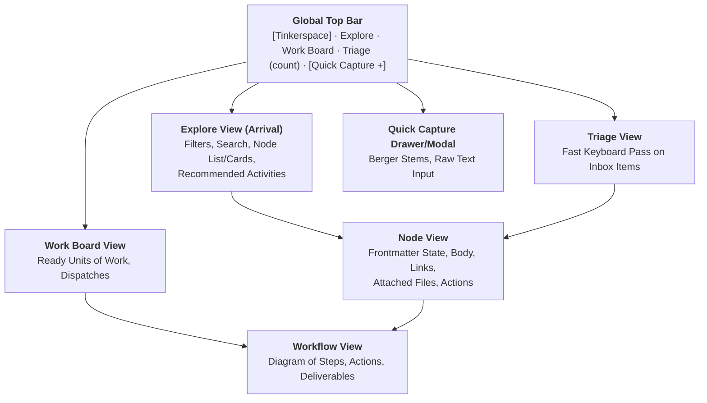

# DA-06 · UI Surface Map and Wireframes

**Desktop-class web UI layout, navigation topology, and low-fi wireframes for Explore and Node views.**

Governed by `docs/InnovatorsWorkspaceVision_12.md` §07, §10 and `docs/DesignPhasePlan_2.md` A5, A12.

---

## 01 · Surface Map and Navigation Topology

The web UI is served as a local ASGI web application (Starlette + Jinja2 + HTMX) designed exclusively for the **Workstation** and **Laptop**. There are no mobile breakpoints, touch targets, or responsive collapses (A12).



---

## 02 · Global Layout Conventions

1. **Header Bar**:
   - Left: System logo / home link (`Tinkerspace`).
   - Center: Navigation tabs (`Explore`, `Work Board`, `Triage (N)`).
   - Right: Quick Capture trigger hotkey button (`[+ Capture]` / `Ctrl+K`), vault status indicator.
2. **Prominent, Copyable IDs**:
   - Every node and work unit displays its uppercase ID (`FRI-A01`, `IDEA-B12`, `UOW-C04`) in bold monospace with a one-click copy button.
3. **Action Triggers**:
   - Actions (e.g. *Edit*, *Assess*, *Plan Workflow*, *Link*, *Attach Result*) live in a clean, consistent action bar in the upper-right corner of the content card.
4. **Frontmatter-Direct Rendering (V§14.15)**:
   - On the Node view, every single metadata badge (CML, 4 scores, 2 worth ratings, state, domain, tags) reads straight from the file's YAML frontmatter.

---

## 03 · Wireframe: Explore View (Arrival Surface)

```text
+----------------------------------------------------------------------------------------------------+
| [Tinkerspace]   [ Explore ]   [ Work Board ]   [ Triage (3) ]                   [+ Quick Capture] |
+----------------------------------------------------------------------------------------------------+
|                                                                                                    |
|  Search: [ bike computer display___________________________ ]  [Filters: All Types v] [Domain v]   |
|  Tags: [x] hardware  [ ] software  [ ] cycling  [+ More]       Sort: [Last Touched v]              |
|                                                                                                    |
|  +-- RECOMMENDED ACTIVITIES (Dormant / Stale Offers) --------------------------------------------+ |
|  | * Scout: "Low-power e-ink cycling displays" (42 days since last sweep)   [Raise Sweep] [Dismiss] | |
|  | * Assess: IDEA-A04 "Magnetic trail-cam rig" (No assessment on record)    [Assess Idea] [Dismiss] | |
|  +-----------------------------------------------------------------------------------------------+ |
|                                                                                                    |
|  +-- EXPLORE RESULTS (Showing 14 items) ---------------------------------------------------------+ |
|  | [FRI-A01]  "Bike computers are $400 and I want three numbers"                 Domain: cycling  | |
|  | Type: friction | State: active | Tags: [hardware, display, low-cost]         Touched: 2d ago  | |
|  | Preview: "I don't like how existing head units cost hundreds just to show speed..."            | |
|  |-----------------------------------------------------------------------------------------------| |
|  | [IDEA-A01] "Minimalist sunlight-readable BLE handlebar number puck"           Domain: cycling  | |
|  | Type: idea | CML: 2 (Plausible) | Worth: High(me) / Low(others)              Touched: 1w ago  | |
|  | Scores: Novel:2 | Works:3 | Reach:2 | Story:3                                                 | |
|  | Links: 2 in-links (derived_from FRI-A01, enables AST-A01) | 1 workflow active (WFL-A01)        | |
|  |-----------------------------------------------------------------------------------------------| |
|  | [AST-A01]  "Jeep trail-camera rig"                                            Domain: auto     | |
|  | Type: asset | Kind: system | State: have | Tags: [raspberry-pi, video, 12v]                     | |
|  +-----------------------------------------------------------------------------------------------+ |
+----------------------------------------------------------------------------------------------------+
```

---

## 04 · Wireframe: Node View (Single Item Surface)

Every field marked with `[FM]` is read directly from YAML frontmatter:

```text
+----------------------------------------------------------------------------------------------------+
| [Tinkerspace]   [ < Back to Explore ]                                           [+ Quick Capture] |
+----------------------------------------------------------------------------------------------------+
|                                                                                                    |
|  [FM: type] IDEA   [FM: id] IDEA-A01                            [FM: state] active                 |
|  ===============================================================================================  |
|  [FM: title] "Minimalist sunlight-readable BLE handlebar number puck"                              |
|                                                                                                    |
|  [ ACTIONS: [ Edit Note ]   [ Assess / Rescore ]   [ Plan Workflow ]   [ Add Link ] ]              |
|  ------------------------------------------------------------------------------------------------  |
|  [FM: domain] cycling         [FM: tags] [hardware] [ble] [low-power] [display]                    |
|  [FM: author] Jared (human)   [FM: created] 2026-08-24        [FM: last_touched] 2026-08-28        |
|                                                                                                    |
|  +-- MATURITY & WORTH RATINGS -------------------------------------------------------------------+ |
|  |  CML: [ 2 · Plausible ]        Worth to me: [ High ]        Worth to others: [ Low ]          | |
|  |  Scores:  Novel: [ 2 ]    Works: [ 3 ]    Reach: [ 2 ]    Story: [ 3 ]                        | |
|  |  Screening Verdict: [ Pursue ] (Assessed 2026-08-25 via human review)                          | |
|  +-----------------------------------------------------------------------------------------------+ |
|                                                                                                    |
|  +-- NOTE PROSE (Markdown Body) -----------------------------------------------------------------+ |
|  |                                                                                               | |
|  |  A dedicated, ultra-low-power handlebar puck that pairs with a phone in a jersey pocket.      | |
|  |  The phone computes GPS speed, grade, and cadence; the puck is a pure display slave.         | |
|  |                                                                                               | |
|  |  Key Design Constraints:                                                                     | |
|  |  1. Sunlight visibility is non-negotiable (Memory LCD or transflective segment).              | |
|  |  2. Battery life > 100 hours on a coin cell.                                                 | |
|  |                                                                                               | |
|  +-----------------------------------------------------------------------------------------------+ |
|                                                                                                    |
|  +-- TYPED RELATIONSHIPS & GRAPH EDGES ----------------------------------------------------------+ |
|  |  Inbound:                                                                                     | |
|  |    <- [derived_from]  FRI-A01 ("Bike computers are $400 and I want three numbers")             | |
|  |  Outbound:                                                                                    | |
|  |    -> [enables]       AST-A02 ("NRF52 BLE Dev Kit")                                           | |
|  |    -> [raises]        QUE-A01 ("Can a transflective segment LCD be driven with 3 GPIOs?")     | |
|  +-----------------------------------------------------------------------------------------------+ |
|                                                                                                    |
|  +-- ATTACHMENTS & WORKFLOW ARTIFACTS -----------------------------------------------------------+ |
|  |  * [ART-A01] Display tech trade study report (from UOW-A01)                                    | |
|  |  * [ART-A02] Schematic diagram: puck_block_diagram.svg [View] [Open Source]                   | |
|  +-----------------------------------------------------------------------------------------------+ |
+----------------------------------------------------------------------------------------------------+
```
