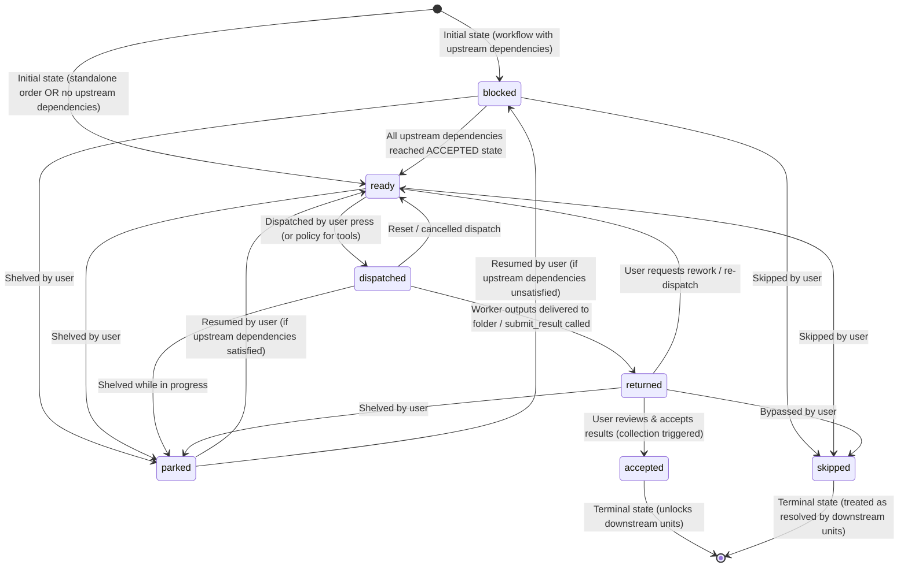
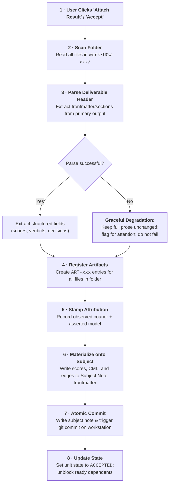
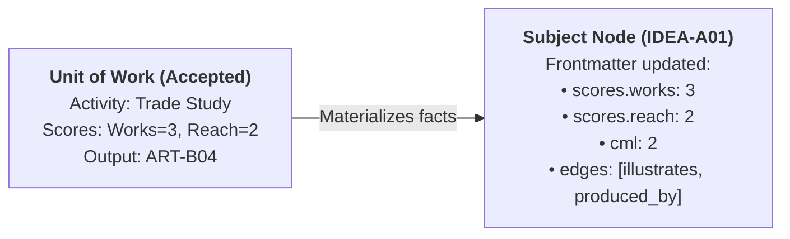

# DA-09 · Unit-of-Work Lifecycle Spec

**The operational lifecycle, state machine, dispatch rules, folder isolation, collection pipeline, attribution stamping, and frontmatter materialization for units of work.**

Governed by `docs/InnovatorsWorkspaceVision_12.md` §05, §06, §14 and `docs/DesignPhasePlan_2.md` DA-09.

---

## 01 · Unit-of-Work State Machine

Every unit of work (`UOW-xxx`) travels an identical lifecycle, whether it is part of a multi-step workflow (`WFL-xxx`) or a standalone order.



### State Definitions

| State | Definition | Inbound Transitions | Outbound Transitions | Downstream Effect |
|---|---|---|---|---|
| **`blocked`** | Waiting on one or more unfinished upstream predecessor units in its workflow. | Workflow instantiation. Resumed from `parked`. | `ready`, `parked`, `skipped` | Downstream units remain blocked. |
| **`ready`** | All upstream prerequisites are `accepted`; ready for human action or agent dispatch. | Standalone creation; all dependencies `accepted`; dispatch reset; rework requested from `returned`. | `dispatched`, `parked`, `skipped` | Sits on Work Board ready set. |
| **`dispatched`** | Order has been issued to assignee via named courier; worker is executing. | Explicit user dispatch click (Agent/Human) or policy execution (Tool). | `returned`, `ready`, `parked` | Visible on board as active work. |
| **`returned`** | Worker has delivered files to `work/UOW-xxx/` or called `submit_result`; awaiting review. | Agent calls `submit_result` or file detected in unit folder. | `accepted`, `ready` (rework), `parked`, `skipped` | Notifies user to review & collect. |
| **`accepted`** | Jared reviewed and approved outputs. Artifacts attached, attribution stamped, subject updated. | Explicit user click ("Attach Result" / "Accept"). | *None* (Terminal) | Unblocks downstream dependent units. |
| **`skipped`** | Jared explicitly bypassed this unit without executing it. | User action from `blocked`, `ready`, or `returned`. | *None* (Terminal) | Treated as resolved; does not block dependents. |
| **`parked`** | Shelved/held by Jared without cancellation or execution. | User action from `blocked`, `ready`, `dispatched`, or `returned`. | `ready`, `blocked` | Held in reserve; ignored by ready-set. |

---

## 02 · Ready-Set Computation

Ready status is **computed on demand, never scheduled or driven by background daemons** (V§14.4).

### The Computation Rule
A unit of work `U` evaluates to `ready` if and only if:
1. `U.state` is not `accepted`, `skipped`, or `parked`; AND
2. Either:
   - `U.workflow_id` is `null` (standalone order), OR
   - Every predecessor unit `P` where `P -> U` in the workflow graph has `P.state == accepted` (or `P.state == skipped`).

```python
def compute_ready_set(workflow: Workflow, units: list[UnitOfWork]) -> list[UnitOfWork]:
    """Compute all units eligible for dispatch. No background watcher."""
    accepted_ids = {u.id for u in units if u.state in (UnitState.ACCEPTED, UnitState.SKIPPED)}
    ready_units: list[UnitOfWork] = []
    
    for unit in units:
        if unit.state not in (UnitState.BLOCKED, UnitState.READY):
            continue
        # Predecessors are units that produce input_artifacts for this unit
        predecessor_ids = workflow.get_predecessors(unit.id)
        if all(pred_id in accepted_ids for pred_id in predecessor_ids):
            ready_units.append(unit)
            
    return ready_units
```

---

## 03 · Dispatch Semantics & Couriers

Dispatch transitions a unit from `ready` to `dispatched`.

### What Dispatch Does
1. **Ensures Directory**: Creates `iw-vault/work/<UOW-id>/` if it does not exist.
2. **Generates Order Spec**: Writes `unit.yaml` into the folder containing:
   - Full instructions and prompts from the activity template.
   - Declared input artifact references (paths or content summaries).
   - Expected deliverable schema and primary output name.
3. **Seeds Human Template (if `assignee.kind == human`)**:
   - Generates a starter markdown file `deliverable.md` pre-headed with expected section headings (`## Criteria`, `## Options`, `## Recommendation`).
4. **Logs Event**: Records an immutable `unit.dispatched` entry in `events.jsonl`.
5. **Updates State**: Sets `state: dispatched` in unit metadata.

### What Dispatch Does NOT Do
- **No Autonomous Execution of Metered Calls**: Anything consuming external AI subscription or API tokens requires an explicit button press by Jared in the UI.
- **No Store Path Leakage**: No absolute filesystem paths, database names, or whole-vault directories are exposed to agent workers.
- **No Background Daemon Execution**: No daemon thread monitors worker progress.

### The Four Couriers

| Courier | Mechanism | Worker Experience |
|---|---|---|
| **MCP pull** | Agent calls `get_step("UOW-xxx")`, receives declared context via `fetch_context`, and submits files via `submit_result`. | Primary AI path. Vendor-neutral across Claude Desktop, Claude Code, Antigravity, Cowork. |
| **File handoff** | Service writes self-contained prompt file to `drop/` or clipboard. Worker writes results to `work/UOW-xxx/`. | Zero-dependency fallback; works with any chat interface or external tool. |
| **Human (Jared)** | Pre-headed markdown template written to `work/UOW-xxx/deliverable.md`. Jared edits in Obsidian and presses *Attach Result*. | Unconstrained human thought. No forms, no field-by-field UI. |
| **Local model** | Direct local endpoint invocation (Phase 4). | Deterministic/offline tasks. |

---

## 04 · Folder Ownership & Isolation (`work/<UOW-id>/`)

Every unit of work strictly owns a dedicated folder in the vault:

```
iw-vault/
  work/
    UOW-A01/
      unit.yaml                 # Task specification, assignee, deliverable spec
      deliverable.md            # Primary output report (authored by human or agent)
      block-diagram.svg         # Secondary output artifact
      raw-data.csv              # Attached data file
```

### Isolation & Hospitality Rules
1. **Exclusive Ownership**: Only the assigned worker and Jared write into `work/<UOW-id>/`.
2. **Open Ingestion of Extra Files**: The deliverable spec defines expected outputs (e.g. primary report). However, if an agent or human creates additional files (extra drawings, logs, references), **all files are ingested and attached**. Extra files are never deleted, rejected, or ignored.
3. **Clean Separation from Store**: Work folder contents do not enter the main corpus graph (`NODE`, `EDGE`) until the collection step is explicitly executed.

---

## 05 · Collection Procedure & Data Loss Prevention

Collection occurs **only when Jared clicks "Attach Result" or "Accept"** on a unit.



### Data Loss Prevention & Robustness Analysis

| Hazard | Risk | Prevention / Resolution Rule |
|---|---|---|
| **Unparseable Header** | Malformed YAML frontmatter or missing sections in agent report. | **Graceful Degradation**: Never abort collection. Ingest the entire prose as a markdown artifact, attach it to the subject node, and log an attention item. |
| **Unexpected / Unlisted Files** | Agent dropped 5 files when deliverable spec only listed 1. | **Open Hospitality**: Scan entire folder directory; create `ART-xxx` node for every file discovered. |
| **Sync Race on Collection** | Tablet syncs an edit while workstation collects. | **Atomic Writes & Disk Hit**: Reads always read fresh from disk (A11). Writes use tempfile + rename. |
| **Filename Collisions** | Two steps produce `diagram.png`. | Artifact nodes use unique IDs (`ART-A01`, `ART-A02`) and store vault-relative paths. |
| **Re-collection / Rework** | Jared edits output and collects again. | Collection is idempotent. Re-running updates existing artifact nodes and subject frontmatter without duplicating edges. |

---

## 06 · Attribution Stamping Rules

Attribution differentiates between what the system **observed** and what the worker **asserted** (V§05):

```yaml
author:
  kind: agent                        # human | agent | tool | external
  courier: mcp-server                # OBSERVED by IW: mcp-server | file-handoff | web-ui
  requested_model: claude-opus-5     # Stated in unit specification
  declared_model: claude-opus-5-2026 # ASSERTED by worker during submission
  timestamp: 2026-08-29T15:30:00Z
```

### Attribution Invariants
1. **Observed vs Asserted**: `courier` is verified by the receiving endpoint. `declared_model` is recorded as stated by the worker. The two are never conflated.
2. **Every Write Attributed**: Every created artifact, node modification, and frontmatter update carries the full `Author` block.
3. **No Anonymous Overwrites**: Synced files without attribution receive `kind: external` during ingest, stamped with the sync detection timestamp.

---

## 07 · Materialization onto Subject Nodes (V§14.15)

Per V§14.15, **a note carries its own state**. When a unit of work reaches `accepted`, its facts are materialized directly into the YAML frontmatter of the subject node(s):



### Materialized Fields
1. **Maturity Scores**: If the activity produced evaluated criteria, update `scores.novel`, `scores.works`, `scores.reach`, or `scores.story`.
2. **Derived CML**: Recompute `cml = min(scores.novel, scores.works, scores.reach, scores.story)`.
3. **Screening Verdict**: If the activity was a screening assessment (e.g. Heilmeier or convergent screen), update `screening_verdict: pass | reject | hold`.
4. **Edges**:
   - `produced_by`: Link output artifacts to the unit.
   - `illustrates` / `evidence_for` / `evidence_against`: Link output artifacts directly to the subject node.
5. **Last Touched**: Stamped with current UTC timestamp.

---

## 08 · Action Guidance & Operational Hand-off ("What To Do" Contract)

To make execution frictionless and transparent, every unit of work produces a plain-English **Action Guide**. This removes all ambiguity about who is doing what, where inputs reside, where outputs belong, and how to resume.

### The Five Invariant Questions
Every Action Guide explicitly answers:
1. **Who is assigned?** (`human: Jared` | `agent: claude-opus-5` | `tool: pdf-extractor`).
2. **Where are the inputs?** (Folder `work/<UOW-id>/inputs/`, declared artifacts `ART-xxx`, or context).
3. **What is the task?** (The core activity instructions and prompt).
4. **What output is expected and where?** (Target file `work/<UOW-id>/deliverable.md`, required format/sections).
5. **What is the resume action?** (The exact button to press or API call to make once work is complete).

---

### Manifestation Across the Four Surfaces

#### 1. In `iw-vault/work/<UOW-id>/unit.yaml`
```yaml
id: UOW-A01
title: "Trade study: display tech for cycling computer"
activity: trade-study
state: ready
assignee:
  kind: human
  name: Jared
inputs:
  folder: work/UOW-A01/
  artifacts: [ART-A01, ART-A04]
deliverable:
  target_file: work/UOW-A01/deliverable.md
  format: markdown-sections
  expected_sections: [criteria, options, scores, sensitivity, recommendation]
action_guide: |
  1. ASSIGNEE: Jared (Human).
  2. INPUTS: Review referenced artifacts ART-A01 and ART-A04 in vault.
  3. TASK: Evaluate display tech trade-offs (e-ink vs memory-in-pixel vs OLED).
  4. OUTPUT: Author findings in 'work/UOW-A01/deliverable.md' under the starter headings.
  5. RESUME: Save the file in Obsidian, return to the IW Work Board, and click the [Attach Result] button.
```

#### 2. In the IW Web UI (Work Board & Unit Detail View)
Rendered as an eye-level, high-contrast action banner at the top of the unit card and detail modal:

```
┌─────────────────────────────────────────────────────────────────────────────────────────┐
│ 📋 ACTION GUIDE                                                                         │
│ • Assignee: Jared (Human)                                                               │
│ • Inputs: work/UOW-A01/ (Artifacts: ART-A01, ART-A04)                                   │
│ • Task: Evaluate display tech trade-offs across power, outdoor contrast, and refresh.   │
│ • Deliverable: work/UOW-A01/deliverable.md                                              │
│ • Next Step: Save edits in Obsidian, then click the [Attach Result] button below.       │
└─────────────────────────────────────────────────────────────────────────────────────────┘
```

#### 3. In `work/<UOW-id>/deliverable.md` (Human Starter Template)
Generated on dispatch at the top of the markdown file:
```markdown
<!--
=== IW WORK UNIT: UOW-A01 ===
Task: Trade study: display tech for cycling computer
Assignee: Jared
Inputs: ART-A01, ART-A04
Instructions: Fill in the sections below. Extra drawings or files can be saved in this folder.
When done: Save this file, return to the IW Work Board, and click [Attach Result].
-->

## Criteria

## Options

## Scores

## Recommendation
```

#### 4. In Agent Couriers (MCP `get_step` & File Handoff)
- **MCP `get_step("UOW-A01")`**: Returns `action_guide` as a top-level field in the response payload alongside structured instructions.
- **File Handoff Prompt**: Formats the 5-point action guide as the header of the exported dispatch markdown.

