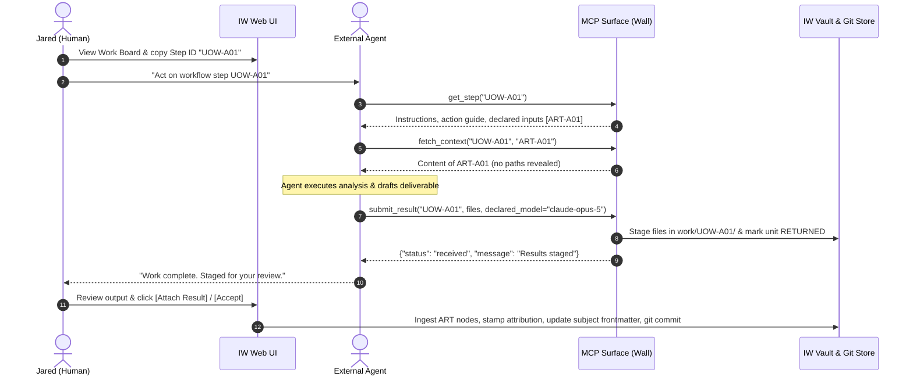

# DA-10 · MCP Surface Contract

**The authoritative JSON Schema specification, sequence diagram, Wall invariants, and negative test suite for the Model Context Protocol (MCP) surface.**

Governed by `docs/InnovatorsWorkspaceVision_12.md` §05, §10, §14.6 and `docs/DesignPhasePlan_2.md` DA-10.

---

## 01 · The Wall Principle (V§14.6)

The MCP server is **a wall, not a window**. It is the sole interface an autonomous agent interacts with.

```
┌────────────────────────────────────────────────────────────────────────┐
│                          EXTERNAL AI AGENT                             │
│       (Claude Code / Claude Desktop / Antigravity / Cowork)           │
└───────────────────────────────────┬────────────────────────────────────┘
                                    │
                       MCP JSON-RPC OVER STDIO/SSE
                                    │
                                    ▼
┌────────────────────────────────────────────────────────────────────────┐
│                        THE MCP SURFACE (WALL)                          │
│                                                                        │
│   1. list_ready()               4. submit_result()                    │
│   2. get_step(unit_id)          5. capture(text)                      │
│   3. fetch_context(unit_id, art_id)                                   │
└───────────────────────────────────┬────────────────────────────────────┘
                                    │
                                NO PASSAGE
                                    │
                                    ▼
┌────────────────────────────────────────────────────────────────────────┐
│                        ISOLATED VAULT & STORE                          │
│   • NO file system paths exposed                                       │
│   • NO vault folder structure or markdown file names                   │
│   • NO database or table names                                         │
│   • NO store-browsing or general search tools                          │
│   • NO undeclared context fetching                                     │
└────────────────────────────────────────────────────────────────────────┘
```

### The Seven Wall Invariants
1. **Zero Path Exposure**: No filesystem path, folder name (`iw-vault`, `drop`, `inbox`), or markdown filename appears in any tool argument, response body, or error message.
2. **Zero Internal Schema Leakage**: No SQL table names, database filenames, or Python class stack traces are ever emitted.
3. **No Store Enumeration**: The server exposes **no tools** for browsing, listing, or searching the corpus (`no list_nodes`, `no search_vault`, `no list_assets`).
4. **Context Gated by Declaration**: `fetch_context` strictly refuses any artifact ID that was not declared in the step's specification.
5. **No Ad-Hoc Writes**: Agents cannot edit nodes directly. `submit_result` writes strictly into the unit's isolated folder (`work/<UOW-id>/`).
6. **Uniform Bulk Delivery**: Large context (such as the capability asset list or association corpus dump) is delivered as content through declared artifacts via `fetch_context`, never via new enumeration tools.
7. **Write-Only Capture**: `capture(text)` accepts raw text and returns an acknowledgement only. It returns no node ID, reads nothing back, and reveals zero vault state.

---

## 02 · Tool Specifications (Exact JSON Schemas)

The MCP server exposes **strictly five tools**.

```json
{
  "tools": [
    "list_ready",
    "get_step",
    "fetch_context",
    "submit_result",
    "capture"
  ]
}
```

---

### Tool 1: `list_ready`
Enumerates units of work that are currently in `ready` or `dispatched` state eligible for execution.

#### Request Schema
```json
{
  "type": "object",
  "properties": {},
  "additionalProperties": false
}
```

#### Response Schema
```json
{
  "type": "object",
  "required": ["units"],
  "properties": {
    "units": {
      "type": "array",
      "items": {
        "type": "object",
        "required": ["unit_id", "title", "activity"],
        "properties": {
          "unit_id": { "type": "string", "description": "e.g. UOW-A01" },
          "title": { "type": "string", "description": "Task summary" },
          "activity": { "type": "string", "description": "Activity catalogue key" },
          "estimate": { "type": "string", "description": "e.g. 1-2h" }
        }
      }
    }
  }
}
```

#### Example Response
```json
{
  "units": [
    {
      "unit_id": "UOW-A01",
      "title": "Trade study: display tech for cycling computer",
      "activity": "trade-study",
      "estimate": "1-2h"
    }
  ]
}
```

---

### Tool 2: `get_step`
Retrieves full work instructions, action guidance, declared input artifact metadata, and deliverable specifications for an explicit unit ID.

#### Request Schema
```json
{
  "type": "object",
  "required": ["unit_id"],
  "properties": {
    "unit_id": { "type": "string", "description": "The unit ID to retrieve (e.g. UOW-A01)" }
  },
  "additionalProperties": false
}
```

#### Response Schema
```json
{
  "type": "object",
  "required": ["unit_id", "title", "activity", "instructions", "action_guide", "declared_inputs", "deliverable_spec"],
  "properties": {
    "unit_id": { "type": "string" },
    "title": { "type": "string" },
    "activity": { "type": "string" },
    "instructions": { "type": "string" },
    "action_guide": { "type": "string" },
    "declared_inputs": {
      "type": "array",
      "items": {
        "type": "object",
        "required": ["artifact_id", "role", "description"],
        "properties": {
          "artifact_id": { "type": "string" },
          "role": { "type": "string" },
          "description": { "type": "string" }
        }
      }
    },
    "deliverable_spec": {
      "type": "object",
      "required": ["primary_output", "format", "expected_sections"],
      "properties": {
        "primary_output": { "type": "string" },
        "format": { "type": "string" },
        "expected_sections": { "type": "array", "items": { "type": "string" } }
      }
    }
  }
}
```

#### Example Response
```json
{
  "unit_id": "UOW-A01",
  "title": "Trade study: display tech for cycling computer",
  "activity": "trade-study",
  "instructions": "Evaluate display technologies across outdoor contrast, power draw, and refresh rate.",
  "action_guide": "1. Review declared input ART-A01 via fetch_context. 2. Author trade study report. 3. Submit via submit_result.",
  "declared_inputs": [
    {
      "artifact_id": "ART-A01",
      "role": "requirements_doc",
      "description": "Cycling computer battery and sunlight visibility constraints"
    }
  ],
  "deliverable_spec": {
    "primary_output": "deliverable.md",
    "format": "markdown-sections",
    "expected_sections": ["criteria", "options", "scores", "sensitivity", "recommendation"]
  }
}
```

---

### Tool 3: `fetch_context`
Fetches the content of an input artifact declared by the step. Refuses undeclared artifacts.

#### Request Schema
```json
{
  "type": "object",
  "required": ["unit_id", "artifact_id"],
  "properties": {
    "unit_id": { "type": "string", "description": "The unit ID owning the context (e.g. UOW-A01)" },
    "artifact_id": { "type": "string", "description": "The declared artifact ID (e.g. ART-A01)" }
  },
  "additionalProperties": false
}
```

#### Response Schema
```json
{
  "type": "object",
  "required": ["artifact_id", "role", "content_type", "content"],
  "properties": {
    "artifact_id": { "type": "string" },
    "role": { "type": "string" },
    "content_type": { "type": "string", "description": "text/markdown, application/json, etc." },
    "content": { "type": "string" }
  }
}
```

#### Example Refusal Response (Undeclared Artifact)
```json
{
  "error": {
    "code": "UNDECLARED_CONTEXT",
    "message": "Artifact ART-X99 is not a declared input for unit UOW-A01."
  }
}
```

---

### Tool 4: `submit_result`
Submits output files, asserted model attribution, and execution notes for a dispatched unit.

#### Request Schema
```json
{
  "type": "object",
  "required": ["unit_id", "files", "declared_model"],
  "properties": {
    "unit_id": { "type": "string", "description": "The unit ID (e.g. UOW-A01)" },
    "declared_model": { "type": "string", "description": "The model asserting execution (e.g. claude-opus-5)" },
    "note": { "type": "string", "description": "Optional summary of approach or assumptions" },
    "files": {
      "type": "array",
      "minItems": 1,
      "items": {
        "type": "object",
        "required": ["name", "content"],
        "properties": {
          "name": { "type": "string", "description": "Filename without path (e.g. deliverable.md, diagram.svg)" },
          "content": { "type": "string", "description": "Text or base64 data" }
        }
      }
    }
  },
  "additionalProperties": false
}
```

#### Response Schema
```json
{
  "type": "object",
  "required": ["status", "unit_id", "files_received", "message"],
  "properties": {
    "status": { "type": "string", "enum": ["received"] },
    "unit_id": { "type": "string" },
    "files_received": { "type": "integer" },
    "message": { "type": "string" }
  }
}
```

---

### Tool 5: `capture`
Allows an agent to log a thought into Jared's inbox during conversation. Returns an acknowledgement only.

#### Request Schema
```json
{
  "type": "object",
  "required": ["text"],
  "properties": {
    "text": { "type": "string", "description": "The raw captured thought or observation" }
  },
  "additionalProperties": false
}
```

#### Response Schema
```json
{
  "type": "object",
  "required": ["status", "message"],
  "properties": {
    "status": { "type": "string", "enum": ["acknowledged"] },
    "message": { "type": "string" }
  }
}
```

---

## 03 · Dispatch Sequence Diagram

The complete end-to-end pull sequence between Jared, the external AI worker, the MCP Wall, and the store:



---

## 04 · Delivery of Declared Bulk Inputs

Certain maturation activities require bulk reference data:
1. **Parts-and-Skills Survey**: Requires Jared's standing capability **asset list** (`AST-xxx`).
2. **Association Engine**: Requires the **distilled corpus dump** (title, domain, tags, state of active ideas).

### The Invariant: Content, Never Tools
- **No `list_assets` tool**.
- **No `dump_corpus` tool**.
- **No `search_ideas` tool**.

When a step requires bulk context, the workflow runtime generates a transient snapshot artifact (e.g. `ART-ASSETS-01` or `ART-CORPUS-01`), records it in `declared_inputs`, and the agent fetches it via standard `fetch_context("UOW-xxx", "ART-ASSETS-01")`.

An agent cannot inspect, query, or discover assets unless that specific step explicitly declared them.

---

## 05 · Error Handling & Sanitization

All errors conform to a strict sanitized schema:

```json
{
  "error": {
    "code": "INVALID_STEP_ID | UNDECLARED_CONTEXT | INVALID_PAYLOAD | STEP_NOT_READY",
    "message": "Human-readable explanation describing the condition without leaking internal paths or schemas."
  }
}
```

### Sanitization Rules
- **No Path Separators**: Responses are scrubbed of `/`, `\`, `C:`, and relative paths (`../`).
- **No Stack Traces**: Python exceptions are logged server-side and mapped to safe error codes.
- **No Database Artifacts**: Terms like `sqlite3`, `table`, `column`, `row`, or SQL queries are strictly forbidden.

---

## 06 · Negative Test Suite Specification (The Wall Tests)

The following tests are defined in `tests/arch/test_architecture.py` and `tests/contract/test_mcp_wall.py` to enforce the Wall before and during server implementation:

| Test ID | Test Function Name | Assertion & Rule Verified |
|---|---|---|
| **WALL-01** | `test_mcp_surface_exposes_strictly_five_tools` | `len(server.list_tools()) == 5` and tool names match exact whitelist. |
| **WALL-02** | `test_mcp_forbids_store_enumeration_or_search_tools` | Asserts no tool contains substrings `list_`, `search_`, `query_`, `get_node`, or `browse_` except `list_ready`. |
| **WALL-03** | `test_fetch_context_refuses_undeclared_artifact_id` | Calling `fetch_context(uow, "ART-UNDECLARED")` returns `UNDECLARED_CONTEXT` refusal. |
| **WALL-04** | `test_fetch_context_refuses_node_ids_or_raw_filenames` | Calling `fetch_context(uow, "IDEA-A01")` or `fetch_context(uow, "idea.md")` fails without path leakage. |
| **WALL-05** | `test_all_tool_responses_contain_no_filesystem_paths` | Scans all tool responses with regex `(?i)(iw-vault|[a-z]:\\\\|/users/|\\.md|\\.jsonl)` and asserts zero matches. |
| **WALL-06** | `test_error_messages_contain_no_database_or_stacktrace_leakage` | Deliberately invalid calls return sanitized error bodies with zero SQL, Python, or table terms. |
| **WALL-07** | `test_capture_returns_pure_acknowledgement_without_id_or_state` | Asserts `capture("thought")` returns strictly `{"status": "acknowledged"}` with no node ID or readback. |
| **WALL-08** | `test_submit_result_rejects_path_traversal_filenames` | Filenames like `../../notes/hack.md` or absolute paths are rejected with `INVALID_PAYLOAD`. |
