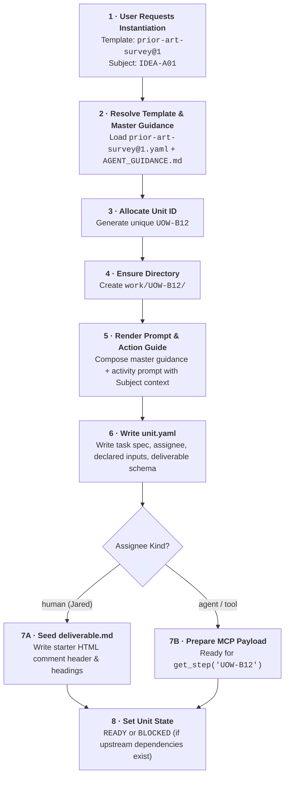

# DA-11 · Activity Template Format & Worked Templates

**The authoritative specification for activity template files, zero-code drop-in expansion, version resolution (`activity@version`), ad-hoc freeform activities, master agent guidance composition, and production-ready worked templates.**

Governed by `docs/InnovatorsWorkspaceVision_12.md` V§06, V§10, D10 and `docs/DesignPhasePlan_2.md` DA-11; integrates directly with `docs/design/DA-09-uow-lifecycle.md` and `docs/design/DA-12-deliverable-header.md`.

---

## 01 · Philosophy & The Content-Not-Code Contract (V§06, V§10)

In Innovator's Workspace, an **activity** is a named kind of work with declared inputs, expected deliverables, a structured prompt, and a defined dimension of maturity advancement.

> **V§10 (Content, not code):** *An activity is content, not code — a versioned template file in the vault, not a component of the architecture. The workflow runtime instantiates activities into units of work; adding an entry to the catalogue is writing a file, not changing the program.*

```
┌────────────────────────────────────────────────────────────────────────┐
│ THE ACTIVITY TEMPLATE CONTRACT                                         │
│                                                                        │
│  1. Zero Code & Zero Config Extension: Adding a new activity requires  │
│     NO Python code and NO central registry config file. Dropping a new │
│     YAML file into templates/activities/ is instantly live.            │
│                                                                        │
│  2. Advancement Invariant: Every activity MUST advance a named CML     │
│     dimension (Novel, Works, Reach, Story) or state (Corpus, Worth).   │
│     An activity that advances nothing is mis-scoped.                   │
│                                                                        │
│  3. Freeform & Ad-Hoc Ready: One-off custom tasks that are not worth   │
│     abstracting use the built-in freeform@1 template.                  │
│                                                                        │
│  4. Composed Master Agent Guidance: Jared's operating posture and     │
│     standards (AGENT_GUIDANCE.md) are maintained in one master file     │
│     and automatically prepended to every agent dispatch prompt.        │
│                                                                        │
│  5. DA-12 Alignment: The deliverable spec inside a template matches    │
│     the DA-12 Deliverable Header contract (Option 1 ArtifactRef).     │
└────────────────────────────────────────────────────────────────────────┘
```

### The 15 Core Activities (Starting Baseline)

The 15 activities from V§06 form the initial library. They can be refined, versioned, or expanded at any time by creating new files:

| Activity Key | Job | Origin | Advances | Default Assignee & Tier |
|---|---|---|---|---|
| **`observation-sweep`** | 2 (Corpus) | Innovator's DNA | `corpus` | Agent · Standard |
| **`association-run`** | 2 (Corpus) | Innovator's DNA | `corpus` | Local Model / Tool |
| **`questionstorm`** | 3 (Maturity) | Berger | `story`, `worth` | Agent · Standard |
| **`prior-art-survey`** | 3 (Maturity) | DARPA / Patent | `novel` | Agent · Frontier |
| **`screening-assessment`** | 3 (Maturity) | DARPA Heilmeier | `story`, `worth` | Human (Jared) or Agent · Frontier |
| **`experiment-design`** | 3 (Maturity) | Scientific Method | `works`, `reach` | Human or Agent · Frontier |
| **`divergent-architecture`** | 4 (Shape) | A-Team | `works` | Agent · Frontier |
| **`convergent-screening`** | 4 (Shape) | A-Team | `works` | Human · Jared |
| **`trade-study`** | 4 (Shape) | Team X | `works`, `reach` | Human or Agent · Standard |
| **`point-design`** | 4 (Shape) | Team X | `reach` | Human or Agent · Standard |
| **`parts-skills-survey`** | 4 (Shape) | Asset Match | `reach` | Agent · Fast / Standard |
| **`sketch-diagram`** | Any | Visual Thinking | `works`, `story` | Human (Jared on Tablet) |
| **`prototype-measure`** | 4 (Shape) | Hardware Bench | `works` | Human · Jared |
| **`story-draft`** | 4 (Shape) | PR-FAQ / Pitch | `story` | Agent · Standard |
| **`assumption-audit`** | 4 (Shape) | Discovery-Driven | `any` | Agent · Frontier |
| **`freeform`** | Any | Custom / Ad-Hoc | `any` | Human or Agent (User Choice) |

---

## 02 · Activity Template YAML Schema (~30 Lines Core Definition)

Activity templates are authored in clean, human-readable YAML:

```yaml
id: prior-art-survey
version: 1
title: "Prior-Art Survey"
description: "Adversarial survey of global patents, products, and literature to test novelty."
origin: "DARPA / Patent Search"
advances:
  dimension: novel          # novel | works | reach | story | worth | corpus | any
  target_score: 3           # Target CML score (1-5) or null
default_assignee:
  kind: agent               # agent | human | tool | external
  tier: frontier            # fast | standard | frontier
  suggested_model: "claude-opus-5-2026"
size_hint: medium           # small | medium | large
inputs:
  - name: subject
    type: node              # node | artifact | text | query
    required: true
    description: "The subject idea or mechanism to survey"
  - name: reference_artifacts
    type: list[artifact]
    required: false
    description: "Optional prior sketches or concept notes"
deliverable:
  primary_file: "deliverable.md"
  format: "markdown"
  expected_verdict: true    # pass | reject | hold
  expected_scores: [novel, works]
  starter_sections:
    - "Executive Summary"
    - "Direct & Adjacent Prior Art Analysis"
    - "Freedom-to-Operate & Novelty Verdict"
    - "Recommendations & Next Steps"
prompt_template: |
  # Task: Prior-Art Survey for {{subject.title}}
  ...
```

### Schema Field Reference

| Field | Type | Required? | Purpose |
|---|---|:--:|---|
| **`id`** | `string` | **Yes** | Unique catalogue key (e.g. `prior-art-survey`, `thermal-sim`). Lowercase slug. |
| **`version`** | `integer` | **Yes** | Major version number (e.g. `1`). Incremented on breaking prompt or deliverable changes. |
| **`title`** | `string` | **Yes** | Human-readable activity name shown in UI cards and work boards. |
| **`description`** | `string` | **Yes** | 1–2 sentence summary explaining what this activity accomplishes. |
| **`origin`** | `string` | No | Methodological origin (e.g. `DARPA Heilmeier`, `Team X`, `Berger`, `Custom`). |
| **`advances`** | `dict` | **Yes** | Declares what maturity dimension (`novel`, `works`, `reach`, `story`) or state (`worth`, `corpus`, `any`) this activity moves. |
| **`default_assignee`** | `dict` | **Yes** | Routing guidance: `kind` (`human`, `agent`, `tool`), `tier` (`fast`, `standard`, `frontier`), and `suggested_model`. |
| **`size_hint`** | `string` | **Yes** | Estimated scale: `small` (1 turn / 15m), `medium` (multi-source / 1h), `large` (deep study / bench). |
| **`inputs`** | `list[InputSpec]` | **Yes** | List of input artifacts or nodes required by the activity. |
| **`deliverable`** | `DeliverableSpec` | **Yes** | Declared output schema, expected verdict/scores, and starter headings matching DA-12. |
| **`prompt_template`** | `string` | **Yes** | Jinja2 template containing the activity instructions. |

---

## 03 · Zero-Code Extension, Versioning & Tag Resolution

### Creating a New Activity (No Code, No Config Registry)
To add a new activity (e.g. `thermal-simulation`):
1. Create `iw-vault/templates/activities/thermal-simulation@1.yaml`.
2. Populate the YAML fields and prompt.
3. **Done!** The activity is immediately discoverable in the IW UI dropdowns, work board dispatch actions, and MCP catalogue. There is **no configuration file to edit, no registry to update, and no server restart required**.

### Resolution Rules (`activity@version`)

1. **Explicit Version (`trade-study@1`)**:
   - Searches `templates/activities/trade-study@1.yaml`.
   - If multiple iterations exist (e.g. `@1.1.yaml`), resolves to the highest patch/minor version for major version 1.
2. **Unversioned Tag (`trade-study`)**:
   - Resolves to the highest available major version (e.g. `trade-study@2.yaml` over `@1.yaml`).
3. **Template Immutability**:
   - Once a unit of work (`UOW-xxx`) is instantiated, it records the exact resolved version string in `unit.yaml` (`template: "trade-study@1"`).
   - Future modifications to template files never alter past or in-flight units of work.

```python
"""Template Resolver Reference Implementation."""

import re
from pathlib import Path
from typing import Any
import yaml

VERSIONED_NAME_REGEX = re.compile(r"^([a-z0-9-]+)(?:@([0-9]+))?\.ya?ml$")


class TemplateResolver:
    """Discovers and resolves activity template files by tag and version with zero registry config."""

    def __init__(self, template_dir: Path) -> None:
        self.template_dir = template_dir

    def list_activities(self) -> list[dict[str, Any]]:
        """Scan directory and return latest version of all available activities."""
        activities: dict[str, tuple[int, Path]] = {}
        if self.template_dir.exists():
            for p in self.template_dir.glob("*.yaml"):
                m = VERSIONED_NAME_REGEX.match(p.name)
                if m:
                    name, ver = m.group(1), int(m.group(2)) if m.group(2) else 1
                    if name not in activities or ver > activities[name][0]:
                        activities[name] = (ver, p)
        
        result: list[dict[str, Any]] = []
        for name, (_, path) in activities.items():
            with open(path, "r", encoding="utf-8") as f:
                data = yaml.safe_load(f)
                if isinstance(data, dict):
                    result.append(data)
        return result

    def resolve(self, template_tag: str) -> dict[str, Any]:
        """Resolve tag like 'prior-art-survey' or 'prior-art-survey@1' to template dict."""
        if "@" in template_tag:
            name, ver_str = template_tag.split("@", 1)
            target_version = int(ver_str)
        else:
            name, target_version = template_tag, None

        candidates: list[tuple[int, Path]] = []
        if self.template_dir.exists():
            for p in self.template_dir.glob(f"{name}*.yaml"):
                m = VERSIONED_NAME_REGEX.match(p.name)
                if m and m.group(1) == name:
                    v = int(m.group(2)) if m.group(2) else 1
                    candidates.append((v, p))

        if not candidates:
            raise FileNotFoundError(f"Activity template '{template_tag}' not found in {self.template_dir}")

        if target_version is not None:
            matching = [p for v, p in candidates if v == target_version]
            if not matching:
                raise FileNotFoundError(f"Version {target_version} of template '{name}' not found.")
            target_path = matching[0]
        else:
            candidates.sort(key=lambda x: x[0], reverse=True)
            target_path = candidates[0][1]

        with open(target_path, "r", encoding="utf-8") as f:
            data = yaml.safe_load(f)
        return data
```

---

## 04 · Instantiation Mechanics (Bridging to DA-09 & DA-12)

When `workflow.instantiate_template(template_id, subject_ids)` executes:



---

## 05 · Worked Template 1: Prior-Art Survey (`prior-art-survey@1.yaml`)

This is the **complete, production-ready** prior-art survey template, written in full:

```yaml
id: prior-art-survey
version: 1
title: "Prior-Art Survey"
description: "Thorough adversarial survey of global patents, commercial products, academic papers, and prior art to test idea novelty."
origin: "DARPA / Patent Search / Novelty Verification"

advances:
  dimension: novel
  target_score: 3

default_assignee:
  kind: agent
  tier: frontier
  suggested_model: "claude-opus-5-2026"

size_hint: medium

inputs:
  - name: subject
    type: node
    required: true
    description: "The primary subject idea, mechanism, or friction note to evaluate"
  - name: reference_artifacts
    type: list[artifact]
    required: false
    description: "Optional drawings, CAD models, or technical notes attached to the subject"

deliverable:
  primary_file: "deliverable.md"
  format: "markdown"
  expected_verdict: true
  expected_scores: [novel, works]
  starter_sections:
    - "Executive Summary"
    - "Search Strategy & Sources Queried"
    - "Direct & Adjacent Prior Art Analysis"
    - "Freedom-to-Operate & Novelty Assessment"
    - "Recommendation & Follow-up Questions"
  starter_artifacts:
    - file: patent-matrix.csv
      role: output
      description: "Summary matrix of queried patents, application numbers, assignees, and expiry dates"
    - file: prior-art-timeline.svg
      role: output
      description: "Visual timeline comparing existing commercial products vs the proposed approach"

prompt_template: |
  # Mission: Prior-Art & Novelty Survey

  You are an expert patent researcher and technology scout conducting an **adversarial novelty survey** on the following idea:

  ## Subject Idea
  **ID:** {{subject.id}}
  **Title:** {{subject.title}}
  **Domain:** {{subject.domain}}
  **Description:**
  {{subject.body}}

  ---

  ## Objectives & Research Discipline
  1. **Adopt an Adversarial Posture:** Do not look to validate or defend the idea. Actively attempt to **refute its novelty** by finding direct prior art, expired foundational patents, Kickstarter/Indiegogo campaigns, academic prototypes, or commercial products with identical mechanisms.
  2. **Check Four Key Arenas:**
     - **Active & Expired Patents:** US (USPTO), European (EPO), and International (WIPO) patents.
     - **Commercial Products:** Existing market hardware, teardowns, cycling/consumer devices, industrial components.
     - **Academic Literature:** IEEE, ACM, arXiv, and university engineering labs.
     - **Adjacent Domain Transfers:** Has this exact mechanism been solved in aerospace, medical devices, or automotive?
  3. **No Hallucinations:** When citing patents, you MUST provide the real patent number (e.g. `US7812345B2`), the real assignee (e.g. `Shimano Inc.`), and the publication/expiry date. If unconfirmed, label it as `[Unverified Citation]`.

  ---

  ## Required Deliverable Output
  Author your complete report in `deliverable.md` adhering strictly to the **DA-12 Header Specification**:

  ```markdown
  ---
  unit: {{unit.id}}
  summary: "<1-2 sentence core finding: what prior art exists and whether the path is clear>"
  verdict: pass | reject | hold
  scores:
    novel: <integer 1 to 5>
    works: <integer 1 to 5>
  recommendation: "<Suggested follow-up step or trade study>"
  artifacts:
    - file: patent-matrix.csv
      role: output
      description: "Structured comparison of 3-10 relevant patents and commercial products"
    - file: prior-art-timeline.svg
      role: output
      description: "Optional diagram mapping prior art evolution"
    - file: {{subject.id}}
      role: input
      description: "Original subject concept note"
  tags: [patent, prior-art, novelty, {{subject.domain}}]
  author:
    declared_model: "{{worker.model}}"
  ---

  # Prior-Art Survey: {{subject.title}}

  ## Executive Summary
  [Concise synthesis of prior art landscape and verdict]

  ## Search Strategy & Sources Queried
  [Databases, search keywords, classification codes (CPC/IPC), and trade catalogues reviewed]

  ## Direct & Adjacent Prior Art Analysis
  [Detailed breakdown of closest 3–5 items found, comparing claims vs the proposed idea]

  ## Freedom-to-Operate & Novelty Assessment
  - **Identical Prior Art:** [None / Found]
  - **Expired Foundations:** [Public domain mechanics available to use]
  - **Active IP Risks:** [Specific patent claims to design around]

  ## Recommendation & Follow-up Questions
  [Specific engineering questions or trade studies required before proceeding]
  ```

  ### Scoring Guide for `scores.novel`:
  - **1 (Trivial/Direct Duplicate):** Direct identical commercial product or patent exists.
  - **2 (Incremental):** Obvious combination of standard off-the-shelf components.
  - **3 (Substantial Novelty):** Novel mechanism or unexpected domain transfer; clear room to operate.
  - **4 (Pioneering):** No direct precedent found in this or adjacent domains.
  - **5 (Foundational):** Creates a net-new category or mechanism.
```

---

## 06 · Worked Template 2: Screening Assessment (`screening-assessment@1.yaml`)

This is the **complete, production-ready** screening assessment template based on the **DARPA Heilmeier Catechism** and convergent gate discipline:

```yaml
id: screening-assessment
version: 1
title: "Screening Assessment (Heilmeier Catechism)"
description: "Rigorous 8-question evaluation to determine project viability, value, technical feasibility, and kill criteria."
origin: "DARPA / George Heilmeier / Shape Up Screening"

advances:
  dimension: story
  target_score: 2

default_assignee:
  kind: human
  tier: frontier
  suggested_model: null

size_hint: small

inputs:
  - name: subject
    type: node
    required: true
    description: "The idea, observation, or friction note undergoing gate screening"
  - name: prior_art
    type: artifact
    required: false
    description: "Optional prior-art survey report (ART-xxx)"

deliverable:
  primary_file: "deliverable.md"
  format: "markdown"
  expected_verdict: true
  expected_scores: [story, works, reach]
  starter_sections:
    - "1. What are we trying to do?"
    - "2. How is it done today, and what are the limits?"
    - "3. What is new in this approach and why will it succeed?"
    - "4. Who cares? If successful, what difference will it make?"
    - "5. What are the key technical and market risks?"
    - "6. How much will it cost and how long will it take?"
    - "7. What are the midterm and final exams to check for success?"
    - "8. What result would definitively KILL this idea?"
    - "Screening Verdict & Decision"
  starter_artifacts:
    - file: screening-scorecard.csv
      role: output
      description: "Heilmeier 8-point rubric evaluation matrix"

prompt_template: |
  # Mission: Heilmeier Screening Assessment

  Evaluate the following concept using George Heilmeier's famous 8-question catechism to establish project clarity, technical viability, and economic payoff before investing build effort.

  ## Subject Under Review
  **ID:** {{subject.id}}
  **Title:** {{subject.title}}
  **Domain:** {{subject.domain}}
  **Description:**
  {{subject.body}}

  ---

  ## Required Deliverable Output
  Author your evaluation in `deliverable.md` using the **DA-12 Header Specification**:

  ```markdown
  <!--
  unit: {{unit.id}}
  summary: "<1-2 sentence gate summary: pass to prototyping, park for research, or reject>"
  verdict: pass | reject | hold
  scores:
    story: <integer 1 to 5>
    works: <integer 1 to 5>
    reach: <integer 1 to 5>
  recommendation: "<Immediate next activity: e.g. trade-study, prototype-measure, or park>"
  artifacts:
    - file: screening-scorecard.csv
      role: output
      description: "8-question evaluation scorecard"
    - file: {{subject.id}}
      role: input
      description: "Subject idea note"
  tags: [screening, heilmeier, gate, {{subject.domain}}]
  -->

  # Screening Assessment: {{subject.title}}

  ### 1. What are we trying to do?
  [Articulate the objective plainly with zero jargon. What physical thing or software are we building?]

  ### 2. How is it done today, and what are the limits of current practice?
  [State current industry approaches and why they fall short or cause friction.]

  ### 3. What is new in this approach and why will it succeed?
  [What is the specific technical mechanism or insight that changes the game?]

  ### 4. Who cares? If successful, what difference will it make?
  [What is the personal or user payoff? Why is this worth building?]

  ### 5. What are the key technical and market risks?
  [Name the top 3 ways this could fail technically, economically, or ergonomically.]

  ### 6. How much will it cost and how long will it take?
  [Ballpark parts cost, development hours, and bench equipment required for a proof-of-concept.]

  ### 7. What are the midterm and final exams to check for success?
  [Define the exact measurable threshold for success: e.g. <50mW power, <$30 BOM, 100k lux readability.]

  ### 8. What result would definitively KILL this idea?
  [State the falsification criteria upfront before building.]

  ---

  ### Screening Verdict & Decision
  - **Verdict:** `PASS` (proceed to Point Design / Prototype) | `HOLD` (needs trade study) | `REJECT` (kill idea).
  - **Justification:** [Plain English rationale]
  ```

  ### Scoring Guide:
  - **`scores.story` (Clarity):** 1 (Vague thought) -> 3 (Clear problem/solution) -> 5 (Irrefutable pitch).
  - **`scores.works` (Feasibility):** 1 (Physics unproven) -> 3 (Sound principles) -> 5 (Lab bench measured).
  - **`scores.reach` (Cost/Skills):** 1 (Needs massive budget/factory) -> 3 (Standard lab tools) -> 5 (On hand today).
```

---

## 07 · Freeform & Ad-Hoc Activities (`freeform@1.yaml`)

For custom, specific, or one-off tasks related to an idea that are **not worth abstracting into a reusable catalogue activity**, Innovator's Workspace provides the built-in **`freeform`** template.

When instantiating a `freeform` activity from the UI or CLI:
1. Jared provides a custom title (e.g. *"Measure thermal rise on test bench under 2A load"*).
2. Jared provides custom prompt text / instructions directly in the dispatch form.
3. Jared selects the assignee (`human: Jared` or `agent: claude-opus-5-2026`).
4. The runtime instantiates a valid `UOW-xxx` that adheres to the same state machine, folder isolation (`work/UOW-xxx/`), deliverable parsing, and attribution stamping as any structured activity.

### Template Definition: `templates/activities/freeform@1.yaml`

```yaml
id: freeform
version: 1
title: "Freeform / Custom Task"
description: "Flexible, ad-hoc task with user-specified instructions and deliverable expectations."
origin: "Custom User Action"

advances:
  dimension: any
  target_score: null

default_assignee:
  kind: human
  tier: standard
  suggested_model: null

size_hint: small

inputs:
  - name: subject
    type: node
    required: true
    description: "The subject idea or node this custom task addresses"
  - name: reference_artifacts
    type: list[artifact]
    required: false
    description: "Optional input artifacts"

deliverable:
  primary_file: "deliverable.md"
  format: "markdown"
  expected_verdict: false
  expected_scores: []
  starter_sections:
    - "Task Objective & Notes"
    - "Observations & Findings"
    - "Next Actions"
  starter_artifacts: []

prompt_template: |
  # Task: {{task_title | default(subject.title)}}

  ## Subject Context
  **ID:** {{subject.id}}
  **Title:** {{subject.title}}
  **Domain:** {{subject.domain}}
  {{subject.body}}

  ---

  ## Custom Instructions
  {{custom_instructions | default("Perform the requested work and record findings in deliverable.md.")}}

  ---

  ## Required Deliverable Output
  Record your findings in `deliverable.md` using the DA-12 Header Specification:

  ```markdown
  ---
  unit: {{unit.id}}
  summary: "<1-2 sentence takeaway of the custom work completed>"
  recommendation: "<Optional next step>"
  artifacts:
    - file: {{subject.id}}
      role: input
      description: "Subject idea node"
  ---

  # {{task_title | default("Custom Task Findings")}}

  [Your notes, measurements, code, diagrams, or analysis here...]
  ```
```

---

## 08 · Master Agent Operating Guidance (`AGENT_GUIDANCE.md` & Prompt Composition)

When dispatching any activity to an AI agent over the MCP surface (`get_step`) or file-handoff courier, the agent needs to know **how Jared likes Innovator's Workspace tasks performed**.

Rather than duplicating standard operating rules in every single activity template, the runtime maintains a single **Master Agent Guidance file** in the vault:

```
iw-vault/
  templates/
    guidance/
      AGENT_GUIDANCE.md
```

### Automatic Prompt Composition Pipeline

When an agent calls `get_step("UOW-xxx")` or when a file handoff prompt is generated, the workflow engine automatically composes the final prompt:

```
┌────────────────────────────────────────────────────────────────────────┐
│ COMPOSED AGENT DISPATCH PROMPT                                         │
│                                                                        │
│  ┌──────────────────────────────────────────────────────────────────┐  │
│  │ 1. MASTER AGENT GUIDANCE (from templates/guidance/AGENT_GUIDANCE)│  │
│  │    • Adversarial engineering posture (refute, don't flatter)     │  │
│  │    • Zero hallucinated citations or numbers                      │  │
│  │    • Concise, density-first writing (no conversational filler)   │  │
│  │    • DA-12 Option 1 Header contract adherence                    │  │
│  └──────────────────────────────────────────────────────────────────┘  │
│                                  +                                     │
│  ┌──────────────────────────────────────────────────────────────────┐  │
│  │ 2. ACTIVITY-SPECIFIC MISSION & PROMPT (from activity@version)   │  │
│  │    • Specific domain instructions (prior-art, trade-study, etc.) │  │
│  │    • Interpolated Subject context (ID, title, domain, body)      │  │
│  │    • Declared inputs & expected deliverable sections             │  │
│  └──────────────────────────────────────────────────────────────────┘  │
└────────────────────────────────────────────────────────────────────────┘
```

### The Production Master Guide: `templates/guidance/AGENT_GUIDANCE.md`

```markdown
# INNOVATOR'S WORKSPACE (IW) — AGENT OPERATING GUIDELINES

You are working as an autonomous engineering and research specialist inside Jared's Innovator's Workspace (IW).

## Core Operating Posture
1. **Adversarial Rigor (No Flattery):** Jared uses this tool to challenge, test, and kill weak ideas early. Never act as a cheerleader. Look for fatal flaws, expired prior art, thermal bottlenecks, and hidden complexity.
2. **Dense & Direct Prose:** Jared reads through an experienced C++/Java/engineering lens. Avoid conversational filler ("I'd be happy to help", "Great idea!"). Go straight to technical facts, data tables, and structured verdicts.
3. **Zero Hallucinated Citations:** If you cite a patent, product, or paper, provide the exact real patent ID (e.g. `US10234567B2`), real company/author, and publication year. If unverified, explicitly flag it as `[Unverified]`.
4. **Files & Deliverables (DA-12 Standard):**
   - Author your primary output in `deliverable.md` with the required YAML frontmatter header.
   - List all secondary files in the header `artifacts:` list using Option 1 (`file`, `role: output/input`, `description`).
   - If generating diagrams, use Mermaid code blocks or standalone SVG files in the work directory.
5. **The MCP Surface is a Wall:** Do not attempt to guess or search vault paths, internal databases, or file structures. Work strictly with the context provided in this step.
```

### Benefits of This Architecture
1. **Single Point of Control:** Jared can update his operating preferences or prompt instructions once in `AGENT_GUIDANCE.md`, and all 15+ activities immediately inherit the update.
2. **Zero Extra Tool Calls:** The agent receives full guidance in the single `get_step` payload — no extra `get_agentguidance` tool call needed, keeping the 5-tool MCP wall clean and intact.
3. **Uniformity Across Couriers:** File-handoff clipboard prompts and MCP payloads both carry identical guidance.

---

## 09 · Template Validation & Quality Invariants

Every template file in `templates/activities/` is validated on server startup and on file save against these structural invariants:

```python
"""Activity Template Schema Validator."""

from typing import Any
import jinja2
import yaml

VALID_DIMENSIONS = {"novel", "works", "reach", "story", "worth", "corpus", "any"}
VALID_ASSIGNEE_KINDS = {"human", "agent", "tool", "external"}
VALID_TIERS = {"fast", "standard", "frontier"}
VALID_SIZES = {"small", "medium", "large"}


def validate_activity_template(data: dict[str, Any], file_path: str = "") -> list[str]:
    """Validate activity template YAML against architectural invariants. Returns list of error strings."""
    errors: list[str] = []

    # 1. Required top-level keys
    required_keys = {"id", "version", "title", "description", "advances", "default_assignee", "size_hint", "deliverable", "prompt_template"}
    missing = required_keys - set(data.keys())
    if missing:
        errors.append(f"Missing required keys: {', '.join(sorted(missing))}")

    # 2. Advances validation
    adv = data.get("advances", {})
    if isinstance(adv, dict):
        dim = adv.get("dimension")
        if dim not in VALID_DIMENSIONS:
            errors.append(f"Invalid advances.dimension '{dim}'. Must be one of {VALID_DIMENSIONS}")
    else:
        errors.append("Field 'advances' must be a mapping with 'dimension' key.")

    # 3. Assignee & Tier validation
    ass = data.get("default_assignee", {})
    if isinstance(ass, dict):
        if ass.get("kind") not in VALID_ASSIGNEE_KINDS:
            errors.append(f"Invalid default_assignee.kind '{ass.get('kind')}'.")
        if ass.get("tier") not in VALID_TIERS:
            errors.append(f"Invalid default_assignee.tier '{ass.get('tier')}'.")
    else:
        errors.append("Field 'default_assignee' must be a mapping with 'kind' and 'tier'.")

    # 4. Deliverable spec validation (DA-12 compatibility)
    deliv = data.get("deliverable", {})
    if isinstance(deliv, dict):
        if not deliv.get("primary_file"):
            errors.append("Deliverable must specify 'primary_file'.")
    else:
        errors.append("Field 'deliverable' must be a mapping.")

    # 5. Prompt Jinja2 syntax validation
    prompt = data.get("prompt_template", "")
    if isinstance(prompt, str) and prompt.strip():
        try:
            jinja2.Template(prompt)
        except jinja2.TemplateSyntaxError as e:
            errors.append(f"Jinja2 syntax error in prompt_template (line {e.lineno}): {e.message}")
    else:
        errors.append("Field 'prompt_template' must be a non-empty string.")

    return errors
```

---

## 10 · Traceable Behaviour Specifications (`TMPL-01` to `TMPL-13`)

These specification IDs serve as the traceability contract for Phase 2 Slice B2-8 unit and behavioural tests:

| Spec ID | Name | Test Invariant |
|---|---|---|
| **`TMPL-01`** | **Catalogue Discovery** | Resolver scans `templates/activities/` and discovers all valid `.yaml` activity files dynamically without registry configuration. |
| **`TMPL-02`** | **Explicit Tag Resolution** | Resolving `activity@version` loads the exact major version file (e.g. `prior-art-survey@1.yaml`). |
| **`TMPL-03`** | **Latest Tag Resolution** | Resolving unversioned `activity` selects the highest available version file in the catalogue. |
| **`TMPL-04`** | **Advancement Declaration** | Every valid template explicitly declares `advances.dimension` matching a valid CML dimension or state. |
| **`TMPL-05`** | **DA-12 Deliverable Alignment** | Deliverable specifications in templates generate starter files compliant with DA-12 Option 1 `ArtifactRef` format. |
| **`TMPL-06`** | **Prompt Interpolation** | Workflow runtime successfully interpolates `{{subject}}` and `{{inputs}}` into `prompt_template` without escaping errors. |
| **`TMPL-07`** | **Human Starter Seeding** | Instantiating a template with `default_assignee.kind == human` automatically creates `work/<UOW-id>/deliverable.md` with starter comment headers and headings. |
| **`TMPL-08`** | **Agent MCP Dispatch** | Instantiating a template with `default_assignee.kind == agent` exposes full rendered prompt via `get_step` MCP tool without leaking store paths. |
| **`TMPL-09`** | **Schema Validation Failure** | Malformed template files missing required keys or carrying invalid Jinja2 syntax are flagged with clear validation error messages and quarantined. |
| **`TMPL-10`** | **Template Immutability** | Modifying a template file on disk does not change the prompt or deliverable spec of previously created units of work. |
| **`TMPL-11`** | **Zero-Code File Drop** | Dropping a new valid `custom@1.yaml` file into `templates/activities/` makes it immediately discoverable and instantiable with zero code or config changes. |
| **`TMPL-12`** | **Freeform Ad-Hoc Dispatch** | `freeform@1` allows dispatching custom, one-off tasks with user-provided instructions while generating a valid UOW and DA-12 deliverable. |
| **`TMPL-13`** | **Master Agent Guidance Composition** | Runtime automatically prepends `templates/guidance/AGENT_GUIDANCE.md` to activity prompt text during agent dispatch (`get_step` and file handoff). |
