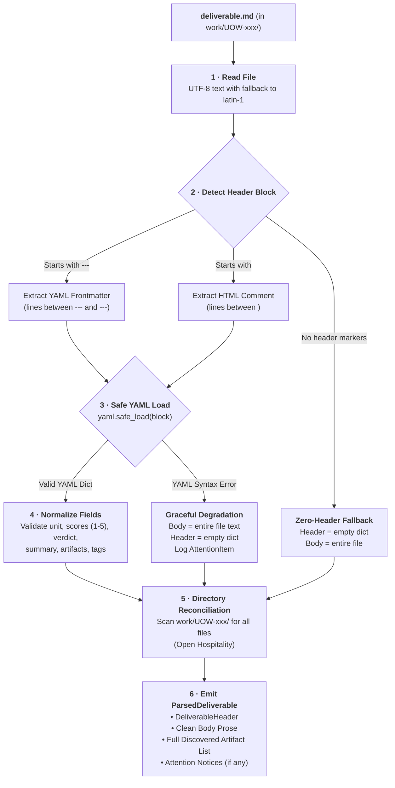
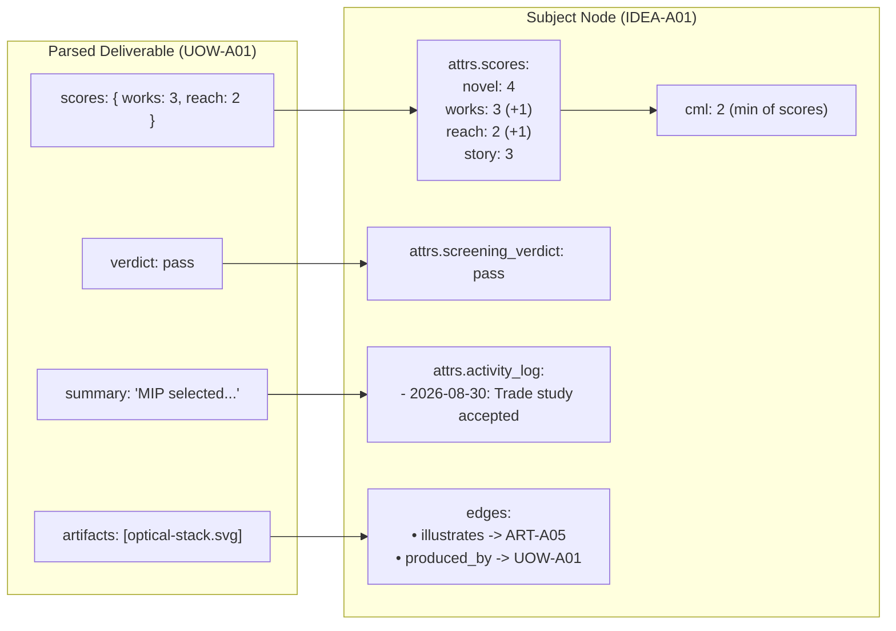

# DA-12 · Deliverable Header Spec

**The authoritative parsing rules, header schema, graceful degradation guarantees, anti-form boundary invariants, and subject materialization mapping for deliverable files.**

Governed by `docs/InnovatorsWorkspaceVision_12.md` D17, §05, §14.7, §14.15 and `docs/DesignPhasePlan_2.md` DA-12.

---

## 01 · Philosophy & The D17 / V§14.7 Contract

The deliverable header is governed by two foundational principles from the Vision document:

> **D17:** *A short required header, then wide open. A few fields the IW needs to file the result; everything else is mine to shape. Strict machine formats only where an output feeds something automatic, and never on a step assigned to me. Rationale: a spec that limits what I can produce inhibits the thinking it exists to support.*
>
> **V§14.7 (Files, not forms):** *My own work happens in a template file in my own editor, or in the embedded diagram editor. The IW specifies the deliverable, never the method, and never invents an interface for me to type into.*

### The Core Balance
The deliverable header is the minimal filing metadata required to connect a deliverable file back to its unit of work (`UOW-xxx`) and materialize its findings onto the subject node (`IDEA-xxx`, `FRI-xxx`, etc.). 

```
┌────────────────────────────────────────────────────────────────────────┐
│ DELIVERABLE FILE: work/UOW-A01/deliverable.md                          │
│                                                                        │
│ ┌────────────────────────────────────────────────────────────────────┐ │
│ │ 1. THE HEADER (Short, Structured, Optional)                       │ │
│ │    • unit: UOW-A01                                                 │ │
│ │    • summary: "MIP display consumes 10x less power than OLED."     │ │
│ │    • verdict: pass                                                 │ │
│ │    • scores: { works: 3, reach: 3 }                                │ │
│ │    • artifacts: [optical-stack.svg, trade-matrix.csv]             │ │
│ └────────────────────────────────────────────────────────────────────┘ │
│                                                                        │
│ ┌────────────────────────────────────────────────────────────────────┐ │
│ │ 2. THE BODY (Wide Open, Free-Form Prose)                           │ │
│ │    • Unconstrained markdown text                                   │ │
│ │    • Drawings, diagrams, tables, sketches, analysis                │ │
│ │    • NO required section headings                                  │ │
│ │    • NO table scraping or regex micro-parsing                      │ │
│ │    • Human thinking & deep AI analysis happen here                 │ │
│ └────────────────────────────────────────────────────────────────────┘ │
└────────────────────────────────────────────────────────────────────────┘
```

The header exists to serve filing and scoring. It is **never an interrogation form** and **never a constraint on human thinking**.

---

## 02 · Header Schema & Field Specifications

The header is composed of clean, self-describing fields. Every field is optional with sensible defaults; even the `unit` field defaults to the enclosing folder name (`work/<UOW-id>/`) if omitted.

```yaml
---
# System & Provenance
unit: UOW-A01
summary: Memory-in-pixel display provides sunlight readability with sub-milliwatt power draw.

# Domain Advancement & Evaluation
verdict: pass
scores:
  works: 3
  reach: 3
recommendation: Proceed to physical prototype testing with Sharp LS027B7DH01.

# Filing & Attachments (Inputs, Outputs, and Descriptions)
artifacts:
  - file: optical-stack.svg
    role: output
    description: Ray-tracing diagram showing anti-reflective coating layers and sunlight reflection
  - file: power-comparison.csv
    role: output
    description: Bench power measurements comparing Sharp MIP vs OLED across 0-100% brightness
  - file: ART-A01-display-survey.md
    role: input
    description: Prior survey defining minimum outdoor contrast and refresh rate constraints

# Metadata & Attribution (Optional)
author:
  declared_model: claude-opus-5-2026
tags: [display, low-power, optics]
date: 2026-08-30
---
```

### Field Definitions

| Field | Type | Required? | Purpose | Default / Fallback |
|---|---|:--:|---|---|
| **`unit`** | `string` | No (Recommended) | The unit of work ID (e.g. `UOW-A01`) that produced this deliverable. | Inferred from parent directory name (`work/<UOW-id>/`). |
| **`summary`** | `string` | No | A 1–2 sentence takeaway summarizing the core conclusion. Rendered in UI work board and touch history. | Extracted from first non-heading prose paragraph (up to 160 chars), or empty. |
| **`verdict`** | `string` / `enum` | No | Categorical conclusion for screening or evaluation steps (`pass`, `reject`, `hold`, `recommend`, `inconclusive`, etc.). | `None`. |
| **`scores`** | `dict[str, int]` | No | Maturity scores evaluated by the activity (`novel`, `works`, `reach`, `story`), integers 1–5. Feeds CML calculation. | `None` (subject scores remain unchanged). |
| **`recommendation`** | `string` | No | Suggested immediate follow-up activity or next step. | `None`. |
| **`artifacts`** | `list[ArtifactRef]` / `list[str]` | No | Declared input/output files with role (`input` / `output` / `reference`) and descriptive notes. | Discovered automatically via folder directory scan as `output` artifacts. |
| **`author`** | `dict` / `str` | No | Asserted author / model info from worker. | Courier attribution stamped by IW on collection. |
| **`tags`** | `list[str]` | No | Additional topic tags to attach to the generated artifact node (`ART-xxx`). | `[]`. |
| **`date`** | `string` | No | Completion timestamp (ISO 8601 or YYYY-MM-DD). | Current collection timestamp. |
| **`attrs`** | `dict[str, Any]` | No | Any additional custom or activity-specific fields. | Preserved without error. |

### Artifact Listing Formats

The **canonical standard format** for Tinkerspace is the **Rich Object List (Option 1)**. It provides complete clarity on what files are produced or consumed and why:

1. **Rich Object List (Canonical Standard):**
   ```yaml
   artifacts:
     - file: optical-stack.svg
       role: output
       description: Cross-section ray trace under 100k lux direct sunlight
     - file: ART-A01-display-survey.md
       role: input
       description: Baseline display specs used for resolution and interface requirements
   ```

*Permissive Parser Fallbacks:* For maximum flexibility, the collection parser also accepts grouped maps (`inputs: [...], outputs: [...]`) and shorthand string lists (`- optical-stack.svg`), automatically normalizing them into the standard object representation without errors.

---

## 03 · Formatting & Authoring Syntax

The deliverable parser supports **two primary header formats** plus a **zero-header fallback**:

### Format A: YAML Frontmatter (Standard)
Enclosed by triple-dashes `---` at the very beginning of the markdown file. Preferred for AI agents, automated couriers, and standard markdown documents:

```markdown
---
unit: UOW-A01
summary: Optical bonding eliminates internal reflections in outdoor sunlight.
verdict: pass
scores:
  works: 3
---

# Display Technology Trade Study
Prose content starts here...
```

### Format B: HTML Comment Block (Obsidian & Human-Friendly)
Enclosed by `<!--` and `-->` at the top of the file. This allows Jared to author notes in Obsidian without raw YAML frontmatter cluttering the reading view:

```markdown
<!--
unit: UOW-A01
summary: Memory-in-pixel display selected.
verdict: pass
scores:
  works: 3
  reach: 3
-->

# Display Technology Trade Study
Prose content starts here...
```

### Format C: Zero-Header Prose (Minimalist)
When Jared (or an external tool) simply creates a markdown file with notes, drawings, or sketches and no header block at all:

```markdown
# Sketch Notes on Cycling Computer UI
Explored 3 different screen layouts with physical pushbuttons.
See attached diagram.svg for the button mapping.
```

The parser detects that no header block exists, defaults `unit` to the directory name `work/UOW-xxx/`, treats 100% of the content as body prose, and scans the folder for companion files.

---

## 04 · Parsing Pipeline & Deterministic Extraction Rules



### Python Reference Implementation (Core Protocol & Types)

```python
"""Deliverable Header Parser and Data Structures."""

from dataclasses import dataclass, field
from datetime import datetime, timezone
import re
from typing import Any
import yaml

from iw.contracts.models import Author, AuthorKind

YAML_FM_REGEX = re.compile(r"^---\s*\r?\n(.*?)\r?\n(?:---|\.\.\.)\s*\r?\n(.*)$", re.DOTALL)
HTML_COMMENT_REGEX = re.compile(r"^\s*<!--\s*\r?\n(.*?)\r?\n-->\s*\r?\n(.*)$", re.DOTALL)


@dataclass
class ArtifactRef:
    """Reference to an input or output artifact declared in deliverable header."""
    file: str
    role: str = "output"        # output | input | reference
    description: str = ""


@dataclass
class DeliverableHeader:
    """Parsed structured metadata from deliverable header."""
    unit: str
    summary: str = ""
    verdict: str | None = None
    scores: dict[str, int] = field(default_factory=dict)
    recommendation: str | None = None
    artifacts: list[ArtifactRef] = field(default_factory=list)
    author_asserted: dict[str, Any] = field(default_factory=dict)
    tags: list[str] = field(default_factory=list)
    date: datetime | None = None
    attrs: dict[str, Any] = field(default_factory=dict)
    parse_warning: str | None = None


@dataclass
class ParsedDeliverable:
    """Full deliverable payload extracted from work folder file."""
    header: DeliverableHeader
    body: str
    discovered_files: list[str] = field(default_factory=list)


def parse_artifact_entries(raw_arts: Any) -> list[ArtifactRef]:
    """Parse string lists, object lists, or grouped input/output maps into ArtifactRef objects."""
    result: list[ArtifactRef] = []
    if isinstance(raw_arts, list):
        for item in raw_arts:
            if isinstance(item, str) and item.strip():
                result.append(ArtifactRef(file=item.strip(), role="output", description=""))
            elif isinstance(item, dict) and "file" in item:
                result.append(
                    ArtifactRef(
                        file=str(item["file"]).strip(),
                        role=str(item.get("role", "output")).lower().strip(),
                        description=str(item.get("description", "")).strip(),
                    )
                )
    elif isinstance(raw_arts, dict):
        # Support grouped inputs/outputs syntax
        for role_key in ("inputs", "outputs", "references"):
            default_role = role_key.rstrip("s")
            group = raw_arts.get(role_key, [])
            if isinstance(group, list):
                for item in group:
                    if isinstance(item, str) and item.strip():
                        result.append(ArtifactRef(file=item.strip(), role=default_role, description=""))
                    elif isinstance(item, dict) and "file" in item:
                        result.append(
                            ArtifactRef(
                                file=str(item["file"]).strip(),
                                role=str(item.get("role", default_role)).lower().strip(),
                                description=str(item.get("description", "")).strip(),
                            )
                        )
    return result


def parse_deliverable_text(raw_text: str, default_unit_id: str) -> tuple[DeliverableHeader, str]:
    """Parse header and body from deliverable markdown text with zero exceptions."""
    match_yaml = YAML_FM_REGEX.match(raw_text)
    match_comment = HTML_COMMENT_REGEX.match(raw_text) if not match_yaml else None

    if match_yaml:
        header_raw, body = match_yaml.group(1), match_yaml.group(2)
    elif match_comment:
        header_raw, body = match_comment.group(1), match_comment.group(2)
    else:
        # Zero-header format: entire text is body
        header = DeliverableHeader(unit=default_unit_id.upper())
        return header, raw_text

    try:
        data = yaml.safe_load(header_raw)
        if not isinstance(data, dict):
            # Not a mapping (e.g. string or list in frontmatter)
            return (
                DeliverableHeader(
                    unit=default_unit_id.upper(),
                    parse_warning="Deliverable header did not contain key-value pairs; prose preserved.",
                ),
                raw_text,
            )
    except yaml.YAMLError as exc:
        # Graceful degradation: do NOT abort; preserve full text
        return (
            DeliverableHeader(
                unit=default_unit_id.upper(),
                parse_warning=f"Malformed YAML in deliverable header: {exc}; prose preserved.",
            ),
            raw_text,
        )

    # Normalize fields
    unit = str(data.get("unit", default_unit_id)).upper()
    summary = str(data.get("summary", "")).strip()
    verdict = str(data["verdict"]).lower().strip() if data.get("verdict") is not None else None
    recommendation = str(data["recommendation"]).strip() if data.get("recommendation") else None

    # Validate and filter scores (1-5 integers)
    scores: dict[str, int] = {}
    raw_scores = data.get("scores")
    if isinstance(raw_scores, dict):
        for k, v in raw_scores.items():
            try:
                val = int(v)
                if 1 <= val <= 5:
                    scores[str(k).lower()] = val
            except (ValueError, TypeError):
                continue

    # Artifacts parsing with rich role and description support
    artifacts = parse_artifact_entries(data.get("artifacts"))

    # Tags list
    tags: list[str] = []
    raw_tags = data.get("tags", [])
    if isinstance(raw_tags, list):
        tags = [str(t).strip() for t in raw_tags if t]

    # Extract extra attributes
    reserved = {"unit", "summary", "verdict", "scores", "recommendation", "artifacts", "author", "tags", "date"}
    extra_attrs = {k: v for k, v in data.items() if k not in reserved}

    header = DeliverableHeader(
        unit=unit,
        summary=summary,
        verdict=verdict,
        scores=scores,
        recommendation=recommendation,
        artifacts=artifacts,
        author_asserted=data.get("author", {}) if isinstance(data.get("author"), dict) else {},
        tags=tags,
        attrs=extra_attrs,
    )
    return header, body
```

---

## 05 · Graceful Degradation & Data Loss Prevention (The "Never Error" Invariant)

A core invariant of Innovator's Workspace collection is that **result collection must never fail or abort due to a deliverable format issue**. 

When Jared clicks *Attach Result*, the system guarantees that all human or agent work is preserved and catalogued, regardless of parsing anomalies.

### Fault Matrix & Degradation Strategies

| Hazard / Anomaly | What Happens to Data | What the System Does | UI / Board Indication |
|---|---|---|---|
| **Malformed YAML Syntax** (e.g. unquoted colon, unclosed quote, tab indentation) | 100% of raw text preserved in body. | Ignores broken header structure; ingests whole file as markdown artifact `ART-xxx`; attaches to subject. | Emits `AttentionItem`: *"Deliverable header parse warning in UOW-xxx; raw prose preserved."* |
| **Missing Header Entirely** (plain notes / sketch file) | 100% of raw text preserved. | Ingests file as primary artifact; infers `unit` from directory `work/<UOW-id>/`. | Normal collection; zero warnings. |
| **Invalid Score Values** (e.g. `works: "high"` or `reach: 9`) | Raw value kept in deliverable prose. | Ignores invalid score; preserves valid scores; leaves unparseable score dimensions untouched. | Note in collection log; does not block CML calculation. |
| **Unexpected / Unlisted Files** in folder (e.g. agent dropped 4 extra CSVs) | All files safely ingested. | Folder directory scan registers every file as an `ART-xxx` node and creates `produced_by` edges (Open Hospitality). | Full artifact list displayed on accepted unit card. |
| **Non-Markdown Primary Output** (e.g. `deliverable.pdf`, `deliverable.svg`, `cad-model.step`) | Binary file preserved intact. | Ingests binary artifact; infers task metadata from `work/<UOW-id>/unit.yaml`. | Attached directly to subject node as visual/data artifact. |
| **Non-UTF-8 Encoding** | Text decoded using standard fallbacks (`utf-8` -> `cp1252` / `latin-1`). | Preserves content without raising encoding exceptions. | Normal collection. |

---

## 06 · Anti-Form Invariants (What is NOT Parsed)

To protect V§14.7 ("Files, not forms") and prevent the back-door re-introduction of rigid questionnaires:

1. **No Section Heading Enforcement**: The parser **never requires specific markdown headings** (`## Criteria`, `## Results`, `## Conclusion`) to exist. Headings in starter templates are purely helpful prompts for the worker, never parse requirements.
2. **No Table Scraping / Regex Scraping from Body**: The parser **never extracts data by scraping markdown tables, bullet lists, or bold keyphrases from the body**. If data is structured, it belongs in the header fields; the body is free-form prose.
3. **No AST Micro-Validation**: The parser never rejects a deliverable because of markdown dialect, footnote syntax, unclosed formatting tags, or styling quirks.
4. **No Mandatory Verdict or Score Requirements**: Units of work for open-ended research (e.g. `questionstorm`, `sketch`, `story draft`) do not require scores or verdicts.
5. **No Intermediate Prompt/Telemetry Scraping**: Deliverable parsing does not inspect or validate LLM reasoning scratchpads, token counts, or internal chat turns.

---

## 07 · Materialization Mapping to Subject Nodes (V§14.15)

Per V§14.15, **a note carries its own state**. When a unit of work reaches `accepted`, the parsed deliverable fields are materialized directly onto the subject node(s):



### Materialization Rules

1. **Maturity Scores (`scores`)**:
   - Updates matching keys in `subject.attrs['scores']`.
   - Automatically recalculates CML: `cml = min(scores.novel, scores.works, scores.reach, scores.story)`.
2. **Screening Verdict (`verdict`)**:
   - Stamped into `subject.attrs['screening_verdict']`.
   - If verdict is `reject` and activity is a screening gate, creates a `rejected_because` edge with the deliverable summary and transitions node state if approved by user.
3. **Summary (`summary`)**:
   - Appended to subject's activity record or touch history log with UTC timestamp.
4. **Artifacts & Attachments (`artifacts` + directory files)**:
   - **Outputs (`role == "output"`)**: Registers each file in the folder as an `ART-xxx` node in the store with `produced_by: UOW-xxx`. Creates edges to the Subject Node (`illustrates` / `evidence_for` / `evidence_against`) carrying `description` in `edge.note`.
   - **Inputs (`role == "input"`)**: For existing artifacts referenced as inputs, appends `UOW-xxx` to `artifact.input_to` and records a provenance edge explaining why the input was used (`note = description`).
   - **Unlisted Files**: Automatically registered as output artifacts under the Open Hospitality rule.

---

## 08 · Four Concrete Worked Examples

### Example 1: AI Agent Prior-Art Survey Deliverable (`deliverable.md`)

```markdown
---
unit: UOW-B12
summary: Found three commercial patents covering low-power optical pulse oximetry in handlebar grips; two expired in 2024.
verdict: pass
scores:
  novel: 4
  works: 3
recommendation: Proceed to trade study on photodiode placement.
artifacts:
  - file: patent-matrix.csv
    role: output
    description: Patent classification and expiry matrix covering US & EP filings
  - file: prior-art-timeline.svg
    role: output
    description: Timeline diagram showing public domain vs active patents
  - file: ART-A02-grip-concept.md
    role: input
    description: Original concept note defining physical sensor packaging constraints
tags: [patent, prior-art, sensor, grip]
author:
  declared_model: claude-opus-5-2026
---

# Prior-Art Survey: Optical Grip Biometrics

## Executive Summary
We surveyed US and European patent databases for optical biometric sensors embedded directly into bicycle handlebar grips.

## Key Findings
1. **US Patent 7,812,345 (Expired 2024):** Covered reflective photoplethysmography in elastomeric grips. Prior art is now public domain.
2. **EP Patent 3,456,789 (Active, Shimano):** Covers dual-wavelength sensing with ambient light cancellation.

## Conclusion & Assessment
The primary optical sensing approach is unencumbered by active foundational patents. Motion artifact rejection remains the primary technical hurdle.
```

---

### Example 2: Human-Authored Trade Study in Obsidian (`deliverable.md`)

```markdown
<!--
unit: UOW-A01
summary: Memory-in-pixel display selected over OLED due to 10x battery life advantage in direct sunlight.
verdict: pass
scores:
  works: 4
  reach: 3
recommendation: Order Sharp LS027B7DH01 breakout board for bench testing.
artifacts:
  - file: optical-bench-test.csv
    role: output
    description: Ambient light sensor readings and current consumption log
  - file: ART-A01-display-survey.md
    role: input
    description: Initial requirements spec for sunlight readable display
-->

# Trade Study: Cycling Display Technology

I spent the afternoon comparing display options on the test bench under outdoor sunlight.

## Comparison Notes
- **OLED:** Looks incredible indoors, washed out completely in direct noon sunlight. Consumes ~80mA with full white backlight.
- **Memory-in-Pixel (Sharp MIP):** Exceptional contrast in direct sun. Consumes only 50µW static. Requires front-light for night riding.

## Decision
Going with the 2.7-inch Sharp Memory LCD. The battery life difference (weeks vs hours) makes this a non-negotiable choice for a bike computer.
```

---

### Example 3: Minimalist Zero-Header Note with Drawing

`deliverable.md`:
```markdown
# Button & Enclosure Layout Sketch

Sketched the top-plate physical button locations on the tablet.
Left button toggles lap screen, right button pauses ride.
Thumb reach tested against standard 31.8mm handlebar mount.
```

Companion file in `work/UOW-A04/`:
- `button-layout.svg` (exported drawing from tablet)

*Collection Result:* `unit` inferred as `UOW-A04`. Prose catalogued as primary report. `button-layout.svg` automatically discovered, registered as `ART-A08` (`role: output`), and attached to subject node.

---

### Example 4: Malformed YAML Header Degradation

```markdown
---
unit: UOW-C02
summary: Bench power measurement complete: 42mW total system draw.
verdict: pass
scores:
  works: 4: invalid: colon: syntax
  reach: [unclosed list
---

# Bench Power Measurements

Measured current draw using Nordic Power Profiler Kit II across three operating modes:
- Deep Sleep: 12 µA
- Active GPS Tracking: 28 mW
- Full Radio Burst: 42 mW
```

*Collection Result:* Safe YAML parser catches `YAMLError`. Zero crash. 100% of the raw markdown (including the broken header block and prose) is preserved as the artifact body. An `AttentionItem` is flagged on the board: *"Deliverable header parse warning in UOW-C02; raw prose preserved."*

---

## 09 · Traceable Behaviour Specifications (`DELIV-01` to `DELIV-11`)

These specification IDs serve as the traceability contract for Phase 2 Slice B2-5 unit and behavioural tests:

| Spec ID | Name | Test Invariant |
|---|---|---|
| **`DELIV-01`** | **Dual Header Format** | Parser successfully extracts metadata from both YAML frontmatter (`---`) and HTML comment blocks (`<!--`). |
| **`DELIV-02`** | **Directory Fallback** | When `unit` is omitted in header or header is absent, parser defaults unit ID to parent folder name (`work/<UOW-id>/`). |
| **`DELIV-03`** | **Advancement Extraction** | Correctly extracts `summary`, `verdict`, `scores`, and `recommendation` when present. |
| **`DELIV-04`** | **Score Normalization** | Validates score integers (1–5) and rejects out-of-range or malformed score values without failing collection. |
| **`DELIV-05`** | **Zero-Error Degradation** | Malformed YAML syntax or corrupt header blocks never raise unhandled exceptions; full text is preserved as artifact body. |
| **`DELIV-06`** | **Attention Flagging** | Malformed headers record a parse warning and generate an `AttentionItem` on the Work Board. |
| **`DELIV-07`** | **Open Hospitality Discovery** | Any extra files present in `work/<UOW-id>/` (drawings, CSVs, logs) are discovered and attached regardless of header listing. |
| **`DELIV-08`** | **Anti-Form Non-Enforcement** | Collection succeeds with zero errors on documents missing headings, tables, scores, or verdicts. |
| **`DELIV-09`** | **Extensible Attribute Storage** | Non-reserved header keys are safely stored in `attrs` dictionary without validation errors. |
| **`DELIV-10`** | **Binary File Ingestion** | Primary outputs that are binary files (e.g. PDF, SVG, ZIP) are ingested safely using task metadata from `unit.yaml`. |
| **`DELIV-11`** | **Artifact Role & Description Ingestion** | Parses and distinguishes input vs output artifact roles and attaches description text to artifact records and relationship edges. |
