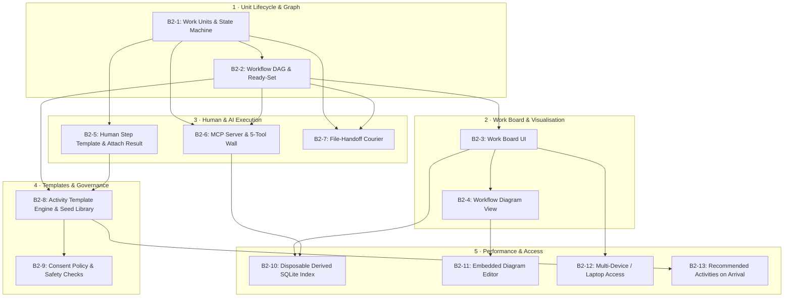

# DA-13 · Phase 2 Slice Plan

**The runnable build slice specifications for Phase 2 (B2-1 through B2-13), turning the Innovator's Workspace into the central dispatch and evaluation environment for human and AI work.**

Governed by `docs/InnovatorsWorkspaceVision_12.md` §05, §06, §07, §14, `docs/DesignPhasePlan_2.md` §09, and design artifacts DA-09 through DA-12.

---

## 01 · Phase 2 Goal & Operating Rules

### The Goal
> **Phase 2 Goal (V§16):** I dispatch work from the Innovator's Workspace rather than opening a chat window.

### Sizing & Review Rules (§09)
1. **One Evening's Review**: Each slice is sized for a single review session (≤400 lines of new Python code, ≤200 lines per file, ≤40 lines per function, ≤1 level of comprehension nesting).
2. **Every Slice Ends Running**: If a slice cannot be exercised and verified in under a minute via test suite and running web/MCP surface, the slice is rejected.
3. **No Background Engines (V§14.4)**: All ready-state computation, collection, and indexing are on-demand upon request/refresh.
4. **The Store is Truth**: Files and YAML frontmatter carry state (V§14.15). No hidden database or ephemeral session state.
5. **Attribution on Every Write (V§14.17)**: Every artifact, unit change, and frontmatter update records `author.kind`, `author.courier`, and model attribution.

---

## 02 · Phase 2 Build Slice Register

---

## 03 · Detailed Slice Specifications

### B2-1 · Work Units, Folders, `unit.yaml` & State Machine
- **Focus**: Core unit-of-work state model, filesystem folder ownership (`work/UOW-xxx/`), atomic `unit.yaml` persistence, and 7-state lifecycle.
- **Layers & Components**:
  - `iw/contracts/models.py`: `UnitOfWork`, `UnitState` (`blocked`, `ready`, `dispatched`, `returned`, `accepted`, `skipped`, `parked`).
  - `iw/contracts/workflow.py`: `WorkflowRuntimeProtocol`.
  - `iw/core/store.py`: `get_unit()`, `write_unit()`, `list_units()`.
  - `iw/domain/workflow/state.py`: State transition rules, guard validations, and event logging (`unit.state_changed`).
- **Spec IDs**: `UOW-01` through `UOW-08`.
- **Done When**:
  - A unit of work can be created in `work/UOW-A01/unit.yaml`.
  - Calling transition methods moves the unit through valid states, rejecting invalid transitions.
  - State changes persist atomically to `unit.yaml` and append to `events.jsonl`.
  - `pytest tests/behaviour/test_unit_lifecycle.py` is green.
- **Deliberately Not Done**: Workflow DAG computation (deferred to B2-2); Web UI rendering (deferred to B2-3).

---

### B2-2 · Workflow Runtime & Ready-Set Computation
- **Focus**: Multi-step dependency DAG execution, predecessor-to-successor graph resolution, and pure on-demand `compute_ready_set` evaluation.
- **Layers & Components**:
  - `iw/contracts/models.py`: `Workflow` graph model with predecessor edge lists.
  - `iw/domain/workflow/runtime.py`: DAG resolution, cycle detection, ready-set evaluator.
- **Spec IDs**: `WORKFLOW-01` through `WORKFLOW-06`.
- **Done When**:
  - Creating a 3-step workflow (e.g. `UOW-A01` -> `UOW-A02` -> `UOW-A03`) initializes `UOW-A01` as `ready` and `UOW-A02`/`UOW-A03` as `blocked`.
  - Marking `UOW-A01` as `accepted` (or `skipped`) automatically evaluates `UOW-A02` into the ready set on next query.
  - Zero background watcher or thread runs; ready set is computed purely in memory when queried.
  - `pytest tests/behaviour/test_workflow_runtime.py` is green.
- **Deliberately Not Done**: Web visualization (B2-4); MCP dispatch (B2-6).

---

### B2-3 · Work Board UI
- **Focus**: Web UI surface (`/board` or `/work`) displaying active units organized by lifecycle status, plus eye-level Action Guide banners.
- **Layers & Components**:
  - `iw/web/app.py`: `/board` route and action endpoints (`/board/dispatch`, `/board/park`, `/board/skip`).
  - `iw/web/board_views.py`: View handlers for board queries.
  - `iw/web/templates/board.html`: Board layout with Ready, Dispatched, Returned, and Parked columns/cards.
  - `iw/web/templates/components/action_guide.html`: Reusable high-contrast action guide banner.
- **Spec IDs**: `BOARD-01` through `BOARD-06`.
- **Done When**:
  - Jared navigates to `http://localhost:8000/board` and sees all active units categorized by status.
  - Each ready card prominently displays the 5-point Action Guide (Assignee, Inputs, Task, Deliverable, Resume).
  - Clicking "Dispatch" updates the unit to `dispatched` with HTMX swap without page reload.
  - `pytest tests/behaviour/test_work_board_web.py` is green.
- **Deliberately Not Done**: Interactive diagram canvas (B2-4); automatic AI execution (B2-6).

---

### B2-4 · Workflow Diagram View
- **Focus**: Visual workflow dependency graph rendering (per TS-04) with status color-coding, dependency arrows, and step action buttons.
- **Layers & Components**:
  - `iw/web/workflow_views.py`: Route `/workflow/{workflow_id}`.
  - `iw/web/templates/workflow.html`: Server-computed CSS grid/box diagram with SVG connecting lines or pure semantic HTML cards.
- **Spec IDs**: `WFLVIEW-01` through `WFLVIEW-04`.
- **Done When**:
  - Opening a workflow renders an intuitive graphical view of the steps.
  - Step boxes show distinct status styling (`ready` green, `dispatched` blue, `returned` yellow, `accepted` slate, `blocked` muted).
  - Clicking a step opens its detail card with action buttons (Dispatch, Attach Result, Skip, Park).
  - `pytest tests/behaviour/test_workflow_view_web.py` is green.
- **Deliberately Not Done**: In-browser node editing (B2-11).

---

### B2-5 · Human Step Template & Result Collection Pipeline
- **Focus**: Human dispatch starter template generation (`deliverable.md`), deliverable header parsing (DA-12), artifact node registration (`ART-xxx`), attribution stamping, and frontmatter fact materialization (V§14.15).
- **Layers & Components**:
  - `iw/domain/workflow/collection.py`: Result collection pipeline, header parser, graceful degradation handler.
  - `iw/domain/workflow/materialization.py`: Updating subject node frontmatter (scores, CML, screening verdicts, edges).
  - `iw/web/collection_views.py`: POST `/board/collect/{uow_id}` handler.
- **Spec IDs**: `COLLECT-01` through `COLLECT-08`.
- **Done When**:
  - Dispathing a human unit generates `work/UOW-xxx/deliverable.md` with section headings and instruction comments.
  - Jared edits `deliverable.md` in Obsidian and clicks "Attach Result" in web UI.
  - System scans `work/UOW-xxx/`, registers `ART-xxx` nodes for all files found, stamps `author: {kind: human, courier: web-ui}`, updates subject node frontmatter (scores and derived CML), and sets unit to `accepted`.
  - Malformed headers gracefully degrade (prose kept, artifact attached, no exception thrown).
  - `pytest tests/behaviour/test_result_collection.py` is green.
- **Deliberately Not Done**: Agent MCP submission (B2-6).

---

### B2-6 · MCP Server & The 5-Tool Wall
- **Focus**: ASGI-native MCP endpoint implementing the 5 tools (`get_step`, `submit_result`, `list_ready`, `fetch_context`, `capture`) with rigorous negative wall security tests (DA-10).
- **Layers & Components**:
  - `iw/mcp/server.py`: MCP ASGI endpoint mounted on the main application.
  - `iw/mcp/tools.py`: Tool handlers for the 5 tools.
  - `iw/mcp/wall.py`: Security sanitizer ensuring zero path separators, table names, or vault root paths leak in responses/errors.
  - `tests/behaviour/test_mcp_wall.py`: The 7+ negative wall tests.
- **Spec IDs**: `MCP-01` through `MCP-10`.
- **Done When**:
  - An MCP client (Claude Desktop / Antigravity / Claude Code) connects to the server and calls `list_ready`, `get_step`, `fetch_context`, `submit_result`, and `capture`.
  - `fetch_context` strictly refuses IDs not declared in the step's input list.
  - All negative wall tests pass (no paths in error bodies, tool list has exactly 5 tools, no whole-vault enumeration).
  - `pytest tests/behaviour/test_mcp_surface.py` and `tests/behaviour/test_mcp_wall.py` are green.
- **Deliberately Not Done**: Autonomous loop execution (disallowed by V§14.4).

---

### B2-7 · File-Handoff Courier
- **Focus**: Zero-dependency offline fallback courier for chat windows or external tools without MCP connectivity.
- **Layers & Components**:
  - `iw/adapters/courier/file_handoff.py`: Generate self-contained prompt markdown file with action guide and declared context.
  - `iw/web/handoff_views.py`: Route to copy dispatch prompt to clipboard or download file.
- **Spec IDs**: `HANDOFF-01` through `HANDOFF-04`.
- **Done When**:
  - Clicking "Dispatch via File Handoff" generates a self-contained markdown dispatch pack in `iw-vault/drop/` and copies prompt text.
  - External worker outputs dropped into `work/UOW-xxx/` are collected and stamped with `courier: file-handoff`.
  - `pytest tests/behaviour/test_file_handoff_courier.py` is green.
- **Deliberately Not Done**: Auto-polling of mailboxes or cloud drives.

---

### B2-8 · Activity Template Engine & Seed Library
- **Focus**: File-based activity template loader (`content/templates/`), template schema validator (DA-11), and the seed templates (`freeform@1`, `prior-art-survey@1`, `screening-assessment@1`).
- **Layers & Components**:
  - `iw/domain/workflow/templates.py`: YAML template parser, version resolver (`name@version`), prompt populator.
  - `content/templates/freeform.v1.yaml`
  - `content/templates/prior-art-survey.v1.yaml`
  - `content/templates/screening-assessment.v1.yaml`
  - `content/guidance/AGENT_GUIDANCE.md`: Master agent instructions (DA-11 §05).
- **Spec IDs**: `TEMPLATE-01` through `TEMPLATE-06`.
- **Done When**:
  - Loading `prior-art-survey@1` instantiates a unit with prompt text, deliverable schema, and section guides.
  - New templates placed in `content/templates/` are discovered with zero code changes.
  - `pytest tests/behaviour/test_activity_templates.py` is green.
- **Deliberately Not Done**: Automated AI-generated template authoring (Phase 3).

---

### B2-9 · Consent Policy & Safe Dispatch
- **Focus**: Explicit consent check before triggering metered model calls or external network tools (V§14.8).
- **Layers & Components**:
  - `iw/domain/governance/consent.py`: Consent engine verifying requested model against `content/consent_policy.yaml`.
  - `content/consent_policy.yaml`: Default policies for allowed local/cloud models and external token allowances.
  - `iw/web/consent_modal.py`: UI prompt when an action exceeds default consent.
- **Spec IDs**: `CONSENT-01` through `CONSENT-04`.
- **Done When**:
  - Attempting to dispatch an unconsented model or tool blocks until explicit user approval is granted in UI.
  - Approved actions proceed and log consent approval in `events.jsonl`.
  - `pytest tests/behaviour/test_consent_policy.py` is green.
- **Deliberately Not Done**: Complex multi-user role-based access control.

---

### B2-10 · Disposable Derived SQLite Index
- **Focus**: High-speed derived query index in SQLite (`iw-vault/.index.db`) operating as an ephemeral projection (D5, A8).
- **Layers & Components**:
  - `iw/adapters/storage/sqlite_index.py`: SQLite index builder and query adapter.
  - `iw/contracts/index.py`: Seamlessly satisfies `IndexProtocol`.
- **Spec IDs**: `INDEX-01` through `INDEX-05`.
- **Done When**:
  - Store queries utilize SQLite when `.index.db` is present for instant filtering across thousands of notes.
  - Deleting `.index.db` triggers a transparent background rebuild from disk markdown producing an identical state.
  - Zero truth lives in SQLite; frontmatter remains the sole source of truth.
  - `pytest tests/behaviour/test_sqlite_derived_index.py` is green.
- **Deliberately Not Done**: Vector embeddings / semantic search (Phase 3).

---

### B2-11 · Embedded Diagram Editor Integration
- **Focus**: Viewing and editing diagrams/sketches directly in the web UI without external tooling (D19).
- **Layers & Components**:
  - `iw/web/diagram_views.py`: SVG viewer/editor component integration for diagrams in `drop/` and `work/UOW-xxx/`.
  - `iw/web/templates/diagram_editor.html`.
- **Spec IDs**: `DIAGRAM-01` through `DIAGRAM-04`.
- **Done When**:
  - Clicking a sketch or diagram on a Node detail or Unit card opens the interactive viewer/editor.
  - Edits save directly to the underlying file via atomic write.
  - `pytest tests/behaviour/test_diagram_editor.py` is green.
- **Deliberately Not Done**: Complex 3D CAD rendering or multi-layer canvas tools.

---

### B2-12 · Multi-Device / Laptop Access Setup
- **Focus**: Verification and configuration for accessing the workstation IW service from the laptop browser over the local network (D21, TS-03).
- **Layers & Components**:
  - `docs/design/runtime.md` & `iw/web/app.py`: Host binding configuration (`0.0.0.0` / LAN firewall rules).
- **Spec IDs**: `NET-01` through `NET-03`.
- **Done When**:
  - Service binds securely to local network interface.
  - Laptop browser accesses Work Board, Explore, and Node views with authenticated LAN session.
  - `pytest tests/behaviour/test_runtime_network_binding.py` is green.
- **Deliberately Not Done**: Cloud SaaS hosting or public internet exposure.

---

### B2-13 · Recommended Activities on Arrival View
- **Focus**: Dynamic activity recommendations on Node detail view based on node type and current CML level (D24).
- **Layers & Components**:
  - `iw/domain/workflow/recommender.py`: Heuristic recommender (e.g., Friction -> `screening-assessment@1`; Idea CML 1 -> `prior-art-survey@1`; Idea CML 3 -> `experiment-design@1`).
  - `iw/web/templates/node.html`: "Recommended Next Steps" action buttons that instantiate workflows with one click.
- **Spec IDs**: `RECOMMEND-01` through `RECOMMEND-04`.
- **Done When**:
  - Opening an Idea note with CML 1 displays a button: *"Launch Prior Art Survey"*.
  - Clicking the button instantiates the workflow, creates the unit, and directs Jared to the Work Board.
  - `pytest tests/behaviour/test_activity_recommender.py` is green.
- **Deliberately Not Done**: Autonomous background dispatch without user click.

---

## 04 · Subsystem Spec Prefix Register for Phase 2

| Subsystem / Feature Area | Prefix | Spec File Location |
|---|:--:|---|
| **Unit of Work State & Folder** | `UOW-` | `docs/design/specs/UOW.md` |
| **Workflow DAG & Runtime** | `WORKFLOW-` | `docs/design/specs/WORKFLOW.md` |
| **Work Board UI** | `BOARD-` | `docs/design/specs/BOARD.md` |
| **Workflow Diagram View** | `WFLVIEW-` | `docs/design/specs/WFLVIEW.md` |
| **Result Collection & Materialization** | `COLLECT-` | `docs/design/specs/COLLECT.md` |
| **MCP Surface & Wall** | `MCP-` | `docs/design/specs/MCP.md` |
| **File Handoff Courier** | `HANDOFF-` | `docs/design/specs/HANDOFF.md` |
| **Activity Template Engine** | `TEMPLATE-` | `docs/design/specs/TEMPLATE.md` |
| **Consent Policy** | `CONSENT-` | `docs/design/specs/CONSENT.md` |
| **Derived SQLite Index** | `INDEX-` | `docs/design/specs/INDEX.md` |
| **Diagram Editor** | `DIAGRAM-` | `docs/design/specs/DIAGRAM.md` |
| **Network & Device Access** | `NET-` | `docs/design/specs/NET.md` |
| **Activity Recommender** | `RECOMMEND-` | `docs/design/specs/RECOMMEND.md` |

---

## 05 · Review Protocol for Phase 2 Slices

Per `AGENTS.md` §05, every Phase 2 slice must hand back:
1. **What changed** (concise list of files and components).
2. **Which Spec IDs were satisfied** (e.g. `UOW-01`..`UOW-08`).
3. **Which tests prove them** (`pytest` command and passing output).
4. **What was deliberately not done** (guarding against scope creep).
