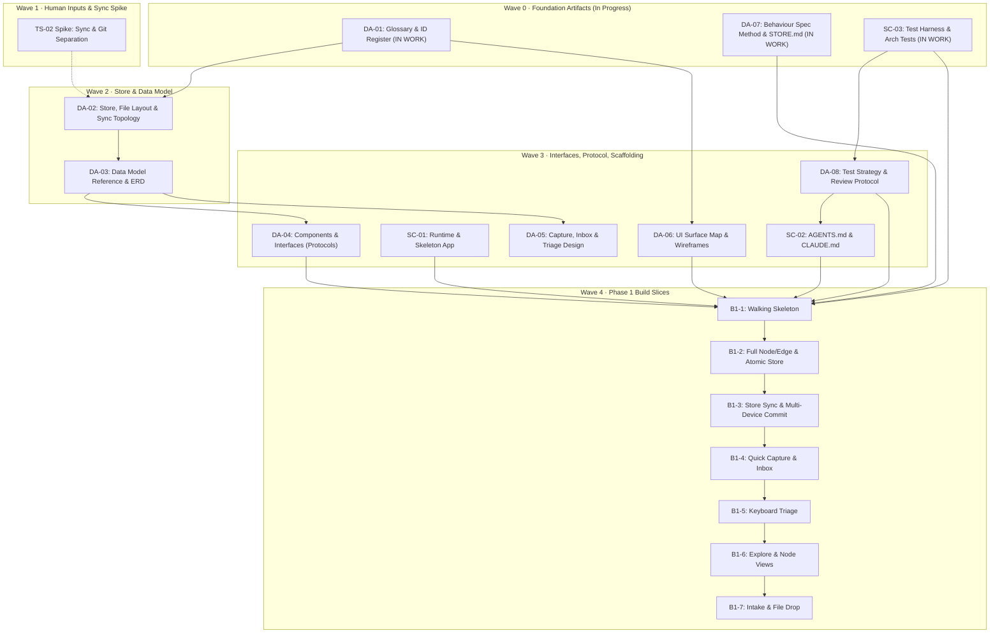

# Tinkerspace (Innovator's Workspace) Development Plan

This plan operationalizes **`docs/DesignPhasePlan_2.md`** and **`docs/InnovatorsWorkspaceVision_12.md`** into an actionable, chunked execution roadmap.

Every task is sized for a single work session (1 block ≈ 90 min, ≤400 lines of code for build slices) and assigned to either **Jared (Human)** or **Antigravity / Claude (AI)**.

---

## Operating Rules & Principles

1. **AI Task Status Rule (§01)**: The AI may mark tasks `in work`. Only **Jared** marks tasks `done` after reviewing outputs.
2. **Review Protocol (§09)**:
   - Run it first.
   - Read behaviour spec → test → interface → implementation.
   - If a test does not read as a clear English specification, reject the slice.
   - Check against the component map (DA-04).
   - Enforce Python limits: file ≤ 200 lines, function ≤ 40 lines, comprehension nesting ≤ 1.
3. **No Mocking the Store**: Store tests always run against real markdown files in temporary directories.
4. **Simulate the Other Writer**: The store must always handle files written or modified outside the service (by tablet sync, text editor, or git).

---

## Recorded Host & Environment Inputs (`IN-01` – `IN-04`)

- **Host & Runtime (`IN-02`)**:
  - Workstation: Windows 11 Home (manually turned on when doing IW service work).
  - Laptop: Windows 11 Pro (client/browser and offline markdown work).
  - Python: Managed via `uv` / Python 3.12+.
- **Repository Structure (`IN-03`)**:
  - `tinkerspace` (`https://github.com/jrdstall/tinkerspace.git`): Code & service repo (`iw-code`).
  - `iw-vault`: Dedicated separate repository & synced folder for corpus datastore / notes.
- **Sync & Mobile (`IN-04`)**:
  - File Sync: Syncthing (or Google Drive as fallback). Solid, free, simple.
  - Markdown Reading/Editing: Obsidian installed on tablet and Android devices.
  - Legacy/Sketching: Samsung Notes on tablet (drawings exported to drop/sync).
- **Prototype Status (`IN-01`)**:
  - Prototype at `c:\Users\jrdst\software\innoworkspace` was exploratory evidence only. No code or data migration; fresh start.

---

## Detailed Task Breakdown

---

### Wave 0 — Immediate Foundation Artifacts

| Task ID | Status | Owner | Output File(s) | Description / Definition of Done |
|---|:--:|:--:|---|---|
| **DA-01** | `in work` | AI | `docs/design/DA-01-glossary.md` | **Glossary & ID Register**: Standardize definitions (node, edge, record, artifact, asset, work unit, workflow, view vs. reading note). ID format (`PREFIX-A01`), allocation mechanics, case-insensitivity, exclude `I`/`O`. |
| **DA-07** | `in work` | AI | `docs/design/DA-07-behaviour-spec-method.md` `docs/design/specs/STORE.md` | **Behaviour Spec Method & Worked STORE Spec**: ID format per subsystem, traceability via test docstrings/names, worked `STORE-01`..`STORE-20` spec. |
| **SC-03** | `in work` | AI | `tests/arch/` `pyproject.toml` (initial) | **Architecture Test Suite**: Pytest configuration with arch test rules (import boundaries, no watcher/background daemon, size limits, no external dependencies in core). |

---

### Wave 1 — Inputs & Physical Spikes (Human + Pairing)

| Task ID | Status | Owner | Output / Artifact | Description / Definition of Done |
|---|:--:|:--:|---|---|
| **IN-01..04** | `done` | Jared | `docs/design/inputs.md` | Jared provided answers to host specifics, repo setup, sync tool, and tablet apps. |
| **TS-02** | `not started` | Jared | `docs/design/spikes/TS-02-sync-git.md` | **Sync & Git Separation Spike**: Test folder sync across workstation/laptop/tablet; confirm `.git` exclusion; force offline conflict and record disk behaviour. |

---

### Wave 2 — Core Storage & Data Model Design

| Task ID | Status | Owner | Output File(s) | Description / Definition of Done |
|---|:--:|:--:|---|---|
| **DA-02** | `in work` | AI | `docs/design/DA-02-store-layout.md` | **Store, Layout & Sync Topology**: Directory hierarchy (`iw-vault`), frontmatter schemas, atomic write rules, handling external writes & sync conflicts, index trigger rules, sync flowchart. |
| **DA-03** | `in work` | AI | `docs/design/DA-03-data-model.md` | **Data Model Reference**: Specification of all node types (including `asset`), 19 edge relationships with exact directionality, authored vs. derived field triggers, `attrs{}` graduation rule, `erDiagram`. |

---

### Wave 3 — Interfaces, Architecture & Scaffolding

| Task ID | Status | Owner | Output File(s) | Description / Definition of Done |
|---|:--:|:--:|---|---|
| **DA-04** | `in work` | AI | `docs/design/DA-04-components.md` `iw/contracts/*.py` | **Component & Interface Map**: Python `Protocol` definitions in `iw/contracts/` for Store, Index, Triage, Workflow, Courier, Capture, Model. Component interaction flowchart. |
| **DA-08** | `in work` | AI | `docs/design/DA-08-test-strategy.md` | **Test Strategy & Review Protocol**: Document 3-tier testing (`tests/contract`, `tests/behaviour`, `tests/arch`), 6-step review protocol, Python ban list. |
| **SC-01** | `in work` | AI | `pyproject.toml` `iw/web/app.py` `docs/design/runtime.md` | **Runtime & ASGI App Skeleton**: Set up Python project with `uv`, Starlette app serving basic status page, document Windows startup/lifecycle and tool wall. |
| **SC-02** | `in work` | AI | `AGENTS.md` `CLAUDE.md` | **Canonical Agent Guidelines**: Under 150 lines, ban list, layer rules, file limits, attribution rules, no restating vision. |
| **DA-06** | `in work` | AI | `docs/design/DA-06-ui-map.md` | **UI Surface Map & Wireframes**: Low-fi wireframes for Explore and Node views, navigation map, layout conventions. |
| **DA-05** | `in work` | AI | `docs/design/DA-05-capture-triage.md` | **Capture, Inbox & Triage Design**: Fast keyboard map, raw inbox format, triage pipeline, attribution stamping for synced notes. |

---

### Wave 4 — Phase 1 Build Slices (B1-1 through B1-7)

| Slice | Status | Focus | Deliverables & Verification |
|---|:--:|---|---|
| **B1-1** | `in work` | Walking Skeleton | Store reads/writes one node type (`friction`); list page and detail page in Starlette/Jinja2; event log writer; arch tests green. |
| **B1-2** | `in work` | Full Model & Atomic Store | All node types (`friction`, `observation`, `idea`, `question`, `experiment`, `asset`, `artifact`, `source`); ID allocator; atomic file writes; git auto-commit with author; broken file quarantine (needs-attention list). |
| **B1-3** | `in work` | Multi-Device Store Sync | Service ingests notes synced from tablet without background watchers; commit-on-refresh; conflict handling. |
| **B1-4** | `in work` | Quick Capture & Inbox | Desktop hotkey/form quick capture; append-only inbox; integration with tablet sync folder. |
| **B1-5** | `in work` | Keyboard Triage | Fast keyboard triage surface: inbox item → typed node with tags, domain, links, and stamped author attribution. |
| **B1-6** | `in work` | Explore & Node Views | Filtering by domain/tag/state/origin; full-text search; derived frontmatter display; all node properties legible in plain markdown editor. |
| **B1-7** | `in work` | Intake & File Drop | Manual intake flow for notebook backlog; drop folder ingestion for sketches/drawings exported from tablet. |

---

### Wave 5 — Phase 2 Design Artifacts

| Task ID | Status | Owner | Output File(s) | Description / Definition of Done |
|---|:--:|:--:|---|---|
| **DA-09** | `done` | AI | `docs/design/DA-09-uow-lifecycle.md` | **Unit-of-Work Lifecycle Spec**: State machine (`stateDiagram-v2`), ready-set computation, dispatch rules, folder ownership (`work/UOW-xxx/`), collection flowchart, data loss prevention, attribution stamping, frontmatter materialization. |
| **DA-10** | `done` | AI | `docs/design/DA-10-mcp-contract.md` | **MCP Surface Contract**: Five tool schemas (`get_step`, `submit_result`, `list_ready`, `fetch_context`, `capture`), negative wall tests, error leakage prevention. |
| **DA-11** | `done` | AI | `docs/design/DA-11-activity-templates.md` | **Activity Template Format, Seed Templates & Master Agent Guidance**: Template schema, zero-code discovery, `freeform@1`, `prior-art-survey@1`, `screening-assessment@1`, and `templates/guidance/AGENT_GUIDANCE.md`. |
| **DA-12** | `done` | AI | `docs/design/DA-12-deliverable-header.md` | **Deliverable Header Spec**: Required fields, markdown parsing rules, graceful degradation on parse failure. |
| **DA-13** | `not started` | AI / Jared | `docs/design/DA-13-phase-2-slices.md` | **Phase 2 Slice Plan**: Runnable slice definitions for B2-1 through B2-13. |
| **DA-14** | `not started` | Jared | `docs/design/DA-14-forward-compatibility.md` | **Forward-Compatibility Checklist**: Review against Phases 3–5 requirements and vendor-independence test. |
| **DA-15** | `not started` | AI | `docs/USER_GUIDE.md` | **Innovator's Workspace User's Guide & Operational Playbook**: Step-by-step execution guides for core workflows (capture, triage, Obsidian human steps, agent MCP dispatch, freeform tasks, template authoring) with behind-the-scenes system explanations for each. |

